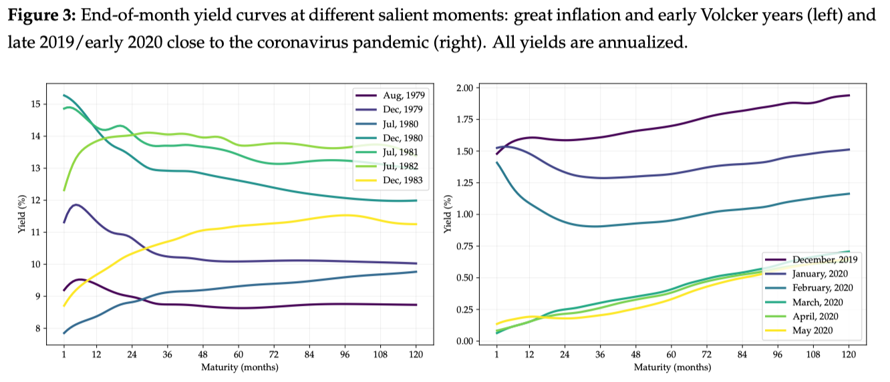

# Intro

- Research in Finance spans many topics;
- Useful separation: Asset Pricing, Corporate Finance and Banking, Market Microstructure, Financial Econometrics, ...;

. . .

\vspace{0.5cm}
**Inaccurate, incomplete, sloppy, but useful**:

- Asset Pricing: why do different assets have different prices? How do investors make choices?
- Corporate Finance and Banking: how do non-financial firms and banks allocate their resources and make choices?
- Market Microstructure: how do markets _actually_ operate?
- Financial Econometrics: specialized tools to handle financial data;

## Are these things really separated?

- This separation is artificial and just pedagogical. It's all Economics.
- I will focus on Asset Pricing topics. Reason: that's what I know best.

. . .

- Felipe will probably navigate across Asset Pricing and Corporate Finance;
- Lars teaches a cool class in Banking and Financial Intermediation;
- Rodrigo Leite usually teaches a class in Behavioral Finance at COPPEAD;
- Fernando Mendo teaches a Macro-heavy Macro-Finance class at PUC;
- EMAp is full of Financial Math classes for you too;

## What is _Asset Pricing?_
**In terms of questions:**

- Asset Pricing is the study of how financial assets are _priced_;
- Why do different stocks have different expected returns?
- Why do bonds with different maturities have different yields?
- Why are prices moving around all the time?
- How do people allocate money across assets? How _should_ they do it?
- Why don't we all invest in a single country or concentrate trading in a single currency?
- Why do we have certain types of insurance contracts but not _all_ types of contracts?
- ...

## What are the top journals?

- The usual top 5 in Economics;
- The top 3 in Finance: Journal of Finance, Journal of Financial Economics, Review of Financial Studies;
- Other great sources: Journal of Financial and Quantitative Analysis, Management Science, Review of Finance;
- If Econometrics-oriented: Journal of Econometrics, Journal of Business & Economic Statistics, Journal of Applied Econometrics, Journal of Financial Econometrics, ...
- Great surveys: Journal of Economic Literature, Journal of Economic Perspectives, Annual Review of Financial Economics;

. . .

\vspace{0.5cm}
\begin{center}
\alert{You should start going through latest editions of these journals and check what seems to interest you!}
\end{center}

## {.standout}
Questions?

# Stylized Facts

## Equity Returns

```{python}
import numpy as np
import pandas as pd
import matplotlib.pyplot as plt
from pyprojroot import here
root = here()
data_path = root / "lecture01" / "data"

# Load US equity data
us_equity = pd.read_csv(
    data_path / "us_equity_data.csv", 
    parse_dates=True, 
    index_col=0)

# Compute daily returns
us_equity['SP500 Returns'] = us_equity['SP500'].pct_change(fill_method=None)
us_equity = us_equity.dropna(subset=['SP500 Returns'])

# Load Brazil equity data
brazil_equity = pd.read_csv(
    data_path / "brazil_equity_data.csv", 
    parse_dates=True, 
    index_col=0)
# the index is in string format with non-stardard stuff but it always start yyyy-mm-dd. Please strip out and convert to datetime
brazil_equity.index = pd.to_datetime([x.date() for x in brazil_equity.index])

# Compute daily returns
brazil_equity['IBOV Returns'] = brazil_equity['IBOV'].pct_change(fill_method=None)
brazil_equity = brazil_equity.dropna(subset=['IBOV Returns'])

# Make both datasets start in 1996
us_equity = us_equity[us_equity.index.year > 1995]
brazil_equity = brazil_equity[brazil_equity.index.year > 1995]
```

```{python}
# Now create two plots side by side: US and Brazil equity returns
fig, axes = plt.subplots(2, 1, figsize=(10, 5), sharex=False)

us_equity['SP500 Returns'].plot(ax=axes[0], color='C0', title='US Equity Returns (S&P 500)')
axes[0].set_ylabel('Returns')
axes[0].grid(True, alpha=0.3)

brazil_equity['IBOV Returns'].plot(ax=axes[1], color='C1', title='Brazil Equity Returns (IBOV)')
axes[1].set_ylabel('Returns')
axes[1].grid(True, alpha=0.3)
plt.xlabel('Date')
plt.tight_layout()
```

## (Daily) Equity Returns Are Not Very Persistent
```{python}
from statsmodels.graphics.tsaplots import plot_acf
# Plot ACF of US equity returns
fig, axes = plt.subplots(2, 1, figsize=(10, 5), sharex=False)
plot_acf(us_equity['SP500 Returns'], lags=30, ax=axes[0], title='ACF of US Equity Returns (S&P 500)', zero=False, color='C0')
axes[0].set_xticks(range(1, 31))
plot_acf(brazil_equity['IBOV Returns'], lags=30, ax=axes[1], title='ACF of Brazil Equity Returns (IBOV)', zero=False, color='C1')
axes[1].set_xticks(range(1, 31))
plt.tight_layout()
```

## (Monthly) Equity Returns Are Not Persistent Either
```{python}
# Compute monthly returns for both countries and plot their ACF
us_equity['Month'] = us_equity.index.to_period('M')
us_monthly_returns = us_equity.groupby('Month')['SP500 Returns'].apply(lambda x: (1 + x).prod() - 1).to_timestamp()
us_monthly_returns.name = 'US Monthly Returns'
brazil_equity['Month'] = brazil_equity.index.to_period('M')
brazil_monthly_returns = brazil_equity.groupby('Month')['IBOV Returns'].apply(lambda x: (1 + x).prod() - 1).to_timestamp()
brazil_monthly_returns.name = 'Brazil Monthly Returns'
# Plot ACF of US monthly equity returns
fig, axes = plt.subplots(2, 1, figsize=(10, 5), sharex=False)
plot_acf(us_monthly_returns, lags=24, ax=axes[0], title='ACF of US Monthly Equity Returns', zero=False, color='C0')
axes[0].set_xticks(range(1, 25))
plot_acf(brazil_monthly_returns, lags=24, ax=axes[1], title='ACF of Brazil Monthly Equity Returns', zero=False, color='C1')
axes[1].set_xticks(range(1, 25))
plt.xlabel('Lags (Months)')
plt.tight_layout()
```

## Realized Volatility
- How volatile are equity returns?
- One measure: the realized volatility, computed as squared returns over a certain period (e.g., daily, monthly);

The monthly realized volatility, in a month with $N_t$ trading days is:

$$
RV_{t} = \sqrt{\sum_{i=1}^{N_t} r_{t,i}^2}
$$

- Think about it as how jagged the returns were;

## Realized Volatility
```{python}
# Compute monthly realized volatility for US equity
us_equity['Month'] = us_equity.index.to_period('M')
us_monthly_vol = us_equity.groupby('Month')['SP500 Returns'].apply(
    lambda x: 100*np.sqrt(np.sum(x**2))
).to_timestamp()
us_monthly_vol.name = 'US Realized Volatility'
# Compute monthly realized volatility for Brazil equity
brazil_equity['Month'] = brazil_equity.index.to_period('M')
brazil_monthly_vol = brazil_equity.groupby('Month')['IBOV Returns'].apply(
    lambda x: 100 * np.sqrt(np.sum(x**2))
).to_timestamp()
brazil_monthly_vol.name = 'Brazil Realized Volatility'

# Plot both volatilities side by side
fig, axes = plt.subplots(2, 1, figsize=(10, 5), sharex=False)
us_monthly_vol.plot(ax=axes[0], color='C0', title='US Monthly Realized Volatility')
axes[0].set_ylabel('Volatility (%)')
axes[0].grid(True, alpha=0.3)
brazil_monthly_vol.plot(ax=axes[1], color='C1', title='Brazil Monthly Realized Volatility')
axes[1].set_ylabel('Volatility (%)')
axes[1].grid(True, alpha=0.3)
plt.xlabel('Date')
plt.tight_layout()
```

## (Monthly) Realized Volatility Is Way More Persistent
```{python}
# Plot ACF of US monthly realized volatility
fig, axes = plt.subplots(2, 1, figsize=(10, 5), sharex=False)
plot_acf(us_monthly_vol, lags=24, ax=axes[0], title='ACF of US Monthly Realized Volatility', zero=False, color='C0')
axes[0].set_xticks(range(1, 25))
plot_acf(brazil_monthly_vol, lags=24, ax=axes[1], title='ACF of Brazil Monthly Realized Volatility', zero=False, color='C1')
axes[1].set_xticks(range(1, 25))
plt.xlabel('Lags (Months)')
plt.tight_layout()
```

## Interest Rates and Equity Risk Premium
```{python}
# Load interest rates
us_rates = pd.read_csv(
    data_path / "us_interest_rates.csv", 
    parse_dates=True, 
    index_col=0)
us_rates.index = pd.to_datetime(us_rates.index)

brazil_rates = pd.read_csv(
    data_path / "brazil_interest_rates.csv", 
    parse_dates=True, 
    index_col=0)
brazil_rates.index = pd.to_datetime(brazil_rates.index)

# Make both datasets start in 1996
us_rates = us_rates[us_rates.index.year > 1995]
brazil_rates = brazil_rates[brazil_rates.index.year > 1995]

# Plot Fed Funds together with DI rate
fig, ax = plt.subplots(figsize=(10, 4))
us_rates['FED_FUNDS'].plot(ax=ax, color='C0', label='US Fed Funds Rate')
brazil_rates['DI_DAILY'].plot(ax=ax, color='C1', label='Brazil DI Rate')
ax.set_title('Short Interest Rates')
ax.set_ylabel('Interest Rate (Annualized %)')
ax.legend()
ax.grid(True, alpha=0.3)
plt.tight_layout()
plt.show()
```

```{python}
# Make the annual rates the equivalent of daily rates and compute the average risk premium for both countries, defined as the average difference between the stock market return and the risk-free rate
us_rates['Daily Fed Funds'] = (1 + us_rates['FED_FUNDS']/100)**(1/252) - 1
brazil_rates['Daily DI'] = (1 + brazil_rates['DI_DAILY']/100)**(1/252) - 1
us_equity = us_equity.join(us_rates['Daily Fed Funds'], how='inner')
brazil_equity = brazil_equity.join(brazil_rates['Daily DI'], how='inner')
us_equity['US Equity Risk Premium'] = us_equity['SP500 Returns'] - us_equity['Daily Fed Funds']
brazil_equity['Brazil Equity Risk Premium'] = brazil_equity['IBOV Returns'] - brazil_equity['Daily DI']
us_erp_mean = us_equity['US Equity Risk Premium'].mean() * 252 * 100
brazil_erp_mean = brazil_equity['Brazil Equity Risk Premium'].mean() * 252 * 100
```

. . .

- Equity risk premium for US `{python} str(np.round(us_erp_mean, 2))`% per year, with volatility around `{python} str(np.round(us_equity['US Equity Risk Premium'].std() * np.sqrt(252) * 100, 2))`% per year;
- Equity risk premium for Brazil `{python} str(np.round(brazil_erp_mean, 2))`% per year, with volatility around `{python} str(np.round(brazil_equity['Brazil Equity Risk Premium'].std() * np.sqrt(252) * 100, 2))`% per year;

## Fat Tails

```{python}
# Compute kurtosis for both US and Brazil equity returns
from scipy.stats import kurtosis
us_mean = us_equity['SP500 Returns'].mean()
us_std = us_equity['SP500 Returns'].std()
brazil_mean = brazil_equity['IBOV Returns'].mean()
brazil_std = brazil_equity['IBOV Returns'].std()

us_kurtosis = kurtosis((us_equity['SP500 Returns'] - us_mean)/us_std, fisher=True)
brazil_kurtosis = kurtosis((brazil_equity['IBOV Returns'] - brazil_mean)/brazil_std, fisher=True)

# Compute mean and standard deviation of the returns, both for US and Brazil, then plot histograms with normal distribution overlayed
fig, axes = plt.subplots(2, 1, figsize=(9, 4.5), sharex=False)
# US histogram
axes[0].hist(
    us_equity['SP500 Returns'], 
    density=True, 
    bins = 100, 
    alpha=0.6, 
    color='C0',
    ec='grey',
    label='US Equity Returns Histogram')
xmin, xmax = axes[0].get_xlim()
x = np.linspace(xmin, xmax, 100)
p = (1/(us_std * np.sqrt(2 * np.pi))) * np.exp(-0.5 * ((x - us_mean)/us_std)**2)
axes[0].plot(x, p, 'k', linewidth=2, label='Normal Distribution')
axes[0].set_title(f'US Equity Returns Distribution (Kurtosis: {us_kurtosis:.2f})')
axes[0].set_ylabel('Density')
axes[0].legend()
axes[0].grid(True, alpha=0.3)
axes[0].set_axisbelow(True)
axes[0].set_xlim(-0.1, 0.1)

# Brazil histogram
axes[1].hist(
    brazil_equity['IBOV Returns'], 
    bins=100, 
    density=True, 
    alpha=0.6, 
    color='C1', 
    ec='grey', 
    label='Brazil Equity Returns Histogram')
xmin, xmax = axes[1].get_xlim()
x = np.linspace(xmin, xmax, 100)
p = (1/(brazil_std * np.sqrt(2 * np.pi))) * np.exp(-0.5 * ((x - brazil_mean)/brazil_std)**2)
axes[1].plot(x, p, 'k', linewidth=2, label='Normal Distribution')
axes[1].set_title(f'Brazil Equity Returns Distribution (Kurtosis: {brazil_kurtosis:.2f})')
axes[1].set_ylabel('Density')
axes[1].legend()
axes[1].grid(True, alpha=0.3)
axes[1].set_axisbelow(True)
axes[1].set_xlim(-0.1, 0.1)

plt.tight_layout()
```


## Extreme Days
```{python}
#| echo: false
#| output: asis

# Compute the days in which aboslute returns were greather than 1 std, 2std, 3std, 4std and so on, for both US and Brazil equity returns
from scipy.stats import norm

us_std = us_equity['SP500 Returns'].std()
brazil_std = brazil_equity['IBOV Returns'].std()
n_us = len(us_equity)
n_brazil = len(brazil_equity)

# Observed frequencies
us_extreme_days = {i: 100 * np.sum(np.abs(us_equity['SP500 Returns']) > i * us_std) / n_us for i in range(1, 6)}
brazil_extreme_days = {i: 100 * np.sum(np.abs(brazil_equity['IBOV Returns']) > i * brazil_std) / n_brazil for i in range(1, 6)}

# Expected frequencies under normality
normal_extreme = {i: 100 * 2 * (1 - norm.cdf(i)) for i in range(1, 6)}

# Create comparison table
comparison_data = {
    'Threshold': [f'{i} $\sigma$' for i in range(1, 6)],
    'US (Obs.)': [f'{us_extreme_days[i]:.2f}' for i in range(1, 6)],
    'Brazil (Obs.)': [f'{brazil_extreme_days[i]:.2f}' for i in range(1, 6)],
    'Gaussian Benchmark': [f'{normal_extreme[i]:.2f}' for i in range(1, 6)]
}

comparison_df = pd.DataFrame(comparison_data)
print(comparison_df.to_markdown(index=False))
```
: Percentage of days with absolute returns greater than the threshold

- Quiet days are more frequent than predicted by normal distribution;
- Extreme days are way more frequent than predicted by normal distribution;
- How can that be possible?
  
## QQ Plots - Fat Tails
```{python}
# Compute the QQ plot for both US and Brazil equity returns
import scipy.stats as stats
fig, axes = plt.subplots(1, 2, figsize=(8, 4))
stats.probplot((us_equity['SP500 Returns'] - us_mean)/us_std, dist="norm", plot=axes[0], fit=False)
axes[0].set_title('QQ Plot - US Equity Returns')
axes[0].grid(True, alpha=0.3)
axes[0].get_lines()[0].set_color('C0')

# Add 45 degree reference line
lims = [
    np.min([axes[0].get_xlim(), axes[0].get_ylim()]),
    np.max([axes[0].get_xlim(), axes[0].get_ylim()]),
]
axes[0].plot(lims, lims, 'k--', alpha=0.5, lw=2)
axes[0].set_xlim(-4, 4)
axes[0].legend(["Quantiles", "45° Line"])

stats.probplot((brazil_equity['IBOV Returns'] - brazil_mean)/brazil_std, dist="norm", plot=axes[1], fit=False)
axes[1].set_title('QQ Plot - Brazil Equity Returns')
axes[1].grid(True, alpha=0.3)
axes[1].get_lines()[0].set_color('C1')
axes[1].set_xlim(-4, 4)
# Add 45 degree reference line
lims = [
    np.min([axes[1].get_xlim(), axes[1].get_ylim()]),
    np.max([axes[1].get_xlim(), axes[1].get_ylim()]),
]
axes[1].plot(lims, lims, 'k--', alpha=0.5, lw=2)
axes[1].legend(["Quantiles", "45° Line"])

plt.tight_layout()
```

## Yield Curves

- The yield on a bond is the constant interest rate that makes the present value of the bond's cash flows equal to its price;

- For a zero-coupon bond at time $t$ with face value $F$ paid at $t+n$:
$$
y_t^{(n)} \equiv -\frac{1}{n}\log\left(\frac{P_t^{(n)}}{F}\right) = \frac{1}{n}\log\left(\frac{F}{P_t^{(n)}}\right)
$$

- Different bonds with different maturities have different yields;
- Two central types of bonds: government bonds (issued by the government) and corporate bonds (issued by firms);

## Secular Decline of Interest Rates

```{python}
# Read GSW_yields.csv, skip the 10 first rows, parse dates in the first column, set index to the first column, and consider only columns that start with SVENY
gsw_yields = pd.read_csv(
    data_path / "GSW_yields.csv", 
    skiprows=9, 
    parse_dates=[0], 
    index_col=0)
gsw_yields = gsw_yields[[col for col in gsw_yields.columns if col.startswith('SVENY')]]
gsw_yields.index = pd.to_datetime(gsw_yields.index).date

# Rename the columns to just the maturity in years and keep only 1, 2, ..., 10 years.
new_columns = {col: f'Y{int(col.replace("SVENY", "").replace("Y", ""))}' for col in gsw_yields.columns}
gsw_yields = gsw_yields.rename(columns=new_columns)
gsw_yields = gsw_yields[[f'Y{i}' for i in range(1, 11)]]
```

```{python}
# Plot all yields
yields_to_plot = [1, 2, 3, 5, 10]
cols_to_plot = [f'Y{i}' for i in yields_to_plot]
fig, ax = plt.subplots(figsize=(9, 4))
ax.plot(gsw_yields.index, gsw_yields.loc[:, cols_to_plot], lw=1)
ax.set_title("US Treasury Yields")
ax.set_ylabel("Yield (%)")
ax.grid(True, alpha=0.3)

# Make x ticks every 5 years and only show the year
xticks = pd.date_range(start=gsw_yields.index.min(), end=gsw_yields.index.max(), freq='4YS')
ax.set_xticks(xticks)
ax.set_xticklabels([x.year for x in xticks])
plt.legend([f'{i}-Year' for i in yields_to_plot], title='Maturity', loc='upper right')
plt.tight_layout()
```

## And Yet It Moves



## Different Shapes - Click on Links

- The 3D American Yield Curve from [New York Times](https://www.nytimes.com/interactive/2015/03/19/upshot/3d-yield-curve-economic-growth.html);
- Another cool visualization from [Dow Jones](https://dqydj.com/treasury-yield-curve/);
- The 3D Brazilian Yield Curve from [Werley Cordeiro](https://werleycordeiro.shinyapps.io/Brazil_Yield_Curves/);

## Exchange Rates

```{python}
# Load exchange rates
fx_data = pd.read_csv(data_path / "usd_fx_data.csv", parse_dates=True, index_col=0)
fx_data.index = pd.to_datetime(fx_data.index).date

# Plot the exchange rates side by side, with the usd/eur in the left
fig, ax = plt.subplots(2, 1, figsize=(8, 4))

fx_data['USDEUR'].plot(ax=ax[0], color='C0', title='USD/EUR Exchange Rate')
ax[0].set_ylabel('EUR per USD')
ax[0].grid(True, alpha=0.3)

fx_data['USDBRL'].plot(ax=ax[1], color='C1', title='USD/BRL Exchange Rate')
ax[1].set_ylabel('Real per USD')
ax[1].grid(True, alpha=0.3)

plt.tight_layout()
```

## ACF of Daily Exchange Rates
```{python}
# Plot ACF of daily exchange rates
fig, axes = plt.subplots(2, 1, figsize=(8, 4), sharex=False)
plot_acf(fx_data['USDEUR'].dropna(), lags=30, ax=axes[0], title='ACF of USD/EUR Exchange Rate', zero=False, color='C0')
axes[0].set_xticks(range(1, 31))
axes[0].set_ylim(0, 1.2)
plot_acf(fx_data['USDBRL'].dropna(), lags=30, ax=axes[1], title='ACF of USD/BRL Exchange Rate', zero=False, color='C1')
axes[1].set_xticks(range(1, 31))
axes[1].set_ylim(0, 1.2)
plt.xlabel('Lags (Days)')
plt.tight_layout()
```

## Exchange Rate Percentage Changes
```{python}
# Compute daily returns for both exchange rates
fx_data['USDEUR Returns'] = fx_data['USDEUR'].pct_change(fill_method=None)
fx_data['USDBRL Returns'] = fx_data['USDBRL'].pct_change(fill_method=None)
fx_data = fx_data.dropna(subset=['USDEUR Returns', 'USDBRL Returns'])   

# Plot Returns
fig, ax = plt.subplots(2, 1, figsize=(8, 4))
fx_data['USDEUR Returns'].plot(ax=ax[0], color='C0', title='USD/EUR Exchange Rate Returns')
ax[0].set_ylabel('Returns')
ax[0].grid(True, alpha=0.3)
fx_data['USDBRL Returns'].plot(ax=ax[1], color='C1', title='USD/BRL Exchange Rate Returns')
ax[1].set_ylabel('Returns')
ax[1].grid(True, alpha=0.3)
plt.tight_layout()
```

## Daily Exchange Rate Movements Are Not Persistent
```{python}
# Plot ACF of daily exchange rate returns
fig, axes = plt.subplots(2, 1, figsize=(8, 4), sharex=False)
plot_acf(fx_data['USDEUR Returns'], lags=30, ax=axes[0], title='ACF of USD/EUR Exchange Rate Returns', zero=False, color='C0')
axes[0].set_xticks(range(1, 31))
plot_acf(fx_data['USDBRL Returns'], lags=30, ax=axes[1], title='ACF of USD/BRL Exchange Rate Returns', zero=False, color='C1')
axes[1].set_xticks(range(1, 31))
plt.xlabel('Lags (Days)')
plt.tight_layout()
```

## Monthly Exchange Rate Movements Are Not Persistent Either
```{python}
# Compute monthly returns for both exchange rates and plot their ACF
fx_data.index = pd.to_datetime(fx_data.index)
fx_data['Month'] = fx_data.index.to_period('M')
usd_eur_monthly_returns = fx_data.groupby('Month')['USDEUR Returns'].apply(lambda x: (1 + x).prod() - 1).to_timestamp()
usd_eur_monthly_returns.name = 'USD/EUR Monthly Returns'
usd_brl_monthly_returns = fx_data.groupby('Month')['USDBRL Returns'].apply(lambda x: (1 + x).prod() - 1).to_timestamp()
usd_brl_monthly_returns.name = 'USD/BRL Monthly Returns'
# Plot ACF of USD/EUR monthly exchange rate returns
fig, axes = plt.subplots(2, 1, figsize=(8, 4), sharex=False)
plot_acf(usd_eur_monthly_returns, lags=24, ax=axes[0], title='ACF of USD/EUR Monthly Exchange Rate Returns', zero=False, color='C0')
axes[0].set_xticks(range(1, 25))
plot_acf(usd_brl_monthly_returns, lags=24, ax=axes[1], title='ACF of USD/BRL Monthly Exchange Rate Returns', zero=False, color='C1')
axes[1].set_xticks(range(1, 25))
plt.xlabel('Lags (Months)')
plt.tight_layout()
```

## Annual Exchange Rate Movements Are Somewhat Persistent
```{python}
# Compute annual returns for both exchange rates and plot their ACF
fx_data['Year'] = fx_data.index.to_period('Y')
usd_eur_annual_returns = fx_data.groupby('Year')['USDEUR Returns'].apply(lambda x: (1 + x).prod() - 1).to_timestamp()
usd_eur_annual_returns.name = 'USD/EUR Annual Returns'
usd_brl_annual_returns = fx_data.groupby('Year')['USDBRL Returns'].apply(lambda x: (1 + x).prod() - 1).to_timestamp()
usd_brl_annual_returns.name = 'USD/BRL Annual Returns'
# Plot ACF of USD/EUR annual exchange rate returns
fig, axes = plt.subplots(2, 1, figsize=(8, 4), sharex=False)
plot_acf(usd_eur_annual_returns, lags=10, ax=axes[0], title='ACF of USD/EUR Annual Exchange Rate Returns', zero=False, color='C0')
axes[0].set_xticks(range(1, 11))
plot_acf(usd_brl_annual_returns, lags=10, ax=axes[1], title='ACF of USD/BRL Annual Exchange Rate Returns', zero=False, color='C1')
axes[1].set_xticks(range(1, 11))
plt.xlabel('Lags (Years)')
plt.tight_layout()
```

## Are Exchange Rates Integrated?
```{python}
#| echo: false
#| output: asis

# Compute an AR(1) for each exchange rates and report the coefficients alongside NW standard errors
import statsmodels.api as sm
def ar1_estimation(series):
    series = series.dropna()
    y = series.values[1:]
    X = series.values[:-1]
    X = sm.add_constant(X)
    model = sm.OLS(y, X).fit(cov_type='HAC', cov_kwds={'maxlags':30})
    return model.params[1], model.bse[1], model.rsquared

usd_eur_ar1_coef, usd_eur_ar1_se, usd_eur_r2 = ar1_estimation(fx_data['USDEUR'])
usd_brl_ar1_coef, usd_brl_ar1_se, usd_brl_r2 = ar1_estimation(fx_data['USDBRL'])

# Create a table to report the results
ar1_results = pd.DataFrame({
    'Exchange Rate': ['USD/EUR', 'USD/BRL'],
    'AR(1) Coefficient': [usd_eur_ar1_coef, usd_brl_ar1_coef],
    'NW Standard Error': [usd_eur_ar1_se, usd_brl_ar1_se],
    '$R^2$': [usd_eur_r2, usd_brl_r2]
})
ar1_results = ar1_results.set_index('Exchange Rate').T
ar1_results = ar1_results.round(4)
print(ar1_results.to_markdown())
```
: AR(1) estimation results for daily exchange rates

```{python}
#| echo: false
#| output: asis
# Run an ADF test for both exchange rates, with and without a trend and report p-values
from statsmodels.tsa.stattools import adfuller
usd_eur_adf_no_trend = adfuller(fx_data['USDEUR'].dropna(), regression='c')
usd_eur_adf_with_trend = adfuller(fx_data['USDEUR'].dropna(), regression='ct')
usd_brl_adf_no_trend = adfuller(fx_data['USDBRL'].dropna(), regression='c')
usd_brl_adf_with_trend = adfuller(fx_data['USDBRL'].dropna(), regression='ct')
# Create a table to report the results
adf_results = pd.DataFrame({
    'Exchange Rate': ['USD/EUR', 'USD/BRL'],
    'ADF $p$-value (no trend)': [usd_eur_adf_no_trend[1], usd_brl_adf_no_trend[1]],
    'ADF $p$-value (with trend)': [usd_eur_adf_with_trend[1], usd_brl_adf_with_trend[1]]
})
adf_results = adf_results.set_index('Exchange Rate').T
adf_results = adf_results.round(4)
print(adf_results.to_markdown())
```
: ADF test results for daily exchange rates

## Wrap-Up
- Returns seem to be stationary. Levels are not;
- Volatility is persistent, and apparently it is time-varying;
- Returns have fat tails, with more extreme events than predicted by normal distribution;
- Interest rates have been declining for decades, but they still move a lot;
- Exchange rates are very persistent and consistent with a random walk;

**The big questions**:

- Where does all of that come from?
- Where do prices come from in the first place?

. . .

\begin{center}
\alert{Stay tuned for more fun!}
\end{center}

## {.standout}
Questions?