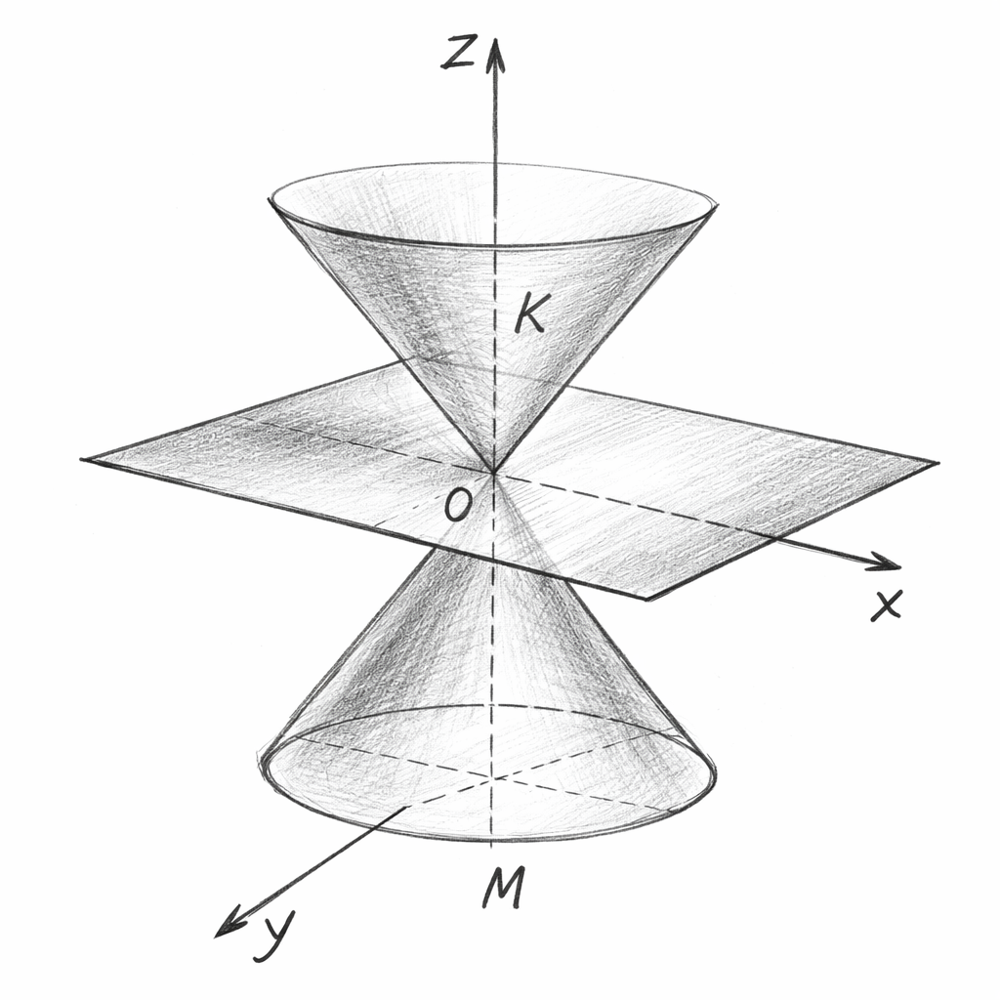

# Intro

- We introduced the notion of a Stochastic Discount Factor (SDF);
- Very connected to the idea of marginal utility and state prices;
- But do we really need utility functions and notions of equilibrium to have an SDF?

. . .

- The answer is a sharp **No**;
- The cornerstone assumption is **No Arbitrage**;
- This will guarantee the existence of *one* SDF that prices all assets correctly;
- Uniqueness will be more subtle;

## Our Agenda

- **No-Arbitrage implies state prices exist**: very weak assumptions guarantee SDF existence;
- **Uniqueness of SDFs depends on market completeness**;
- **Hansen-Jagannathan bound**: observable Sharpe ratios constrain SDF volatility;
- **Minimum-variance SDF** and its role in asset pricing;

# Setup

- There are $S$ possible states of the world, with probabilities $\pi_s > 0$ for $s=1,\ldots,S$;
- There are only two dates;
- There are $N$ assets, with time-1 payoffs $D_i = (d_{i1}, \ldots, d_{iS})$;
- Collect these payoffs in a $N \times S$ matrix $\mathbf{D}$;
- The prices of these securities are $q_i$ for $i=1,\ldots,N$;

\vspace{0.5cm}

```{=latex}
\begin{mydef}
A \textit{portfolio} is a vector $\theta = (\theta_1, \ldots, \theta_N)$ indicating the number of units held of each asset. The cost of the portfolio is given by $q^\top \theta \in \mathbb{R}$ and the payoffs are given by $\mathbf{D}^\top \theta \in \mathbb{R}^S$.
\end{mydef}
```

## Absence of Arbitrage
```{=latex}
\begin{mydef}
An \textit{arbitrage} is a portfolio $\theta$ such that one of the two conditions hold:
\begin{enumerate}\itemsep0.5em
\item $q^\top \theta < 0$ and $\mathbf{D}^\top \theta \geq 0$;
\item $q^\top \theta \leq 0$ and $\mathbf{D}^\top \theta > 0$;
\end{enumerate}
If no such portfolio exists, we say that the market satisfies the \textit{No Arbitrage} (NA) condition.
\end{mydef}
```

- You cannot get money and never pay anything;

. . .

\vspace{0.5cm}

```{=latex}
\begin{mydef}
A \textit{state-price vector} is a vector $\psi \in \mathbb{R}^S_{++}$ with $q = \mathbf{D} \psi$.
\end{mydef}
```

- $\mathbf{D}$ is like a basis for payoffs;
- $\psi$ ensures that the Law of One Price holds given this basis;

## No-Abitrage is Equivalent to the Existence of a State-Price Vector
```{=latex}
\begin{prop}
The market satisfies the No Arbitrage condition if, and only if, there exists a state-price vector.
\end{prop}
```
. . .

- This theorem holds in way more general setups;
- We could have a continuum of states, and time could be continuous too;
- We could also have several periods;

. . .

- Tools for the general version: Hahn-Banach, Separating Hyperplane Theorem, Riesz Representation Theorem;
- See @Hansen1987 for all intricate details;
- Here: we will need a Separating Hyperplane Theorem for cones;

# Main Proof

## A Useful Theorem

```{=latex}
\begin{mydef}
A set $C \subseteq \mathbb{R}^k$ is a \textit{cone} if for any $x \in C$ and any $\lambda \geq 0$, we have that $\lambda x \in C$.
\end{mydef}
```

- Is every cone convex?
- Is every cone open? Is every cone closed?

. . .

\vspace{0.5cm}

```{=latex}
\begin{theorem}[Separating Hyperplane Theorem for Cones]
Suppose M and K are closed convex cones in $\mathbb{R}^k$ with $M \cap K = \{0\}$. If $K$ does not contain a linear subspace other than $\{0\}$, than there is a nonzero linear functional $F$ such that $F(x) < F(y)$ for each $x \in M$ and $y \in K$, with $y\neq 0$.
\end{theorem}
```

## Visualizing the Theorem (Thanks, Chat GPT!)
{width=2.8in fig-align="center"}

## Proof of the Main Theorem
Recall what we want to prove:
```{=latex}
\begin{prop}
The market satisfies the No Arbitrage condition if, and only if, there exists a state-price vector.
\end{prop}
```

. . .

Define the following sets:

- $M = \{(-q^\top \theta, \mathbf{D}^\top \theta) : \theta \in \mathbb{R}^N \}$
- $K = \mathbb{R}_{+} \times \mathbb{R}^S_{+}$ and $L = \mathbb{R} \times \mathbb{R}^S$;

. . .

- Notice that $K$ and $M$ are closed convex cones;
- Moreover, notice that $K$ does not contain any linear subspace other than $\{0\}$;

. . .

- No arbitrage is **equivalent** to $M \cap K = \{0\}$;

## Proof of the Main Theorem

Let's start easy. Assume there exists a state-price vector $\psi$;

- Then, the cost of any portfolio $\theta$ is given by $q^\top \theta = \psi^\top \mathbf{D}^\top \theta$;
- If $\mathbf{D}^\top \theta \geq 0$, then $q^\top \theta = \psi^\top \mathbf{D}^\top \theta \geq 0$ since $\psi \in \mathbb{R}^S_{++}$;
- If a portfolio generates non-negative payoffs, its cost cannot be negative;
- Thus, no arbitrage;

## Proof of the Main Theorem
Now, assume No-Arbitrage holds;

- Then, $M \cap K = \{0\}$;
- By the Separating Hyperplane Theorem for Cones, there exists a non-zero linear functional $F$ such that $F(x) < F(y)$ for each $x \in M$ and $y \in K$, with $y\neq 0$;

. . .

- Notice that we have $F(x) \leq 0, \forall x \in M$; (Why?)

. . .

- Assume $F(x) < 0$ for some $x \in M$;
- Then, for any $x \in M$, we have that $F(-x) > 0$ and $F(-x) > 0$;
- This is a contradiction since $-x \in M$ ($M$ is a linear subspace!);
- Thus, $F(x) = 0, \forall x \in M$;

## Proof of the Main Theorem
Since, we are working in $\mathbb{R}^{S+1}$, for any $(c, p) \in \mathbb{R}\times \mathbb{R}^S$, we can write:
$$
F(c,p) = \alpha \cdot c + \beta^\top p, \text{ for some } \alpha \in \mathbb{R}, \beta \in \mathbb{R}^S.
$$

. . . 

- For any $x \in M$, we have that $F(x) = 0$;
- Thus, for any portfolio $\theta$, we have that:
$$
F(-q^\top \theta, \mathbf{D}^\top \theta) = -\alpha q^\top \theta + \beta^\top \mathbf{D}^\top \theta = 0, \forall \theta \in \mathbb{R}^N.
$$

. . .

- This implies that $\alpha q = \mathbf{D} \beta$;

. . .

- Notice that $e_1 \equiv (1,0,\ldots,0) \in K \implies \alpha > 0$;
- Also, for any $p \in \mathbb{R}^S_{+}$, we have that $(0,p) \in K \implies \beta \in \mathbb{R}^S_{++}$;

. . .

- We define $\psi \equiv \frac{\beta}{\alpha} \in \mathbb{R}^S_{++}$ and conclude that $q = \mathbf{D} \psi$. We are done!

## {.standout}
Questions?

## Uniqueness of State-Price Vectors

- Can we say anything about uniqueness of State-Price Vectors?
- No-Arbitrage ensures the existence of a positive one;
- What if there are several ones?

. . .

- Recall: we say that a market is _complete_ if the column space of $\mathbf{D}$ is $\mathbb{R}^S$;
- This requires at least $N \geq S$ assets;

. . .

- If $N=S$ and the market is complete, we can write $\psi = \mathbf{D}^{-1} q$, which implies uniqueness;

. . .

- If $N > S$, $\text{rank}(\mathbf{D}) = S \iff (\mathbf{D}^\top \mathbf{D})^{-1}$ exists;

. . .

- In that case, we can write $\psi \equiv \left(\mathbf{D}^\top\mathbf{D}\right)^{-1} \mathbf{D}^\top q$ is unique;

## Comments
- We need at least $S$ linearly independent assets to span the state space;
- With incomplete markets, there are many SDFs that price assets correctly;
- They _will_ disagree about the payoffs we do not trade;
- That makes sense: how would we price by no-arbitrage something we cannot _replicate_?

. . .

- No-Arbitrage is very weak: there is no utility function, no equilibrium notion...
- Good and bad: generality vs lack of discipline;

. . .

- From state prices to SDFs: just re-scale by the physical probabilities;
- State-prices and the SDF encode the same fundamental information!

# The Hansen-Jagannathan Bound

- The SDF is not observable and the incomplete market case is the realistic scenario;
- Are there any restrictions on the SDF we can learn from observed asset returns?
- We already know that $R_f = \frac{1}{\mathbb{E}[m]}$ and $R_f$ is observable;

. . .

Recall that for any risk premium $R - R_f$, we can write:
$$
\mathbb{E}[m(R - R_f)] = 0 \implies \mathbb{E}[R - R_f] = -\frac{\text{Cov}(m, R)}{\mathbb{E}[m]}
$$

- Let $\rho(m, R - R_f) \equiv \frac{\text{Cov}(m, R - R_f)}{\sigma(m) \sigma(R - R_f)}$ be the correlation between $m$ and $R - R_f$;

. . .

- Then, we can write:
$$
\mathbb{E}[R - R_f] = -\rho(m, R - R_f)\cdot \sigma(m)\cdot \sigma(R - R_f) \cdot \frac{1}{\mathbb{E}[m]}
$$

## The Hansen-Jagannathan Bound
- Rearranging, we get:
$$
\frac{\mathbb{E}[R - R_f]}{\sigma(R - R_f)} = -\rho(m, R - R_f) \cdot \sigma(m) \cdot \frac{1}{\mathbb{E}[m]}
$$

. . .

- Using that $|\rho(\cdot, \cdot)| \leq 1$, we get the **Hansen-Jagannathan** bound:
$$
\underbrace{\left| \frac{\mathbb{E}[R - R_f]}{\sigma(R - R_f)} \right|}_{\text{absolute Sharpe Ratio}} \leq \sigma(m) \cdot \frac{1}{\mathbb{E}[m]}, \forall \text{ returns } R \text{ and any sdf } m
$$

- Stare at it again and reflect how powerful this is.
- First derived in @Hansen1991;

## Maximal Sharpe Ratio Portfolio

- We can take the $\sup$ over all returns $R$ and the $\inf$ over all SDFs $m$ to get:
$$
\sup_{R} \left| \frac{\mathbb{E}[R - R_f]}{\sigma(R - R_f)} \right| \leq \inf_{m: \mathbb{E}[mR] = 1} \left[\frac{\sigma(m)}{\mathbb{E}[m]}\right]
$$

. . .

- The maximum Sharpe Ratio attained by a portfolio is bounded the volatility of the SDF;
- This is very general: we only assumed No-Arbitrage!
- Important: to mimick the high Sharpe Ratios observed in the data, the SDF must be very volatile;
- The return process with the highest (absolute) Sharpe Ratio is such that $\rho(m, R - R_f) = \pm 1 \implies R - R_f = a + b \cdot m$;
- What's the intuition?

## {.standout}
Questions?

## What's the least volatile SDF?

- Consider $N$ assets with random returns $R = (R_1, \ldots, R_N)^\top$ and a risk-free rate $R_f$;
- Consider finding the SDF with the smallest variance that prices these assets correctly;
- This is _the_ SDF that _attains_ the HJ bound;

. . .

- Let $\mathcal{R}$ be the linear span of $(1, R^\top)^\top$;
- Notice the following for any SDF $m$
$$
m = \text{Proj}(m | \mathcal{R}) + e
$$
where $e$ is orthogonal to $\mathcal{R}$;

. . .

- It's trivial that $\sigma^2(m) = \sigma^2(\text{Proj}(m | \mathcal{R})) + \sigma^2(e) \geq \sigma^2(\text{Proj}(m | \mathcal{R}))$;

. . .

- Crucial question: can we find and SDF in $\mathcal{R}$?

## An SDF in $\mathcal{R}$

- Any element of $\mathcal{R}$ can be written as:
$$
m(a,b) \equiv a + b^\top \left(R - R_f \mathbf{1} - \mu\right), \quad \mu \equiv \mathbb{E}[R - R_f \mathbf{1}]
$$

. . .

- Any candidate should respect:
$$
\mathbb{E}[m(a,b) R_i] = 1, \quad \forall i=1,\ldots,N
$$
and $\mathbb{E}[m(a,b)] = 1/R_f$

. . .

- Great news! This is a system of $N+1$ equations with $N+1$ unknowns $(a,b)$!

. . .

- Exercise: show that the solution is given by:
```{=latex}
\begin{equation*}
a^* = \frac{1}{R_f}, \qquad b^* = - \frac{1}{R_f} \cdot \mu^\top \Sigma^{-1}
\end{equation*}
```
where $\Sigma \equiv \mathbb{E}\left[(R - R_f\mathbf{1} - \mu)(R - R_f\mathbf{1} - \mu)^\top\right]$ is the covariance matrix of excess returns.


## The Hansen-Jagannathan SDF

- The SDF with the smallest variance that prices the $N$ risky assets and the risk-free rate correctly is given by:
```{=latex}
\begin{equation*}
m^* = \frac{1}{R_f} - \frac{1}{R_f} \cdot \mu^\top \Sigma^{-1} \left(R - R_f \mathbf{1} - \mu\right)
\end{equation*}
```

. . .

- Very important lesson: only $\text{Proj}(m, \mathcal{R})$ matters for pricing assets;
- If two SDFs have the same projection into $\mathcal{R}$, they price all assets the same;

. . .

- Exercise: show that the highest Sharpe Ratio allowed by this SDF is given by:
```{=latex}
\begin{equation*}
\text{SR}_{\max} = \sqrt{\mu^\top \Sigma^{-1} \mu}
\end{equation*}
```

## Comments

- This SDF prices all included assets _perfectly_;
- But it made no promises on pricing _other_ assets;
- What would be challenges to its implementation?
- Does it need to be positive? Does that imply it's possible to find an arbitrage?
- Please read @Hansen1991!

## {.standout}
Questions?

## AI-Generated Summary and Key Takeaways
I asked Chat GPT to summarize this lecture. Here is the unfiltered output:

- **SDF exists $\iff$ No-Arbitrage** (no preferences/equilibrium needed)
- **NA $\iff \exists$ state prices** $\psi \in \mathbb{R}^S_{++}$ s.t. $q = D\psi$ (pricing = a positive linear functional)
- **Uniqueness $\iff$ completeness**: $\text{col}(D)=\mathbb{R}^S$; incomplete markets ⇒ many SDFs (disagree off-span)
- **Hansen–Jagannathan bound**:
  $$
  \left|\frac{\mathbb{E}[R-R_f]}{\sigma(R-R_f)}\right|\le \frac{\sigma(m)}{\mathbb{E}[m]}
  $$
High Sharpe ratios $\implies$ **volatile** SDF
- **Minimum-variance SDF** lies in $\mathcal{R}=\text{span}(1,R)$; only $\text{Proj}(m\mid \mathcal{R})$ matters for pricing

## Readings and Rereferences {.noframenumbering}
- (C): Chapters 1, 4, and 5;
- (D): Chapter 1;
