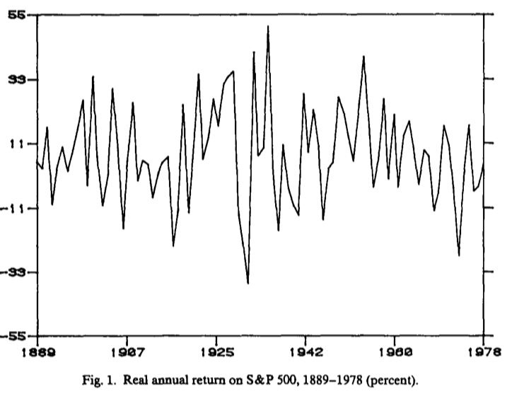
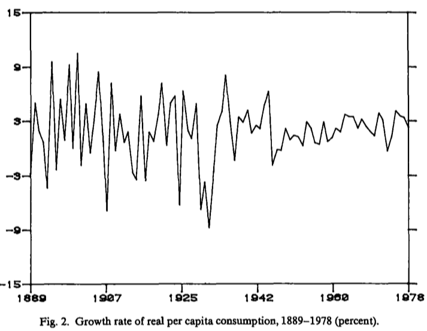

# Intro

- @Lucas1978 set the stage for modern comsumption-based asset pricing
- Lucas changed asset pricing exactly like Jimi Hendrix changed how we play the guitar!
- Elegant framework, simple elements, but powerful insights with technical precision

. . .

\vspace{1em}
**Then the 80s:** the Guns n Roses release [Appetite for Destruction](https://open.spotify.com/album/28yHV3Gdg30AiB8h8em1eW)

:::: {.columns}

::: {.column width="70%"}
- The equity premium puzzle: the Lucas-like economy cannot fit equity data
- The risk-free rate puzzle: if you torture parameters to fit equity, risk-free rates explode
- The volatility puzzle: consumption growth is too smooth to explain asset return volatility
- Where is your Asset Pricing God now, huh?
:::

::: {.column width="30%"}
{fig-align="center" width="65%"}
:::
::::

## Flight Plan

- Some empirical evidence about equity returns and consumption growth
- The Mehra-Prescott economy: setup and solution
- Taking the model to the data: the equity premium puzzle
- The risk-free rate puzzle
- Next class: the volatility puzzle and the early Campbell-Shiller papers
- After that: let's try to solve the equity premium puzzle!


# The Equity Premium Puzzle

- @Mehra1985 is our reference
- In a traditional general equilibrium environment, how large can the equity premium be?
- This is very different from the statistical shenanigans of APT!
- Here: the SDF will heavily depend on consumption growth
- Back to "$m$ high $\iff$ low consumption growth"

## Some (Annual) Data for the US
```{=latex}
\begin{table}[!htbp]
\centering
\scriptsize
\setlength{\tabcolsep}{6pt}
\renewcommand{\arraystretch}{1.2}
\begin{tabular}{l cc cc cc cc}
\toprule
& \multicolumn{2}{c}{\% growth rate of} 
& \multicolumn{2}{c}{\% real return on a} 
& \multicolumn{2}{c}{\% risk premium} 
& \multicolumn{2}{c}{\% real return on} \\
Time 
& \multicolumn{2}{c}{per capita real consumption} 
& \multicolumn{2}{c}{relatively riskless security} 
& \multicolumn{2}{c}{} 
& \multicolumn{2}{c}{S\&P 500} \\
\cmidrule(lr){2-3}
\cmidrule(lr){4-5}
\cmidrule(lr){6-7}
\cmidrule(lr){8-9}
periods 
& Mean & Std. dev. 
& Mean & Std. dev. 
& Mean & Std. dev. 
& Mean & Std. dev. \\
\midrule
1889--1978 
& 1.83 & 3.57 
& 0.80 & 5.67 
& 6.18 & 16.67 
& 6.98 & 16.54 \\
& \multicolumn{2}{c}{(Std. error = 0.38)}
& \multicolumn{2}{c}{(Std. error = 0.60)}
& \multicolumn{2}{c}{(Std. error = 1.76)}
& \multicolumn{2}{c}{(Std. error = 1.74)} \\
\addlinespace
1889--1898 
& 2.30 & 4.90 
& 5.80 & 3.23 
& 1.78 & 11.57 
& 7.58 & 10.02 \\
1899--1908 
& 2.55 & 5.31 
& 2.62 & 2.59 
& 5.08 & 16.86 
& 7.71 & 17.21 \\
1909--1918 
& 0.44 & 3.07 
& $-1.63$ & 9.02 
& 1.49 & 9.18 
& $-0.14$ & 12.81 \\
1919--1928 
& 3.00 & 3.97 
& 4.30 & 6.61 
& 14.64 & 15.94 
& 18.94 & 16.18 \\
1929--1938 
& $-0.25$ & 5.28 
& 2.39 & 6.50 
& 0.18 & 31.63 
& 2.56 & 27.90 \\
1939--1948 
& 2.19 & 2.52 
& $-5.82$ & 4.05 
& 8.89 & 14.23 
& 3.07 & 14.67 \\
1949--1958 
& 1.48 & 1.00 
& $-0.81$ & 1.89 
& 18.30 & 13.20 
& 17.49 & 13.08 \\
1959--1968 
& 2.37 & 1.00 
& 1.07 & 0.64 
& 4.50 & 10.17 
& 5.58 & 10.59 \\
1969--1978 
& 2.41 & 1.40 
& $-0.72$ & 2.06 
& 0.75 & 11.64 
& 0.03 & 13.11 \\
\bottomrule
\end{tabular}
\end{table}
```

## SP500 Returns vs Consumption Growth (USA)
:::: {.columns}

::: {.column width="50%"}
{fig-align="center" width="95%"}
:::

::: {.column width="50%"}
{fig-align="center" width="95%"}
:::
:::: 

## Similar Evidence Across Developed Markets (Quarterly Data)
```{=latex}
\begin{table}[!htbp]
\centering
\footnotesize
\setlength{\tabcolsep}{6pt}
\renewcommand{\arraystretch}{1.15}
\begin{tabular}{l l r r r r r r r r r}
\toprule
Country & Sample period & $\bar r_e$ & $\sigma(r_e)$ & $\rho(r_e)$ & $\bar r_f$ & $\sigma(r_f)$ & $\rho(r_f)$ & $\overline{\Delta c}$ & $\sigma(\Delta c)$ & $\rho(\Delta c)$ \\
\midrule
USA         & 1947Q2--2011Q2 & 6.85 & 15.98 & 0.10 & 0.72 & 1.78 & 0.36 & 1.74 & 1.64 & 0.04 \\
Australia   & 1970Q1--2011Q2 & 3.84 & 20.75 & 0.03 & 2.00 & 2.18 & 0.55 & 1.82 & 1.77 & $-0.09$ \\
Canada      & 1970Q2--2011Q2 & 5.47 & 17.85 & 0.15 & 2.07 & 1.64 & 0.66 & 1.69 & 1.93 & 0.07 \\
France      & 1973Q2--2011Q2 & 7.06 & 23.10 & 0.08 & 2.08 & 1.53 & 0.74 & 1.38 & 1.80 & $-0.13$ \\
Germany     & 1978Q4--2011Q2 & 7.54 & 23.85 & 0.04 & 2.38 & 1.09 & 0.40 & 1.74 & 4.19 & $-0.07$ \\
Italy       & 1971Q2--2011Q2 & 1.51 & 25.74 & 0.07 & 1.86 & 2.06 & 0.77 & 2.18 & 2.23 & 0.47 \\
Japan       & 1970Q2--2011Q2 & 2.70 & 21.41 & 0.09 & 1.03 & 1.91 & 0.29 & 1.72 & 2.92 & $-0.10$ \\
Netherlands & 1977Q2--2011Q2 & 8.57 & 19.76 & 0.09 & 2.29 & 1.42 & 0.45 & 1.05 & 2.21 & $-0.11$ \\
Sweden      & 1970Q1--2011Q2 & 8.93 & 25.16 & 0.12 & 1.68 & 2.23 & 0.40 & 1.23 & 1.81 & $-0.15$ \\
Switzerland & 1982Q2--2011Q2 & 8.14 & 20.05 & 0.01 & 0.87 & 1.32 & 0.03 & 0.75 & 1.30 & $-0.22$ \\
UK          & 1970Q1--2011Q2 & 6.33 & 19.85 & 0.10 & 1.34 & 2.60 & 0.46 & 2.14 & 2.68 & $-0.03$ \\
\bottomrule
\end{tabular}
\end{table}
```

## Takeaways

- Average return on stocks is high compared to consumption growth across markets
- Consumption growth is _way_ less volatile than stock returns
- Risk-free rates are low and smooth (for developed markets!)
- Stock returns have low autocorrelation
- Consumption growth even has negative autocorrelation sometimes. Italy seems an exception there

## The Mehra-Prescott Economy

- They build upon @Lucas1978 (the Lucas tree model)
- There is a representative agent with preferences over consumption streams given by
$$
  U(c)=\mathbb{E}_0\left[\sum_{t=0}^\infty \beta^t \frac{c_t^{1-\gamma}}{1-\gamma}\right]
$$
where $\beta \in (0,1)$ and $\gamma > 0$. If $\gamma = 1$, we have log-utility

. . .

- There is one unit of an equity asset that pays perishable dividends $y_t$ every period, evolving according to
$$
y_{t+1} = x_{t+1} \cdot y_t, \quad y_0 > 0
$$

- The growth rate process $x_t \in \{\lambda_1, \ldots, \lambda_n\}$ follows an ergodic Markov chain
$$
\mathbb{P}\left(x_{t+1} = \lambda_j \mid x_t = \lambda_i \right) = \phi_{ij} \in (0,1)
$$

## Household Problem (Sequential)

- Choose $\{c_t, b_{t+1}, s_{t+1}\}_{t\ge 0} \implies$ consumption, bond holdings, and shares of the tree
- State variables: $(b_t, s_t, y_t, x_t) \implies$ current holdings of bonds, shares, dividend, and growth state
- Prices: $q_t$ (bond), $p_t$ (tree)

```{=latex}
\begin{gather*}
\max_{\{c_t, b_{t+1}, s_{t+1}\}_{t \ge 0}} \; \mathbb{E}_0\left[\sum_{t=0}^\infty \beta^t \frac{c_t^{1-\gamma}}{1-\gamma}\right] \\
c_t + q_t b_{t+1} + p_t s_{t+1}
\;\le\;
b_t + (p_t + y_t)s_t, \qquad \forall t
\end{gather*}
```

Notice that marginal utility is given by $u'(c_t) = c_t^{-\gamma}$.

## The First Order Conditions

If $\mu_t$ is the Lagrange multiplier on the budget constraint at time $t$, the FOCs are:

```{=latex}
\begin{gather*}
c_t^{-\gamma} = \mu_t \\
q_t \mu_t = \beta \mathbb{E}_t\left[\mu_{t+1}\right] \\
p_t \mu_t = \beta \mathbb{E}_t\left[\mu_{t+1}(p_{t+1}+y_{t+1})\right]
\end{gather*}
```

. . .

Define the SDF:
$$
m_{t+1} = \beta \left(\frac{c_{t+1}}{c_t}\right)^{-\gamma}
= \beta \frac{\mu_{t+1}}{\mu_t}
$$

```{=latex}
\begin{gather*}
\mathbb{E}_t\!\left[m_{t+1} R_{t+1}^f\right]=1, \qquad R_{t+1}^f = \frac{1}{q_t} \\
\mathbb{E}_t\!\left[m_{t+1} R_{t+1}^e\right]=1, \qquad R_{t+1}^e = \frac{p_{t+1}+y_{t+1}}{p_t}
\end{gather*}
```

## Pricing the Tree Recursively

- These equations are no surprise if you got this far in the class
- If we iterate the equity pricing equation forward and impose the no-bubble condition, we get
$$
p_t = \mathbb{E}_t\left[\sum_{j=1}^\infty \beta^j \left(\frac{c_{t+j}}{c_t}\right)^{-\gamma} y_{t+j}\right]
$$

. . .

- Since the dividend is perishable, $c_t = y_t$ for all $t$. Then:
$$
p_t = \mathbb{E}_t\left[\sum_{j=1}^\infty \beta^j \left(\frac{y_{t+j}}{y_t}\right)^{-\gamma}\! y_{t+j}\right] = y_t \cdot \mathbb{E}_t\left[\sum_{j=1}^\infty \beta^j \left(\frac{y_{t+j}}{y_t}\right)^{1-\gamma}\right]
$$

. . .

- Since $q_t = \mathbb{E}_t[m_{t+1}]$, then
$$
q_t = \beta \mathbb{E}_t\left[\left(\frac{y_{t+1}}{y_t}\right)^{-\gamma}\right] = \beta \mathbb{E}_t\left[x_{t+1}^{-\gamma}\right]
$$

## Solving the Mehra-Prescott Economy

- Guess a solution for the price-dividend ratio:
$$
\frac{p_t}{y_t} = f(x_t)
$$

- Why is this a reasonable guess in this environment?

. . .

- Since we have $n$ states for $x_t$, we have $n$ unknowns: $f(\lambda_1), \ldots, f(\lambda_n)$
- Let's search for these unknowns using the notation $F \equiv [f_1, \dots, f_n]^\top$

. . .

- To ease computations, define the following matrices/vectors:
  - $\Phi \equiv [\phi_{ij}]$ (transition matrix)
  - $D \equiv \text{diag}(\lambda_1^{1-\gamma}, \ldots, \lambda_n^{1-\gamma})$
  - $\mathbf{1} \equiv [1, \ldots, 1]^\top$ (vector of ones)


## Solving a Linear System

- Recall the recursive pricing equation:
$$
p_t = \mathbb{E}_t\left[m_{t+1} (p_{t+1} + y_{t+1})\right]
$$

- This equation can be written as 
$$
f(x_t) = \beta \mathbb{E}_t\left[x_{t+1}^{1-\gamma} (f(x_{t+1}) + 1)\right]
$$

. . .

- Using the notation from before:

$$
F = \beta \Phi D F + \beta \Phi D \mathbf{1} \implies (I - \beta \Phi D) F = \beta \Phi D \mathbf{1}
$$

- @Mehra1985 shows an explicit condition on $D$ and $\Phi$ such that $[I - \beta \Phi D]$ is invertible. In that case (show it at home):

$$
F = \beta [I - \beta \Phi D]^{-1} \Phi D \mathbf{1}
$$

## Equilibrium Returns

- The price $q_t$ is also a function of the state $x_t$:
$$
q(x_t = \lambda_i) \equiv q_i = \beta \sum_{j=1}^n \phi_{ij} \lambda_j^{-\gamma},\quad  \forall i=1,\ldots,n
$$

- The risk-free rate in state $x_t = \lambda_i$ is given by
$$
R_i^f = \frac{1}{q_i} = \frac{1}{\beta \sum_{j=1}^n \phi_{ij} \lambda_j^{-\gamma}}
$$

. . .

- The (gross) return on equity from state $i$ to state $j$ is:
$$
R_{i,j}^e = \frac{p_{t+1} + y_{t+1}}{p_t} = \lambda_j \left(\frac{f_j + 1}{f_i}\right)
$$

## Unconditional Averages
- Let $\pi = [\pi_1, \ldots, \pi_n]$ be the stationary distribution of the Markov chain for $x_t$
- This distribution is characterized as
$$
\pi = \Phi^\top \pi, \quad \sum_{i=1}^n \pi_i = 1
$$

- The unconditional mean risk-free rate is
$$
\bar R^f = \sum_{i=1}^n \pi_i R_i^f
$$

. . .

- The unconditional mean return on equity is
$$
\bar R^e = \sum_{i=1}^n \pi_i \left(\sum_{j=1}^n \phi_{ij} R_{i,j}^e\right)
$$

- The risk premium is then $\overline{RP} = \bar R^e - \bar R^f$

## {.standout}
Questions?

# Taking this to the Data

- Parameters defining preferences: $\beta$ and $\gamma$
- Parameters defining the technology: $\{\lambda_i\}_{i=1}^n$ and $\Phi$

. . .

- They assumed two states for consumption growth: $n=2$
- There are three parameters for technology: $\theta$, $\delta$, and $\phi$:
```{=latex}
\vspace{-1em}
\begin{gather*}
\lambda_1 = 1 + \theta + \delta, \quad \lambda_2 = 1 + \theta - \delta \\
\Phi = \begin{bmatrix} \phi & 1 - \phi \\ 1 - \phi & \phi \end{bmatrix}
\end{gather*} 
```

. . .

- Parameters were calibrated to match the average, standard deviation, and first autocorrelation of US consumption growth
$$
\theta = 0.018, \quad \delta = 0.036, \quad \phi = 0.43
$$

## Preference Parameters and Feasible Region
```{=latex}
\begin{columns}[c]
\column{0.45\textwidth}
\begin{itemize}\itemsep1em
\item Vast literature on $\gamma$, but typical values are less than 10.
\item Theory implies $\beta \in (0,1)$
\item Given a pair $(\gamma, \beta) \in [1,10]\times(0,1)$, the model is determined
\item Why not try many values to match the equity premium and the risk-free rate?
\item Essentially, no pair is able to match the data!
\end{itemize}
\column{0.55\textwidth}
\centering
\includegraphics[width=0.9\linewidth]{Admissible_Region.png}
\end{columns}
```

# The Risk-Free Rate Puzzle

- The Equity Premium Puzzle has a close cousin: the Risk-Free Rate Puzzle
- This is due to @Weil1989

. . .

**Main Idea**:

- What if we bump up the risk aversion parameter $\gamma$ to match the equity premium?
- What happens to the risk-free rate then? Maybe the previous evidence on $\gamma$ is all wrong!

. . .

- We shall prove that, for realistic values of consumption growth volatility, $\uparrow \gamma \implies R_f \uparrow$ 

. . .

- Any intuition why? What would break this result?

## A Quick Math Lemma
- We need to prove a lemma first. We want to show that, if $X$ has enough moments, then
$$
\log(\mathbb{E}\left[e^X\right]) \approx \mathbb{E}[X] + \frac{1}{2} \text{Var}(X)
$$

- In case $X$ is Gaussian, this is exact!

. . .

- Recall the moment generating function (MGF) of $X$:
$$
M_X(t) \equiv \mathbb{E}\left[e^{tX}\right]
$$
- Define also the cumulant generating function (CGF):
$$
K_X(t) \equiv \log(M_X(t)) = \log\left(\mathbb{E}\left[e^{tX}\right]\right)
$$

- Notice that we want to approximate $K_X(1)$

## Mr. Taylor To The Rescue

- Let's do a second-order approximation around $t=0$:
$$
K_X(1) \approx K_X(0) + K_X'(0)(1-0) + \frac{1}{2} K_X''(0)(1-0)^2
$$

- Recall that $M_X^{(n)}(0) = \mathbb{E}[X^n]$. Using this, we can compute the derivatives of $K_X(t)$:
```{=latex}
\vspace{-2em}
\begin{gather*}
K_X(0) = \log\left(\mathbb{E}\left[e^{0}\right]\right) = 0 \\
K_X'(t) = \frac{M_X'(t)}{M_X(t)} \implies K_X'(0) = \mathbb{E}[X] \\
K_X''(t) = \frac{M_X''(t) M_X(t) - (M_X'(t))^2}{(M_X(t))^2} \implies K_X''(0) = \text{Var}(X)
\end{gather*}
```

. . .

- Then we have that
$$
\log(\mathbb{E}\left[e^X\right]) = K_X(1) \approx \mathbb{E}[X] + \frac{1}{2} \text{Var}(X)
$$

## Applying The Lemma

- Recall that $\mathbb{E}_t[m_{t+1}] = \frac{1}{R^f_t}$ and that
$$
m_{t+1} = \beta \left(\frac{c_{t+1}}{c_t}\right)^{-\gamma} = \beta e^{-\gamma \Delta c_{t+1}}, \qquad \Delta c_{t+1} \equiv \log\left(\frac{c_{t+1}}{c_t}\right)
$$

. . .

- Using the lemma (and using the unconditional version of the pricing equation):

$$
\log\left(\mathbb{E}[m_{t+1}]\right) \approx \log(\beta) - \gamma \mathbb{E}[\Delta c_{t+1}] + \frac{1}{2} \gamma^2 \text{Var}(\Delta c_{t+1})
$$

- Let $r^f \equiv \log(R_f)$. Then:
$$
r^f \approx -\log(\beta) + \gamma \mathbb{E}[\Delta c_{t+1}] - \frac{1}{2} \gamma^2 \text{Var}(\Delta c_{t+1})
$$

## Two Economic Forces
$$
r^f \approx -\log(\beta) + \gamma \mathbb{E}[\Delta c_{t+1}] - \frac{1}{2} \gamma^2 \text{Var}(\Delta c_{t+1})
$$

- When $\gamma$ increases, there are two economic forces at play. What's the intuition?

. . .

- In the US data, $\mathbb{E}[\Delta c] \approx 1.75\%$, with $\sigma^2(\Delta c) \approx 0.0165^2 = 0.00027225 \approx 0.027\%$
- The first term is two orders of magnitude larger than the second

. . .

- Bumping up $\gamma$ to match the equity premium will make $r^f$ explode!
- The average real risk-free rate in the US for 1947-2011 was 0.72\% per year (see @campbell_financial_2018)

## Risk Aversion and Intertemporal Substitution

- Notice that $\gamma$ controls the Arrow-Pratt measure of relative risk aversion;

```{=latex}
\begin{gather*}
u(c)=\frac{c^{1-\gamma}}{1-\gamma}, \qquad
\text{RRA} \equiv -\frac{c u''(c)}{u'(c)} = \gamma
\end{gather*}
```

. . .

- But it also controls the intertemporal substitution:
```{=latex}
\begin{gather*}
1 = \beta R_{t+1} \left(\frac{c_{t+1}}{c_t}\right)^{-\gamma}
 \;\Rightarrow\;
\frac{c_{t+1}}{c_t} = (\beta R_{t+1})^{1/\gamma} \\
\text{EIS} \equiv \frac{\partial \log(c_{t+1}/c_t)}{\partial \log R_{t+1}} = \frac{1}{\gamma}
\end{gather*}
```

- $\uparrow \gamma \implies$ more risk averse **and** less willing to shift consumption over time

## {.standout}
Questions?

## AI-Generated Summary

- Standard power utility with $\gamma < 10$ cannot generate 6% equity premium
- Increasing $\gamma$ to match equity premium makes $r^f$ explode
- CRRA confounds risk aversion and intertemporal substitution (EIS $= 1/\gamma$)
- Consumption too smooth: $\sigma(\Delta c) \ll \sigma(r^e)$


## Readings and References {.noframenumbering .allowframebreaks}
\footnotesize
