# Intro

- Last class: equity premium and risk-free rate puzzles
- Consumption too smooth: $\sigma(\Delta c) \ll \sigma(r^e)$

. . .

**Today: Excessive Volatility**

- Prices move too much for constant discount rates (@Shiller1981)
- Campbell-Shiller: decompose into expected returns vs dividend growth
- Discount-rate news dominates (@Campbell1991, @cochrane_presidential_2011)
- Subjective beliefs revive cash-flow news (@DeLaO2021)


# Do Stock Prices Move Too Much to be Justified by Subsequent Changes in Dividends?

## Motivation

- @Shiller1981 is a provocative paper
- Equity prices move around a lot... can dividend expectation changes justify this?

. . .

- Typical model to price stocks (recall your analyst friend from Lecture 1):

$$
P_t = \mathbb{E}_t\left[\sum\limits_{k=1}^{\infty}\frac{D_{t+k}}{(1+r)^k}\right]
$$

- $D_{t+k}$ = dividend at time $t+k$
- $r$ = constant discount rate

. . .

- With constant $r$, can this model generate the same volatility in prices as seen in the data?
- Price changes **must** be driven by news about future dividends!

## Realized vs Forecasted Dividends

- The "efficient market model" implies:
$$
P_t = \mathbb{E}_t\left[\sum\limits_{k=1}^{\infty}\frac{D_{t+k}}{(1+r)^k}\right] = \sum\limits_{k=1}^{\infty}\gamma^{k}\mathbb{E}_t[D_{t+k}], \qquad  \gamma \equiv \frac{1}{1+r}
$$

. . .

- Realized dividends are the sum of expected dividends and an "innovation" (forecast error):
$$
D_{t+k} = \mathbb{E}_{t}[D_{t+k}] + \varepsilon_{t+k}, \quad \mathbb{E}_{t}[\varepsilon_{t+k}] = 0
$$

. . .

- The realized series cannot be smoother than its projection:
$$
\sigma^2(D_{t+k}) = \sigma^2(\mathbb{E}_{t}[D_{t+k}] + \varepsilon_{t+k}) = \sigma^2(\mathbb{E}_{t}[D_{t+k}]) + \sigma^2(\varepsilon_{t+k}) \geq \sigma^2(\mathbb{E}_{t}[D_{t+k}])
$$

## Shiller's Key Insight

- Let $P_t^* \equiv \sum\limits_{k=1}^{\infty}\gamma^{k}D_{t+k}$. How should $\sigma(P_t^*)$ and $\sigma(P_t)$ compare?

. . .

- Let $\Pi_t$ be the GDP deflator and $A \equiv 1+g$, where $g$ a growth rate for real dividends
- Shiller deflated the index prices and dividends by inflation and the growth rate:
  
$$
p_t \equiv \frac{P_t}{\Pi_t A^{t-T}}, \qquad d_t \equiv \frac{D_t}{\Pi_t A^{t+1-T}}
$$
where $T = 1978$ is the last year of the sample and $g$ is estimated as the constant log-growth rate of real dividends.

. . .

- Then we have $p_t = \sum\limits_{k=1}^{\infty}\tilde{\gamma}^{k}\mathbb{E}_t[d_{t+k}]$, where $\tilde{\gamma} \equiv \frac{A}{1+r} = A\gamma$

. . .

- Similarly: $p_t^* = \sum\limits_{k=1}^{\infty}\tilde{\gamma}^{k}d_{t+k}$

## Shiller's Key Insight

- Crucially, we have the relationship:
$$
p_t = \mathbb{E}_t[p_t^*] \implies \sigma^2(p_t) = \sigma^2(\mathbb{E}_t[p_t^*]) \leq \sigma^2(p_t^*)
$$

. . .

**Implementation matters**:

- Dividends after 1978 are unknown at time $t$
- Shiller assumed that they would grow at rate $g$ forever
- This assumption likely understates $\sigma^2(p_t^*)$

. . . 

- $p^*_{1978}$ is computed with "fake dividends" and then you use the recursion backward:
$$
p^*_t = \tilde{\gamma}(d_{t+1} + p^*_{t+1})
$$
- The discount rate $r$ is such that $r = \frac{\mathbb{E}[d]}{\mathbb{E}[p]}$ (why was deflating necessary for this step?)

## The Main Plot
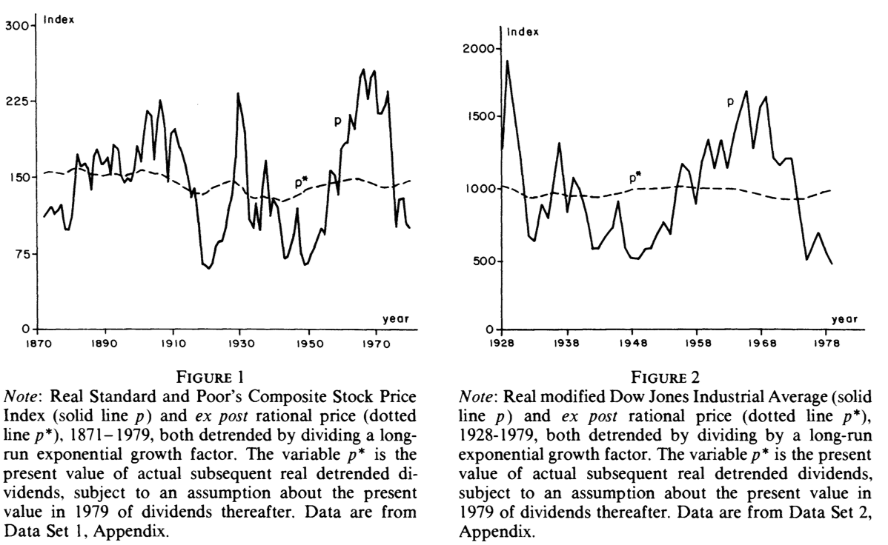{fig-align="center" width="83%"}

## Main Numerical Result

```{=latex}
\begin{columns}[c]
\begin{column}{0.5\textwidth}
\begin{itemize}\itemsep1em
\item Strange things: inequalities upside down!
\item You see many rows because he derived many bounds with different assumptions
\item The data is rejecting theory by an order of magnitude
\item $50 > 8$ and $355.9 > 26.8$
\end{itemize}

\vspace{0.5cm}
\textbf{Historical evidence}:

\begin{itemize}\itemsep1em
\item During the Great Depression, (real) dividends were below average only on 1933-1935, and 1939
\item But returns were pretty bad!
\end{itemize}
\end{column}
\begin{column}{0.5\textwidth}
\begin{center}
\includegraphics[width=0.68\textwidth]{Table2.png}
\end{center}
\end{column}
\end{columns}
```

## Newer Data
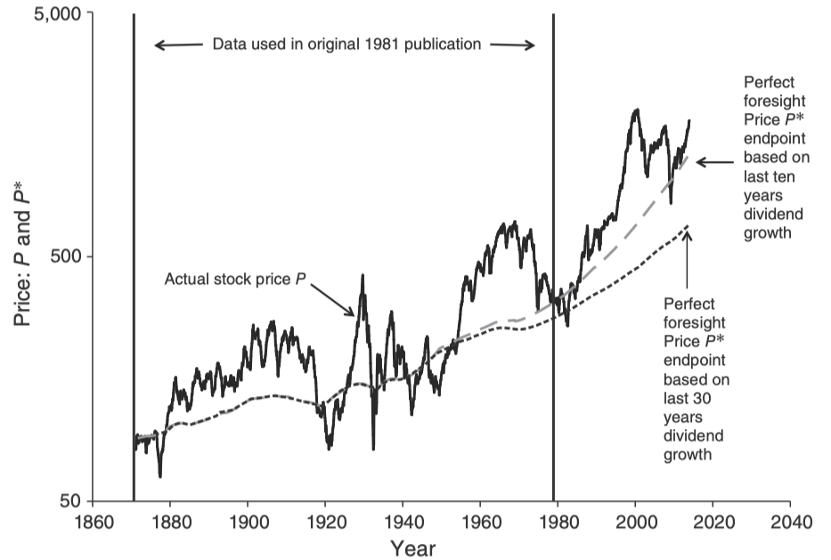{fig-align="center" width="75%"}

## What if Discount Rates Vary?

- We can always write:
$$
P_t = \mathbb{E}_t\left[\sum\limits_{k=1}^{\infty}D_{t+k}\prod\limits_{j=1}^{k}\frac{1}{1+r_{t+j-1}}\right]
$$
- If we impose no discipline, this will always be true for some series of returns
- @Shiller1981 used 6-month prime commercial paper + a constant
- @Shiller2014 used our good and old friend:
$$
r_{t+1}  = -\log(\beta) + \delta \cdot \Delta c_{t+1}
$$

## Newer Data and Time-Varying Interest Rates
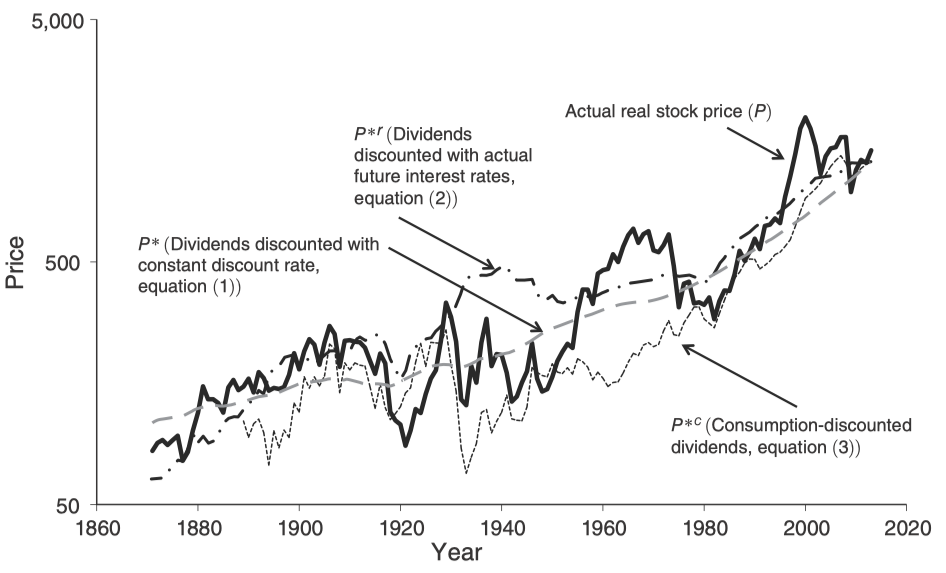{fig-align="center" width="80%"}

## Where The Literature Took This

**Takeaway message**: 

- Stock prices move too much to be justified by subsequent changes in dividends
- The natural way to reconcile this is allowing for rich time-variation in discount rates

**Two Paths Forward**:

. . .

1. **Return decompositions**: how much of price movements is due to changes in dividend expectations vs expected returns? [@CampbellShiller1988; @Campbell1991; @cochrane_presidential_2011]

. . .

2. **Behavioral finance and limits to arbitrage**: prices deviate from fundamentals due to investor psychology and limits to arbitrage [@DeLong1990; @ShleiferVishny1997; @Shiller2014; @BarberisThaler2003; @Barberis2018]

## Behavioral Finance

- Excess volatility could reflect investor psychology, not rational risk premia
- Noise traders and limits to arbitrage [@DeLong1990; @ShleiferVishny1997]
- @Shiller2014: irrational exuberance and social dynamics drive speculative prices

. . .

- Surveys: @BarberisThaler2003 and @Barberis2018 (extrapolation, overconfidence, prospect theory)
- We will not pursue this path, but it is an important and active research program


## {.standout}
Questions?

# Discount Rates: They Like to Move It!

## The Campbell-Shiller Decomposition

- @CampbellShiller1988 made a simple, crazy powerful point
- Prices are *discounted expected cash-flows*: either return or dividends expectations must move to **generate** returns! 

. . .

- *The dividend-price ratio can only move if either **expected returns** or **expected dividend growth** moves, regardless of your mambo-jambo model!*
- They introduced the "Campbell-Shiller" decomposition, based on a Taylor expansion
- An almost model-free playground to test theories of time-varying discount rates

## Campbell--Shiller Log-Linearization (Setup)

- Exact log return identity:
$$
h_t \equiv \log(P_{t+1}+D_t)-\log(P_t)
$$

. . .

- Rewrite the nonlinear term:
$$
\log(P_{t+1}+D_t)=p_{t+1}+\log\!\left(1+\exp(d_t-p_{t+1})\right)
$$

- Define the log dividend--price ratio:
$$
\delta_{t+1}\equiv d_t-p_{t+1}
$$

- Dividend $D_t$ is paid at time $t+1$ in this notation (keeping it close to the paper)

---

## Campbell--Shiller Log-Linearization (Taylor Step)

- Let $g(\delta)\equiv \log(1+e^\delta)$ and expand around $\bar\delta$ (the long-run average):
$$
g(\delta_{t+1})\approx g(\bar\delta)+g'(\bar\delta)(\delta_{t+1}-\bar\delta)
$$

. . .

- Derivative and the key constant $\rho$:
$$
g'(\delta)=\frac{e^\delta}{1+e^\delta},\qquad
1-\rho\equiv g'(\bar\delta),\qquad
\rho=\frac{1}{1+e^{\bar\delta}}
$$

. . .

- Collect constants into $k$:
$$
\log(P_{t+1}+D_t)\approx k+\rho\,p_{t+1}+(1-\rho)\,d_t
$$


## Campbell--Shiller Log-Linear Return + Forward Solution

- Substitute into the return identity:
$$
h_t \approx k+\rho\,p_{t+1}+(1-\rho)\,d_t-p_t
$$

. . .

- Express in terms of $\delta_t\equiv d_{t-1}-p_t$:
$$
h_t \approx k+\Delta d_t+\delta_t-\rho\,\delta_{t+1}
$$

. . .

- Rearranged recursion and forward solution:
$$
\delta_t = (h_t-\Delta d_t-k)+\rho\,\delta_{t+1}
\;\Rightarrow\;
\boxed{\delta_t = \sum_{j=0}^{\infty}\rho^j\big(h_{t+j}-\Delta d_{t+j}\big)-\frac{k}{1-\rho}}
$$

- This equation has no economic content: it is an (approximate) **identity**. Intuition?

## How to Add Empirical Content

- Notice that we can take expectations conditional on information at time $t$:
$$
\delta_t = \mathbb{E}_t\left[\sum_{j=0}^{\infty}\rho^j\big(h_{t+j}-\Delta d_{t+j}\big)\right]-\frac{k}{1-\rho} = \sum_{j=0}^{\infty}\rho^j\big(\mathbb{E}_t[h_{t+j}]-\mathbb{E}_t[\Delta d_{t+j}]\big)-\frac{k}{1-\rho}
$$

- An Asset Pricing model will imply structure about $\mathbb{E}_t[h_{t+j}]$ and $\mathbb{E}_t[\Delta d_{t+j}]$

. . .

- Example: suppose that for some $r_{t+j}$ and some $c$ we have $\mathbb{E}_t[h_{t+j}] = \mathbb{E}_t[r_{t+j}] + c$
- We can write:
$$
\delta_t = \sum_{j=0}^{\infty}\rho^j\big(\mathbb{E}_t[r_{t+j}]-\mathbb{E}_t[\Delta d_{t+j}]\big)+\frac{c-k}{1-\rho}
$$

- This will become testable once we specify a model for returns and dividends
  
. . .

- Example: give me $\tilde{r}_{t,j} \equiv \mathbb{E}_t[r_{t+j}]$ and $\tilde{\Delta d}_{t,j} \equiv \mathbb{E}_t[\Delta d_{t+j}]$ and generate $\tilde{\delta}_t$
- We should have $\delta_t \approx \tilde{\delta}_t$

## {.standout}
Questions?

# Campbell and Shiller Meet the Data

## There is hope in the approximation!
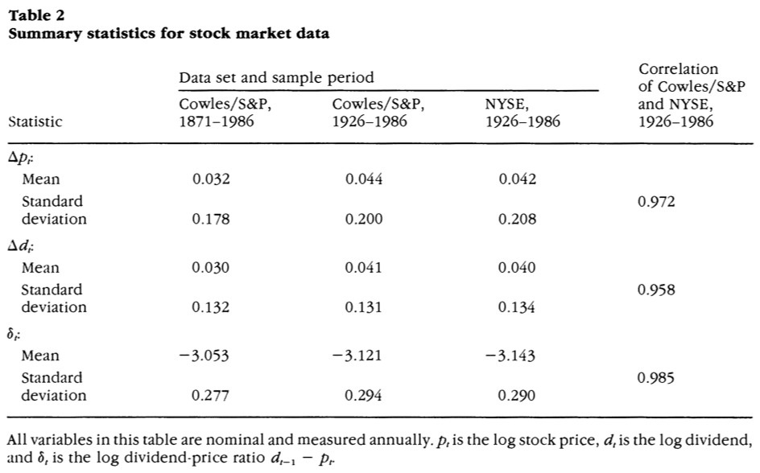{fig-align="center" width="80%"}

## Setup

- Assume that market participants use state variables $y_t$ to do forecasts
- $y_t$ evolves linearly (think about an MA($\infty$) process)
- The econometrician observes (with abuse of notation) $x_t \equiv (\delta_t, h_{t-1}, \Delta d_{t-1})^\top \subset y_t$

. . .

- Assume that $x_t$ (already demeaned) follows a VAR($p$):
$$
x_t = C_1 x_{t-1} + \ldots + C_p x_{t-p} + u_t
$$ 
where all variables are demeaned and $u_t$ is a white noise process each $C_i$ is a $3\times 3$ matrix

. . .

- Rewrite the VAR in companion form:
$$
z_t \equiv \begin{bmatrix}
x_t \\
x_{t-1} \\
\vdots \\
x_{t-p+1}
\end{bmatrix}
=
\begin{bmatrix}
C_1 & C_2 & \ldots & C_p \\
I & 0 & \ldots & 0 \\
0 & I & \ldots & 0 \\
\vdots & \vdots & \ddots & \vdots \\
0 & 0 & \ldots & 0
\end{bmatrix}
\begin{bmatrix}
x_{t-1} \\
x_{t-2} \\
\vdots \\
x_{t-p} \\
\end{bmatrix}+
\begin{bmatrix}
u_t \\
0 \\
\vdots \\
0
\end{bmatrix} = A z_{t-1} + v_t
$$

## The VAR Approach

- The companion form implies: $\mathbb{E}_t[z_{t+j}] = A^j z_t$
- The VAR is a forecasting machine to generate discount rate and dividend forecasts
- Given $A$, we can compute:
$$
\tilde{\delta}_t = \sum_{j=0}^{\infty}\rho^j\big(\mathbb{E}[h_{t+j}| \{x_t, x_{t-1}, \ldots\}]-\mathbb{E}[\Delta d_{t+j}| \{x_t, x_{t-1}, \ldots\}]\big)
$$

. . .

- Let $e_1 = (1,0,0, \ldots, 0)^\top$ and $e_2 = (0,1,0, \ldots, 0)^\top$ and $e_3 = (0,0,1,0, \ldots, 0)^\top$. Then:
$$
\tilde{\delta}_t = \sum_{j=0}^{\infty}\rho^j\big(e_2^\top A^{j+1} z_t - e_3^\top A^{j+1} z_t\big) = \sum_{j=0}^{\infty}\rho^j\big((e_2-e_3)^\top A^{j+1} z_t\big)
$$

. . .

- What condition would make the observed $\delta_t$ and the synthetic $\tilde{\delta}_t$ match?

## Rational Pricing Implies Objective Forecasts

- If we impose $\delta_t = \tilde{\delta}_t$, then:
$$
e_1^\top z_t = \delta_t = \tilde{\delta}_t = \sum_{j=0}^{\infty}\rho^j\big((e_2-e_3)^\top A^{j+1} z_t\big) = \bigg(\sum_{j=0}^{\infty}\rho^j (e_2-e_3)^\top A^{j+1}\bigg) z_t, \forall z_t
$$

. . .

- This would imply the following restriction on the VAR coefficients:
$$
\boxed{
e_1^\top = \bigg(\sum_{j=0}^{\infty}\rho^j (e_2-e_3)^\top A^{j+1}\bigg) = (e_2-e_3)^\top A(I-\rho A)^{-1}
}
$$

. . .

- We can do a Wald test! This is just a (non-linear) restriction on the VAR coefficients!
- A rejection would imply that whatever theory we imposed to generate the forecasts is not consistent with the data
- $\rho = 0.93$ to match average dividend--price ratio in the data

## Tested Theory 1

- They assume a constant conditional expected return $\mathbb{E}_t[h_{t+j}] = \bar{r}$
- They can use $x_t = (\delta_t, \Delta d_{t-1})$ here since $\bar{r}$ gets absorbed

. . .

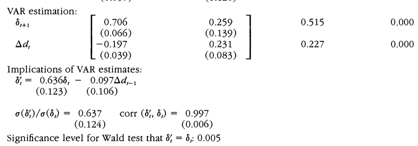{fig-align="center" width="90%"}

- The idea of constant expected returns is easily rejected!

## Tested Theory 2

- They impose a constant *premium* over the risk-free rate: $\mathbb{E}_t[h_{t+j}] = \mathbb{E}_t[r^f_{t+j}] + c$
- Use $x_t = (\delta_t, r_{t-1}^f - \Delta d_{t-1})$ with nominal variables -- inflation cancels out!

. . .

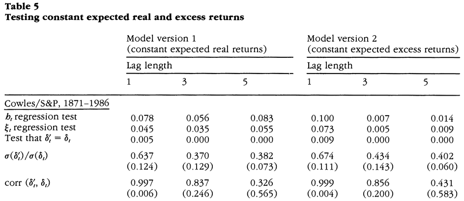{fig-align="center" width="90%"}

## Tested Theory 3 and 4

- The third one: $\mathbb{E}_t[h_{t+j}] = \alpha \cdot \mathbb{E}_t[\Delta c_{t+j}] + \text{constant}$, where $\alpha$ is an estimated RRA parameter
- The fourth one: $\mathbb{E}_t[h_{t+j}] = \alpha \cdot V_t + \text{constant terms}$, where $V_t = h_t^2$ is a proxy for volatility
- This is due to @Mehra1985 and @Pyndick1984

## Tested Theory 3 and 4
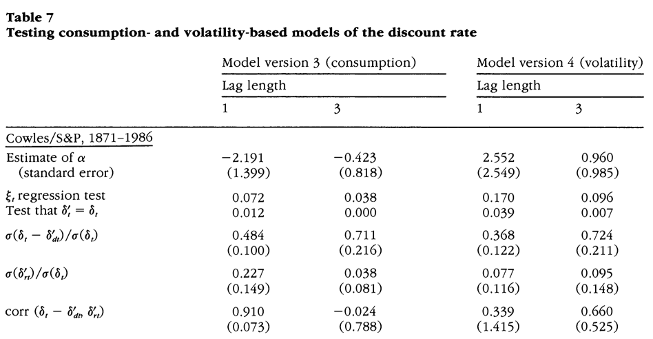{fig-align="center" width="90%"}

## Main Takeaways from C-S 1988

- @CampbellShiller1988 called it: the dividend-price ratio can only move if either expected returns or expected dividend growth moves
- Their decomposition imposes very little structure! *You give me some theory, my VAR gives you a test.*
- Constant expected returns cannot rationalize the data!
- Allowing the discount rates to depend on consumption and volatility was *not* enough
- Expected discount rates *have* to move, and they have to move a lot!

## {.standout}
Questions?

# The Variance Decomposition of Returns

## From C-S Identity to News Decomposition

- @Campbell1991 took the C-S log-linearization one step further
- Recall the approximate identity:
$$
h_t \approx k + \Delta d_t + \delta_t - \rho\,\delta_{t+1}
$$

. . .

- The forward solution gives:
$$
h_t \approx -\sum_{j=1}^{\infty}\rho^j \Delta d_{t+j} + \sum_{j=1}^{\infty}\rho^j h_{t+j} + \Delta d_t + (1-\rho)\delta_t + k'
$$
where $k' \equiv k/(1-\rho)$ collects constants

. . .

- This is still just an identity -- but now let's take *surprises*

## Taking Surprises

- Define the "surprise operator": $(\mathbb{E}_t - \mathbb{E}_{t-1})[\cdot]$
- Apply it to both sides of the identity. Constants and $t-1$-known quantities vanish:

$$
h_t - \mathbb{E}_{t-1}[h_t] = (\mathbb{E}_t - \mathbb{E}_{t-1})\left[\sum_{j=0}^{\infty}\rho^j \Delta d_{t+j}\right] - (\mathbb{E}_t - \mathbb{E}_{t-1})\left[\sum_{j=1}^{\infty}\rho^j h_{t+j}\right]
$$

. . .

- Define **cash-flow news** and **discount-rate news**:
$$
\eta_{d,t} \equiv (\mathbb{E}_t - \mathbb{E}_{t-1})\sum_{j=0}^{\infty}\rho^j \Delta d_{t+j}, \qquad \eta_{h,t} \equiv (\mathbb{E}_t - \mathbb{E}_{t-1})\sum_{j=1}^{\infty}\rho^j h_{t+j}
$$

## The @Campbell1991 Decomposition

$$
\boxed{h_t - \mathbb{E}_{t-1}[h_t] = \eta_{d,t} - \eta_{h,t}}
$$

- Unexpected returns = cash-flow news $-$ discount-rate news
- Still an approximate identity -- no model content yet!

. . .

- Intuition for the signs:
  - Good cash-flow news ($\eta_{d,t} > 0$): future dividends revised upward $\implies$ positive surprise return
  - Positive discount-rate news ($\eta_{h,t} > 0$): expected future returns revised upward $\implies$ current price drops $\implies$ negative surprise return

. . .

- This is the key equation: how much of the variance of unexpected returns comes from each component?

## VAR Implementation for News

- Use the same VAR machinery from the C-S section. With $z_t = A z_{t-1} + v_t$:
$$
(\mathbb{E}_t - \mathbb{E}_{t-1})[z_{t+j}] = A^jz_t - A^j\mathbb{E}_{t-1}[z_t] = A^j\left(z_t - \mathbb{E}_{t-1}[z_t]\right) = A^j v_t
$$

. . .

- Discount-rate news (let $e_h$ select the return row from $z_t$):
$$
\eta_{h,t} = e_h^\top \sum_{j=1}^{\infty}\rho^j A^j \, v_t = e_h^\top \rho A(I - \rho A)^{-1} v_t
$$

. . .

- Cash-flow news (backed out from the identity):
$$
\eta_{d,t} = (h_t - \mathbb{E}_{t-1}[h_t]) + \eta_{h,t} = e_h^\top v_t + e_h^\top \rho A(I - \rho A)^{-1} v_t
$$

. . .

- Both $\eta_{d,t}$ and $\eta_{h,t}$ are linear functions of the VAR innovations $v_t$
- $\text{Var}(\eta_{h,t}) = \lambda ' \Sigma_v \lambda$ where $\lambda \equiv e_h^\top \rho A(I - \rho A)^{-1}$ and $\Sigma_v$ is the covariance matrix of $v_t$

## The Variance Decomposition

- Take variances of the decomposition $h_t - \mathbb{E}_{t-1}[h_t] = \eta_{d,t} - \eta_{h,t}$:
$$
\text{Var}(h_t - \mathbb{E}_{t-1}[h_t]) = \text{Var}(\eta_{d,t}) + \text{Var}(\eta_{h,t}) - 2\,\text{Cov}(\eta_{d,t}, \eta_{h,t})
$$

. . .

- Divide both sides by $\text{Var}(h_t - \mathbb{E}_{t-1}[h_t])$:
$$
1 = \frac{\text{Var}(\eta_{d,t})}{\text{Var}(h_t - \mathbb{E}_{t-1}[h_t])} + \frac{\text{Var}(\eta_{h,t})}{\text{Var}(h_t - \mathbb{E}_{t-1}[h_t])} - \frac{2\,\text{Cov}(\eta_{d,t}, \eta_{h,t})}{\text{Var}(h_t - \mathbb{E}_{t-1}[h_t])}
$$

. . .

- Notice that $\text{Var}(h_t - \mathbb{E}_{t-1}[h_t]) = e_h^\top \Sigma_v e_h$
- The question: which share is larger?
- This is all computable from the VAR estimates ($A$ and $\Sigma_v$)

## Another Interesting Measure

- If expected returns are moving around, these expectations might have some persistence
- Let $u_{t} \equiv [\mathbb{E}_t - \mathbb{E}_{t-1}]h_{t+1}$. 
- This is news about tomorrow's return, which came in today
- Notice that $u_t = e_h^\top A v_t$

. . .

- Define $P_h$ as the following ratio:
$$
P_h \equiv \frac{\sigma(\eta_{h, t})}{\sigma(u_t)} = \frac{\lambda^\top \Sigma_v \lambda}{e_h^\top A \Sigma_v A^\top e_h}
$$

- Intuition: if $u_t$ increases, by how much does $\eta_{h,t}$ increase?
- Important exercise: show that if $\mathbb{E}_{t}[h_{t+1}]$ follows an AR(1), $\eta_{h,t}$ and $u_t$ are proportional

. . .

Notes on implementation:

- Everything is done at the monthly frequency, unless specified otherwise
- Focus on the broad NYSE index to smooth dividends

## Variance Decomposition
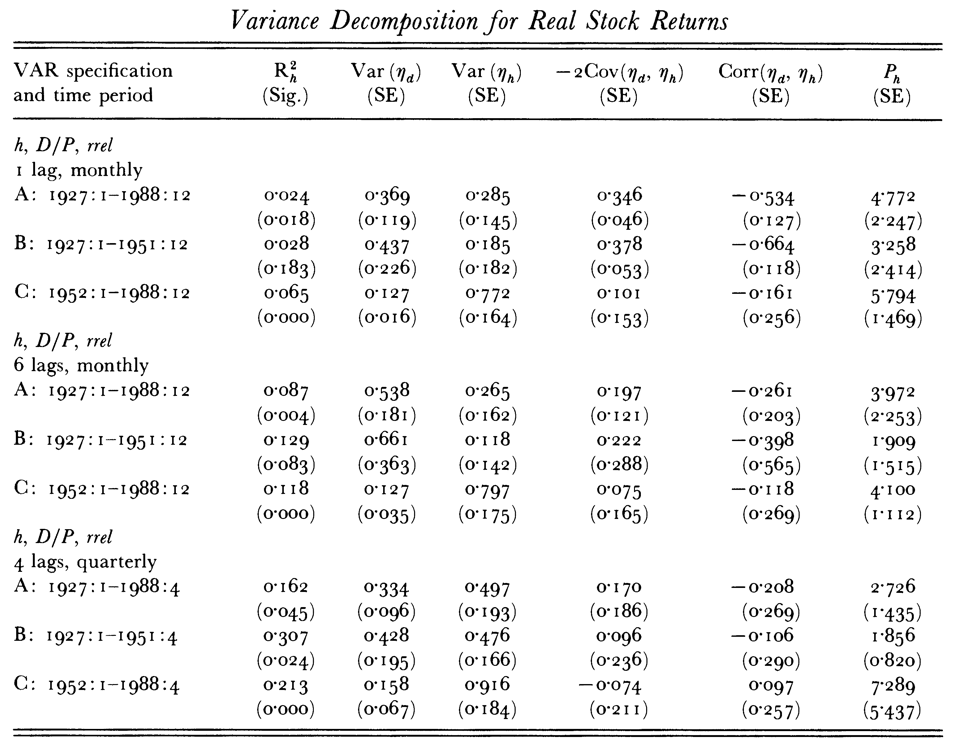{fig-align="center" width="65%"}

## Implied Variance Ratios
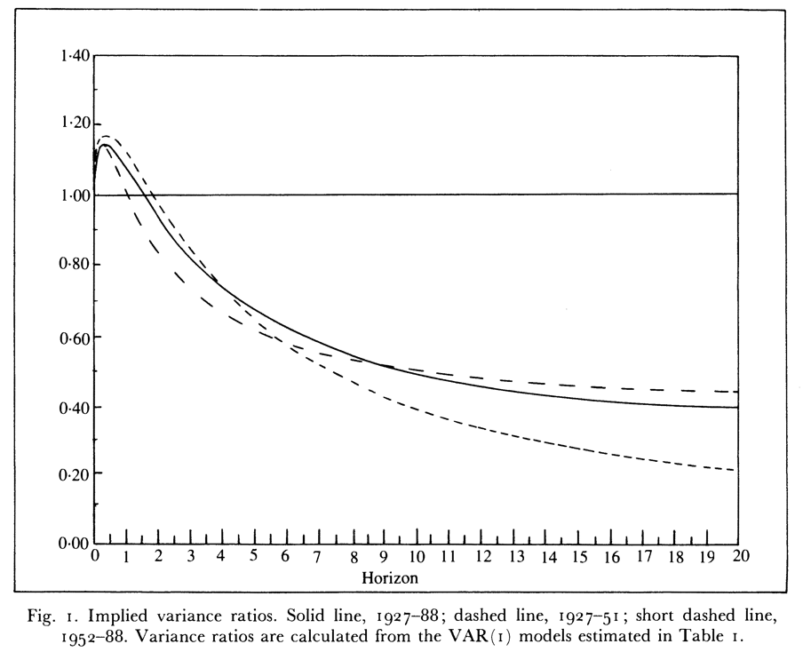{fig-align="center" width="70%"}

## Main Takeaways from @Campbell1991

- News about *expected returns* explain at least half of the variation in unexpected *realized returns*
- Expected returns are persistent, and show negative autocorrelation at longer horizons
- This is consistent with the idea that expected returns are time-varying and that they are a key driver of stock price movements
- In the post-war period, it's almost all discount-rate news and very little cash-flow news

## {.standout}
Questions?

## Taking Stock
- @Shiller1981 showed that stocks prices are too volatile to be consistent by constant discount rates
- @CampbellShiller1988 built the decomposition framework and tested theories of time-varying discount rates
- Strong rejection of constant premia and of premia that depend on consumption growth and volatility
- @Campbell1991: *You guys have been paying attention to wrong thing!*
- Most of the variation in stock prices comes from variation in expected returns!

. . .

**Implications for Asset Pricing**:
- The bar is high: models should have time-varying discount rates
- From @Mehra1985: rates should be higher than what a Lucas-economy can deliver
- Oh, and by the way, they should move a lot!


## Implications and Road Ahead

- Shiller showed that prices are too volatile under constant discount rates
- @CampbellShiller1988 built the decomposition framework and tested theories
- @Campbell1991 showed that most price variation is **discount-rate news**

. . .

- The message is clear: we need models that generate rich time-variation in discount rates!
- @cochrane_presidential_2011: this is *the* central finding of modern empirical asset pricing

## {.standout}
Questions?

# Some More Modern Stuff

## Newer Data, Same Message
- @cochrane_presidential_2011 revisited @CampbellShiller1988 with data up to 2010
- Recall the decomposition:
$$
\delta_t = \sum_{j=0}^{\infty}\rho^j h_{t+1+j} - \sum_{j=0}^{\infty}\rho^j\Delta d_{t+j} + \text{constants}
$$

. . .

Take the covariance on both sides with $\delta_t$:
$$
\text{Var}(\delta_t, \delta_t) = \text{Cov}(\delta_t, \delta_t) = \text{Cov}\left(\delta_t, \sum_{j=1}^{\infty}\rho^j h_{t+1+j}\right) - \text{Cov}\left(\delta_t, \sum_{j=1}^{\infty}\rho^j\Delta d_{t+j}\right)
$$

. . .

- We get an identity in terms of regression coefficients:
  
$$
1 = \frac{\text{Cov}\left(\delta_t, \sum_{j=1}^{\infty}\rho^j h_{t+1+j}\right)}{\text{Var}(\delta_t)} - \frac{\text{Cov}\left(\delta_t, \sum_{j=1}^{\infty}\rho^j\Delta d_{t+j}\right)}{\text{Var}(\delta_t)} \equiv b_r - b_{\Delta d}
$$

## It's All Discount-Rate News
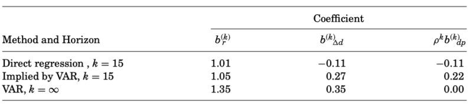{fig-align="center" width="80%"}

- Essentially **all** variation in the dividend-price ratio is explained by variation in expected returns
- The game in town is explaining time-variation of expected returns!
- Given early lectures: this is tightly connected to explaining time-variation of the SDF!

## 30 years later... Dividends Strike Back!
- @DeLaO2021 brought *subjective beliefs* into the picture
- Under rational expectations, we have that
$$
\text{Cov}(\mathbb{E}_t[\Delta d_{t+1}], \delta_t) = \text{Cov}(\Delta d_{t+1}, \delta_t)
$$
- Under subjective beliefs, it does not need to be the case!

. . .

Their idea:

- Measure return and dividend growth expectation using survey data (IBES and Graham-Harvey)!
- Instead of inferring what people think, just ask them!
- This is a *very* influential paper

## One-year ahead expectations
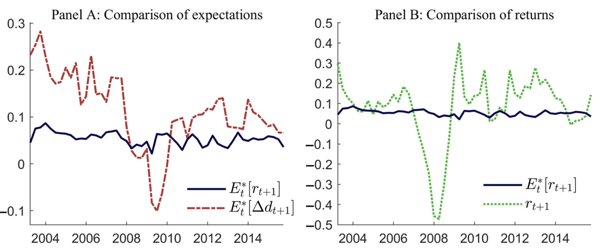{fig-align="center" width="99%"}

## The Subjective Belief Campbell-Shiller Decomposition
- If $\mathbb{E}_t^*$ is a *subjective* expectation operator, we can write:
$$
\delta_t = \sum_{j=0}^{\infty}\rho^j \mathbb{E}_t^*[h_{t+1+j}] - \sum_{j=0}^{\infty}\rho^j \mathbb{E}_t^*[\Delta d_{t+j}] + \text{constants}
$$
- This has to hold because it's just an accounting identity!

. . . 

- They don't observe, at time $t$, the full path of expectations. They focus on:
$$
1
=
\underbrace{
\frac{
\operatorname{cov}\!\left( E_t^*[\Delta d_{t+1}], \, \delta_t \right)
}{
\operatorname{var}(\delta_t)
}
}_{CF_1}
\;+\;
\underbrace{
\frac{
-\operatorname{cov}\!\left( E_t^*[r_{t+1}], \, \delta_t \right)
}{
\operatorname{var}(\delta_t)
}
}_{DR_1}
\;+\;
\underbrace{
\rho
\frac{
\operatorname{cov}\!\left( E_t^*[\delta_{t+1}], \, \delta_t \right)
}{
\operatorname{var}(\delta_t)
}
}_{LT}
$$

- They can **directly** measure $CF_1$ and $DR_1$ in the data

## Empirical Results

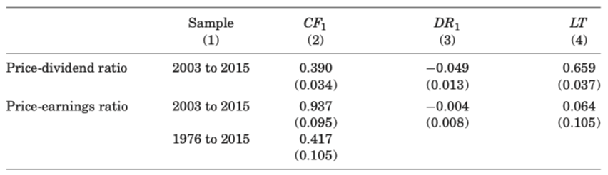{fig-align="center" width="90%"}

- You'd expect very high $DR_1$ and very low $CF_1$... not what happens!
- Most of the variation in price-dividends and price-earnings is steaming from dividends!
- This is exactly the *opposite* to @Campbell1991

## Empirical Results

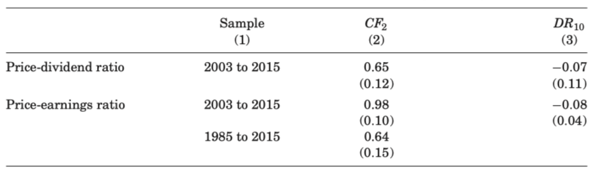{fig-align="center" width="90%"}

$$
CF_2
\equiv
\frac{
\operatorname{cov}\!\left(
\sum_{j=1}^{2} \rho^{\,j-1} E_t^*[\Delta d_{t+j}],
\, \delta_t
\right)
}{
\operatorname{var}(\delta_t)
}
\qquad
DR_{10}
\equiv
\frac{
\operatorname{cov}\!\left(
-\sum_{j=1}^{10} \rho^{\,j-1} E_t^*[r_{t+j}],
\, \delta_t
\right)
}{
\operatorname{var}(\delta_t)
}
$$

## Benchmarks
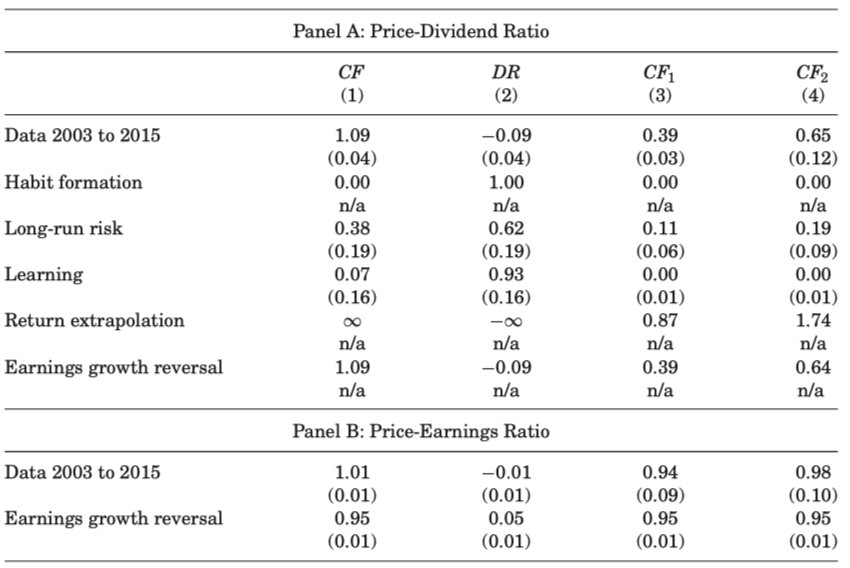{fig-align="center" width="70%"}

## {.standout}
Questions?

## AI-Generated Summary

- @Shiller1981: with constant $r$, prices are too volatile
- Takeaway: big time-variation in expected returns / discount rates (SDF)
- @CampbellShiller1988: dividend--price ratio reflects expected returns vs dividend growth
- VAR tests reject constant expected returns (and simple consumption/volatility stories)
- @Campbell1991 / @cochrane_presidential_2011: discount-rate news dominates
- @DeLaO2021: surveys + subjective beliefs revive cash-flow news


## Readings and References {.noframenumbering .allowframebreaks}
\footnotesize
