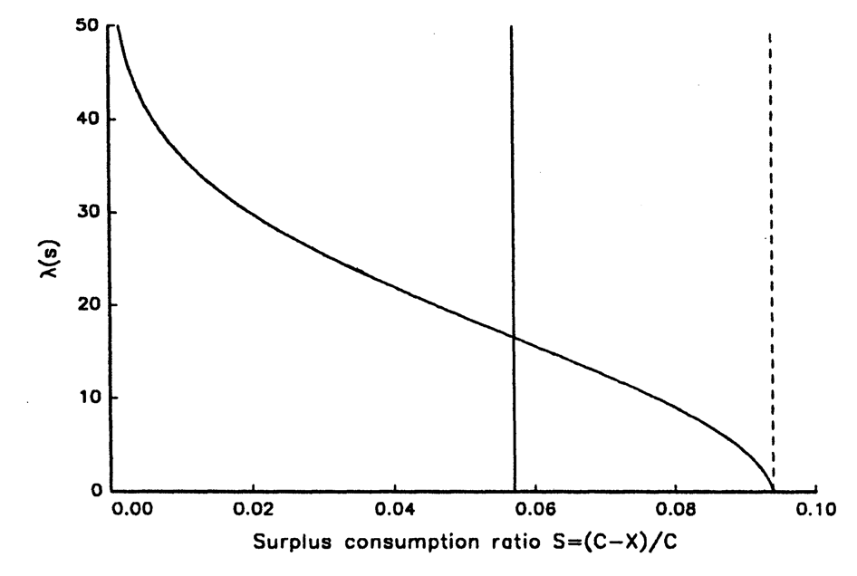
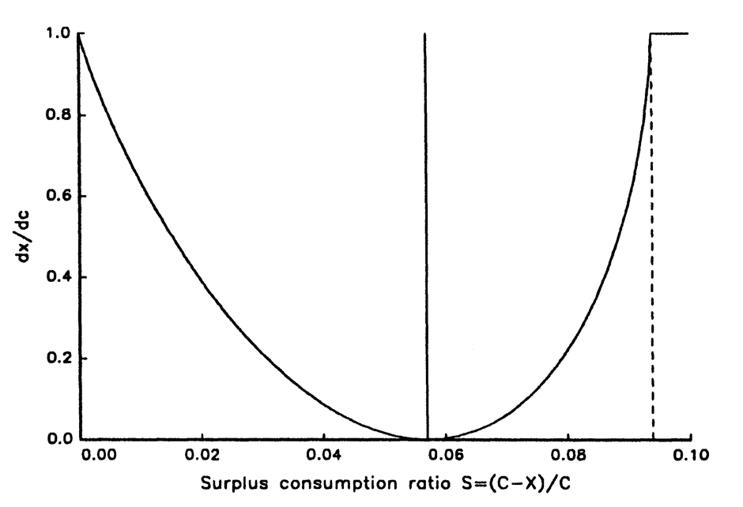
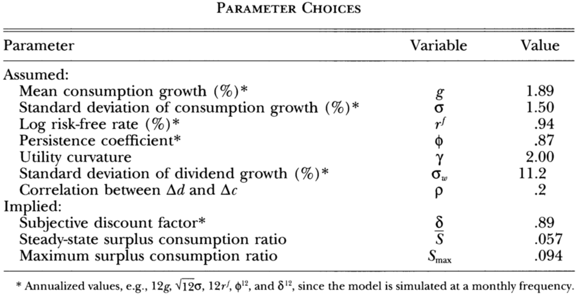
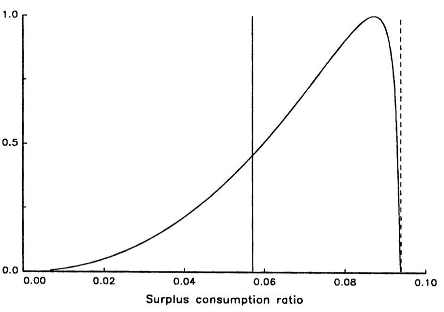
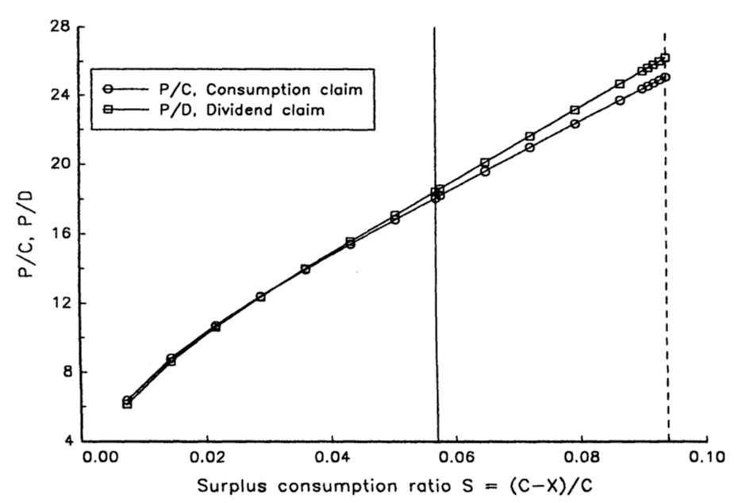
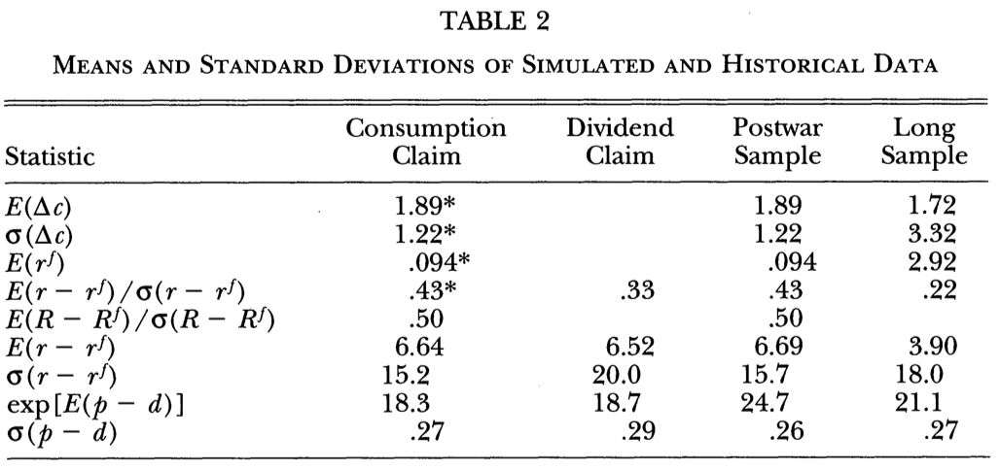
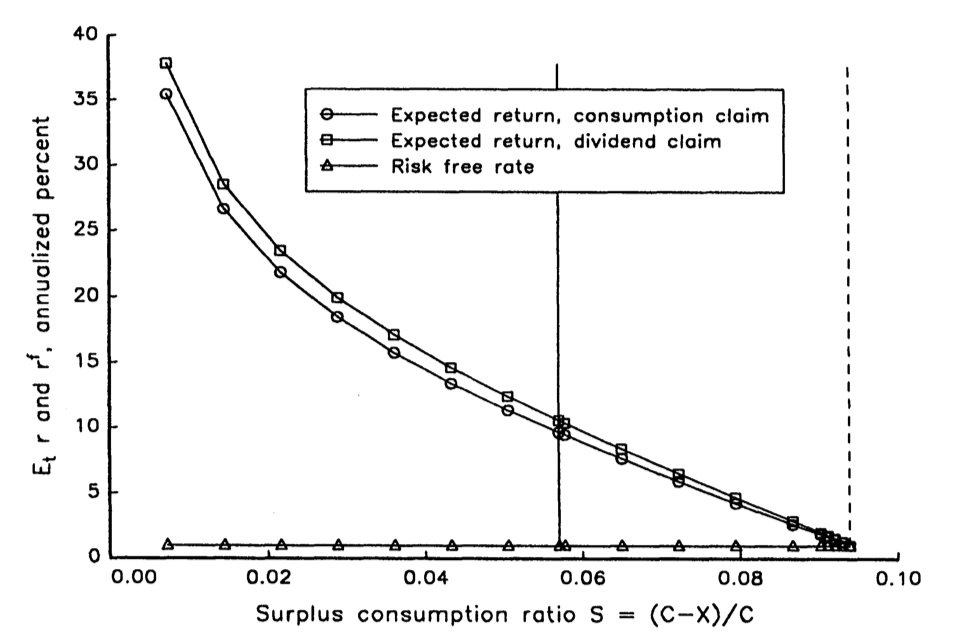
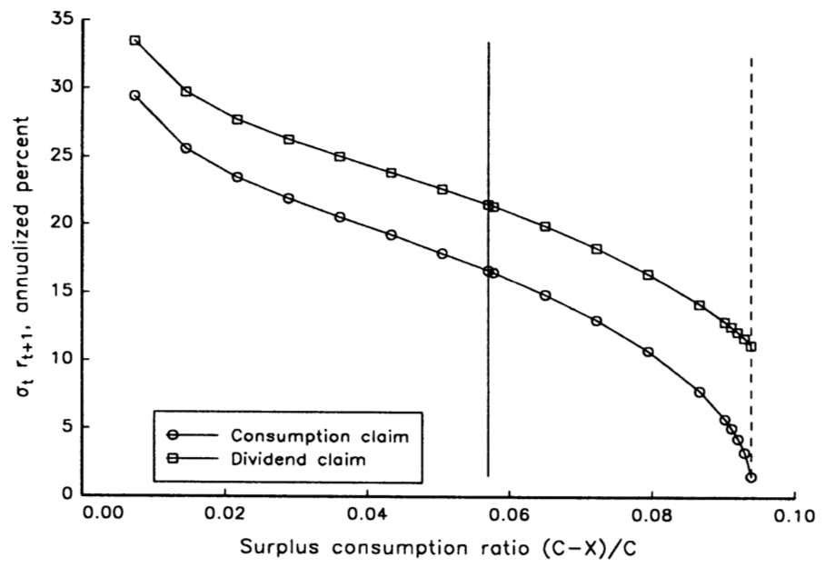
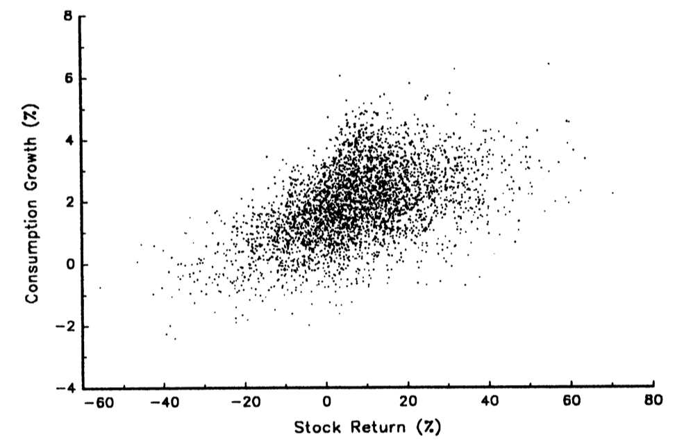
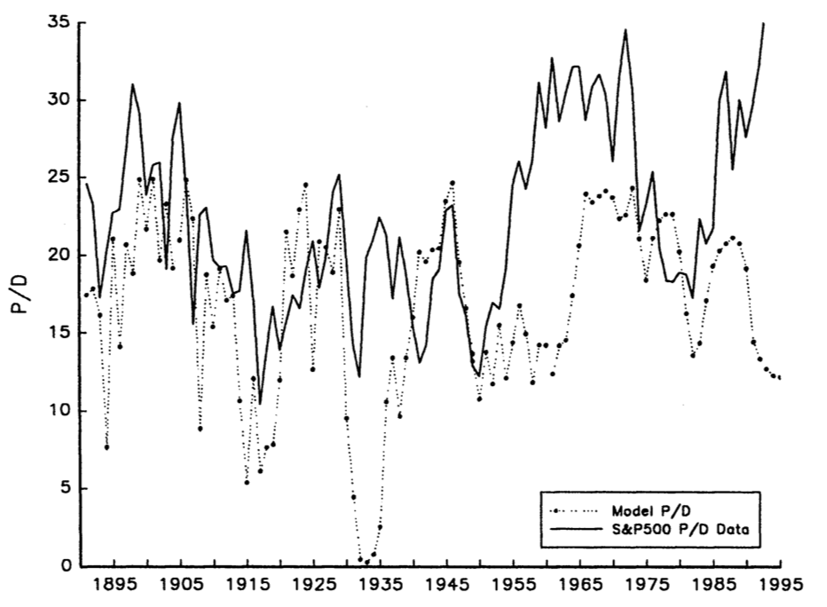

# Intro

- Late 80s: everyone started for a solution to the equity premium puzzle
- Many solutions proposed: more complicated preferences, market frictions, aggregation issues...
- There is no single solution -- many mechanisms are at play
- No notion of "best" or worse
- Everyone was looking for the same: how can we *spice up* the SDF and get more volatility?
- The next few classes will be about "wins" in this game

## Flight Plan

- Parts I-II: derive the Campbell-Cochrane habit model [@CampbellCochrane1999]
- Part III: the model meets (and matches!) the data
- Part IV: follow-up tracks in equity markets, fixed income securities, and foreign exchange (FX)

# Part I: By Force of Habit -- Main Setup

## Why Habit?

- Time-separable CRRA struggles with high equity premia and low/steady $r_f$ [@Mehra1985; @Weil1989]
- We want countercyclical risk prices without implausible interest-rate dynamics
- External habit creates a recession state variable
- Target: high Sharpe ratios in bad times

## Preferences and Surplus Consumption

- Representative agent has utility on consumption levels *net* of habit:

$$
U_t = \mathbb{E}_t\left[\sum_{j=0}^{\infty}\beta^j \frac{(C_{t+j}-X_{t+j})^{1-\gamma}-1}{1-\gamma}\right]
$$

- $X_t$: habit, $C_t$: consumption, $\beta$: discount factor, $\gamma$: power parameter
- Habit is *external*: your individual consumption does not affect $X_t$
- "Keeping up with the Joneses": utility depends on relative consumption
- *Internal* habit: $X_t$ depends on your own past consumption, not aggregate
- External habit is way more tractable!

## State-Dependent Risk Aversion

- Define the surplus consumption ratio and its log state:

$$
S_t \equiv \frac{C_t-X_t}{C_t}, \qquad s_t \equiv \log S_t
$$

- Local curvature is state dependent:

$$
-\frac{C \cdot u''(C - X)}{u'(C - X)} = \gamma\frac{C}{C-X} = \frac{\gamma}{S}
$$

- Low $S_t \implies$ high local curvature
- As $S_t$ moves around, risk-aversion moves around

## Consumption and Habit Dynamics

- Consumption growth is i.i.d. lognormal ($c_t \equiv \log(C_t)$):
$$
\Delta c_{t+1} = g + \sigma_c \varepsilon_{c, t+1}, \qquad \varepsilon_{c, t+1} \sim \mathcal{N}(0,1)
$$

. . .

- **Exogenous** law of motion for $s_t$:

$$
s_{t+1} = (1-\phi)\bar s + \phi s_t + \lambda(s_t)\sigma_c \varepsilon_{c, t+1}
$$

- $\phi$: persistence, $\bar s$: mean surplus consumption, $g$: mean consumption growth, $\lambda(s_t)$: sensitivity function

. . .

- These two laws of motion jointly determine the evolution of $X_t$ as well!

. . .

- Exercise 1: assume that $\sigma_c = 0$ and use a Taylor expansion to show that, for some $\alpha$
$$
x_{t+1} \equiv \log(X_{t+1}) \approx \alpha(1-\phi) + \phi x_t + (1-\phi) c_{t}
$$

. . .

- Exercise 2: (using the result above) show that $x_{t+1} = \alpha + (1-\phi)\sum_{j=0}^{\infty} \phi^j c_{t-j}$

## The Stochastic Discount Factor

- The marginal utility is $u'(C_t - X_t) = (C_t - X_t)^{-\gamma} = S_t^{-\gamma}\cdot C_t^{-\gamma}$

. . .

- Intertemporal rate of substitution (AKA Mr. SDF):
$$
M_{t+1} \equiv \beta \frac{u'(C_{t+1} - X_{t+1})}{u'(C_t - X_t)} = \beta\left(\frac{C_{t+1}}{C_t}\right)^{-\gamma}\left(\frac{S_{t+1}}{S_t}\right)^{-\gamma}
$$

. . .

- The log-SDF $m_{t+1}$ follows the following process:
$$
m_{t+1} = \log(\beta) - \gamma g + \gamma(1-\phi)(s_t-\bar s) - \gamma\sigma_c[1 + \lambda(s_t)] \varepsilon_{c, t+1}
$$

. . .

- The risk-free rate is $r_{f,t} = \log(\mathbb{E}_t[M_{t+1}])$ is available in closed form:
$$
\boxed{
r_{f,t} = -\log(\beta) + \gamma g - \gamma(1-\phi)(s_t-\bar s) - \frac{\gamma^2\sigma^2}{2}[1+\lambda(s_t)]^2
}
$$
- Exercise 3: show it at home
- What's the intuition for each term?

## Deriving the Sharpe Ratio Bound

- From the log-SDF: $m_{t+1} = \log(\beta) - \gamma g + \gamma(1-\phi)(s_t-\bar s) - \gamma\sigma_c[1 + \lambda(s_t)] \varepsilon_{c, t+1}$
- Since $\varepsilon_{c,t+1} \sim \mathcal{N}(0,1)$, we have $M_{t+1} = e^{m_{t+1}}$ is lognormal conditional on $s_t$

. . .

- Hansen-Jagannathan bound: $\max_R \frac{|\mathbb{E}_t[R_{t+1}^e]|}{\sigma_t(R_{t+1}^e)} = \frac{\sigma_t(M_{t+1})}{\mathbb{E}_t[M_{t+1}]}$

. . .

- For lognormal $M$: $\frac{\sigma_t(M)}{\mathbb{E}_t(M)} = \sqrt{\exp(\sigma_t^2(m)) - 1}$

. . .

- From the log-SDF: $\sigma_t(m_{t+1}) = \gamma\sigma_c[1+\lambda(s_t)]$

. . .

- Therefore: $\max_R \frac{\mathbb{E}_t[R_{t+1}^e]}{\sigma_t(R_{t+1}^e)} = \sqrt{\exp\!\left(\gamma^2\sigma_c^2[1+\lambda(s_t)]^2\right)-1} \approx \gamma\sigma_c[1+\lambda(s_t)]$
- The Sharpe ratio bound will move around with $s_t$ through $\lambda(s_t)$

# Part II: By Force of Habit -- Calibrating $\lambda(s_t)$

## How to choose $\lambda(s_t)$?
- This function controls the conditional volatility of the SDF
- It will matter for the risk-free rate, and the conditional maximum Sharpe ratio
- How to choose it?

. . .

\vspace{1cm}

Let's match the following features:

1. The (real) risk-free rate should be constant
2. Today's consumption does not affect today's habit if $s_{t+1} \approx \bar{s}$: ($dx_{t+1}/dc_{t+1} = 0$)
3. For any value of $s_t$, the habit response to consumption shocks should be nonnegative: ($dx_{t+1}/dc_{t+1} \ge 0$)

## Restricting $\lambda(s_t)$

- Functional-form choice in @CampbellCochrane1999:

$$
\lambda(s_t)\equiv
\begin{cases}
\dfrac{1}{\bar S}\sqrt{1-2(s_t-\bar s)}-1, & s_t\le s_{\max} \\
0, & s_t > s_{\max}
\end{cases}, \quad s_{\max} \equiv \bar s - \frac{1}{2}(1-\bar S^2),
$$
where $\bar{S} \equiv \sigma_c\sqrt{\frac{\gamma}{1-\phi}}$

. . .

- It is *decreasing* with $s_t$: habit becomes less sensitive to shocks as $s_t$ increases

. . .

- Exercise 4: show that a function $\lambda(s_t)$ can make $r_{f,t}$ constant if, and only if
$$
(1+\lambda(s_t))\cdot \lambda'(s_t) = \frac{1-\phi}{\gamma\sigma_c} = \frac{1}{\bar S^2}
$$

## How This Function Looks Like

:::: {.columns}

::: {.column width="50%"}

:::

::: {.column width="50%"}

:::

::::

- Solid line: steady-state value $\bar S$
- Dashed line: maximum value $S_{\max}$, above which $\lambda(s_t) = 0$
- Important: $dx/dc$ is U-shaped, with a minimum at $\bar S$ where it is zero

## Does It Do Its Job?

Constant risk-free rate:
$$
r_{f,t} = -\log(\beta) + \gamma g - \gamma(1-\phi)(s_t-\bar s) - \frac{\gamma^2\sigma^2}{2}[1+\lambda(s_t)]^2 = -\log(\beta) + \gamma g - \frac{\gamma}{2}(1-\phi)
$$

. . .

Habit response to consumption:
```{=latex}
\begin{gather*}
\frac{dx_{t+1}}{dc_{t+1}}(s_{t+1}) = 1 + \frac{\lambda(s_{t+1})}{1 - e^{-s_{t+1}}} = 1 + \frac{\frac{1}{\bar S}\sqrt{1-2(s_{t+1}-\bar s)}-1}{1 - e^{-s_{t+1}}} = 1 + \frac{\lambda(s_{t+1})}{1 - e^{-s_{t+1}}}\\
\frac{dx_{t+1}}{dc_{t+1}}(\bar{s}) = 1 + \frac{\frac{1}{\bar{S}} - 1}{1 - \frac{1}{S}} = 0
\end{gather*}
```

- Exercise 5: show that $dx/dc \geq 0$ for all $s_{t+1}$

## Solving for Asset Prices

- We have a fully specified SDF. What assets will we price and what are their prices?

. . .

- Consumption claim pays aggregate consumption $C_t$
- Define the **price-consumption ratio** $V(s_t)\;\equiv\;\frac{P_t^c}{C_t}(s_t)$

. . .

- Euler equation:
  $$
  P_t^c = \mathbb{E}_t\!\left[M_{t+1}\left(P_{t+1}^c + C_{t+1}\right)\right]
  $$
  Divide by $C_t$:
  $$
  \boxed{
  V(s_t)=\mathbb{E}\!\left[M_{t+1}\frac{C_{t+1}}{C_t}\left(1+V(s_{t+1})\right) \mid s_t\right]
  }
  $$

. . .

- In Campbell–Cochrane:
  $$
  \frac{C_{t+1}}{C_t}=e^{g+\sigma_c\varepsilon_t},\qquad
  s_{t+1}=(1-\phi)\bar s+\phi s_t+\lambda(s_t)\sigma_c\varepsilon_t,
  \qquad \varepsilon_t\sim\mathcal{N}(0,1)
  $$

## The One-Shock Integrand

Recall:
$$
M_{t+1}=\beta\left(\frac{C_{t+1}}{C_t}\right)^{-\gamma}\left(\frac{S_{t+1}}{S_t}\right)^{-\gamma}
=\beta\left(e^{g + \sigma_c\varepsilon_t}\right)^{-\gamma}e^{-\gamma(s_{t+1}-s_t)}
$$

. . .

Plug into the recursion:
$$
\boxed{
V(s_t)=\mathbb{E}\!\left[
\beta\left(e^{g + \sigma_c\varepsilon_t}\right)^{-\gamma}e^{-\gamma(s_{t+1}-s_t)}
\left(1+V(s_{t+1})\right)
\right]
}
$$

. . .

With one shock $\varepsilon$, you need to approximate an integral over $\mathbb{R}$:
$$
V(s)=\int_{-\infty}^{\infty}
\underbrace{
\beta e^{(1-\gamma)(g+\sigma_c\varepsilon)}
e^{-\gamma(s'(\varepsilon;s)-s)}
\left(1+V(s'(\varepsilon;s))\right)
}_{\text{known given }V(\cdot)}
\varphi(\varepsilon)\,d\varepsilon
$$
where $\varphi(\varepsilon)$ is the standard normal density and $s'(\varepsilon;s) = (1-\phi)\bar s + \phi s + \lambda(s)\sigma_c\varepsilon$

## Pricing a Dividend Claim

- Data: dividend growth and consumption growth are weakly correlated
- Their idea: $\Delta d_t = g + \sigma_w w_t$, where $\text{corr}(w_t, \varepsilon_t) = 0.2$

. . .

- Define the price-divided ratio as $Q(s_t)\;\equiv\;\frac{P_t^d}{D_t}(s_t)$. It will follow:
$$
Q(s_t)=\mathbb{E}\!\left[M_{t+1}\frac{D_{t+1}}{D_t}\left(1+Q(s_{t+1})\right) \mid s_t\right]
$$
- You can solve this with the same type of technique as before
- Notice that the randomness on $M_{t+1}$ is only through $\varepsilon_t$

## {.standout}
Questions?

# Part III: Meet The Data

## Calibration
{fig-align="center" width="90%"}

## Surplus Consumption and Asset Prices
::: columns
::: column
{fig-align="center"}
:::
::: column
{fig-align="center"}
:::
:::

## Equity Premium Puzzle No More!
{fig-align="center"}

## Equity Premium and Conditional Volatility
::: columns
::: column
{fig-align="center"}
:::
::: column
{fig-align="center"}
:::
:::

- The equity premium is large *and* it is time-varying!
- Return volatility is high and countercyclical, even with smooth consumption growth

## Consumptio Growth, Stock Returns, and $P/D$ Ratio
::: columns
::: column
{fig-align="center"}
:::
::: column
{fig-align="center"}
:::
:::

## {.standout}
Questions?

# Part IV: Where Habit Models Went

## Three Follow-Up Tracks

At least three quite cool direct follow-ups:

- More on equity: richer predictability and valuation implications [@MenzlySantosVeronesi2004]
- Interest rate term structure: bond premia under habit-based discount rates [@Wachter2006]
- FX markets: currency premia from cross-country habit risk [@Verdelhan2010]
- Same mechanism: state-dependent SDF via $S_t$
- Exercise 6: read these papers!

## {.standout}
Questions?

## Takeaways and Transition

- External habit resolves key aggregate puzzles through state-dependent risk prices
- Main trick: time-varying risk-aversion even with smooth consumption growth
- Calibration discipline is essential: $\lambda(s_t)$ is doing the hard work
- Pushback: is this truly microfounded?
- Follow-ups show the same mechanism in equities, bonds, and FX

. . .

- Next class: time-varying disaster risk!


## Readings and References {.noframenumbering .allowframebreaks}
\footnotesize

- Campbell, Chapter 6
