# Intro

## Flight Plan

- Part I: Rietz (1988) as the baseline disaster mechanism [@Rietz1988]
- Part II: Barro (2006) and the empirical discipline step [@Barro2006]
- Part III: Wachter (2013) and time-varying disaster risk [@Wachter2013]
- Part IV: strengths, criticism, and open limits

## Why Disaster Models?

- Habit models generate countercyclical prices of risk [@CampbellCochrane1999]
- Disaster models target macro left-tail risk directly: you are afraid of large crashes
- Rare severe contractions can move premia a lot
- Core object: how disasters enter the SDF

# Part I: Rietz (1988)

## What Rietz Tries to Explain

- Standard calibrations miss the observed equity premium [@Mehra1985]
- Add a third state to the Mehra and Prescott economy: consumption will fall by a lot
- Keep the representative-agent CRRA setup, with a single tree
- Ask whether tails can reconcile moments [@Rietz1988]
- Everything is the same as @Mehra1985 except for the disaster state

## Disaster State in Consumption Growth

- $y_t$ is the stochastic dividend from the tree
- Its growth rate $x_t \in \{\lambda_1, \lambda_2, \lambda_3\}$ follows a 3-state Markov chain
$$
\lambda_1 = 1 + \mu + \delta, \quad \lambda_2 = 1 + \mu - \delta, \quad \lambda_3 = \psi(1+\mu)
$$

. . .

- The transition matrix is given by:
$$
\Phi = \begin{bmatrix}
\phi & 1-\eta-\phi & \eta \\
1-\phi-\eta & \phi & \eta \\
0.5 & 0.5 & 0
\end{bmatrix}
$$

- We assume $\lambda_1 > \lambda_2 > \lambda_3$
- $\eta$ is the probability of a crash

## SDF and Tail Risk

$$
M_{t+1}=\beta\left(\frac{C_{t+1}}{C_t}\right)^{-\gamma} = \beta \left(\frac{y_{t+1}}{y_t}\right)^{-\gamma}
$$

- Rietz noted that the Mehra and Prescott economy was "too symmetric"
- Things are never *that* bad
- Disaster states raise marginal utility sharply
- Payoffs that crash in disasters must pay higher premia

. . .

- You can solve the model exactly like Mehra and Prescott, but now with a 3-state Markov chain

## Calibrating The Model

- How to calibrate $\psi$ and $\eta$? This is key
- How large should a recession be to be called a "disaster"?
- How frequently can disaster occur?
- By definition this should be super hard to calibrate!

. . .

- His strategy: given $(\eta, \psi, \gamma, \beta)$, estimate $(\mu, \delta, \phi)$ with GMM

## Super Large Crash ($\psi = 0.5$)
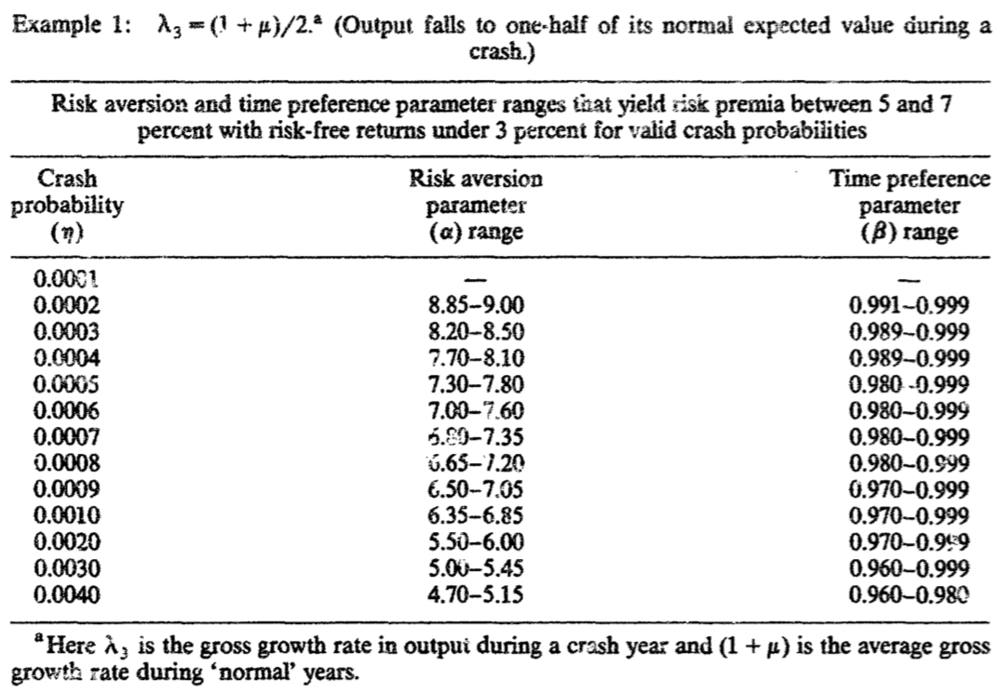{fig-align="center" width="75%"}

## Super Large Crash ($\psi = 0.5$)
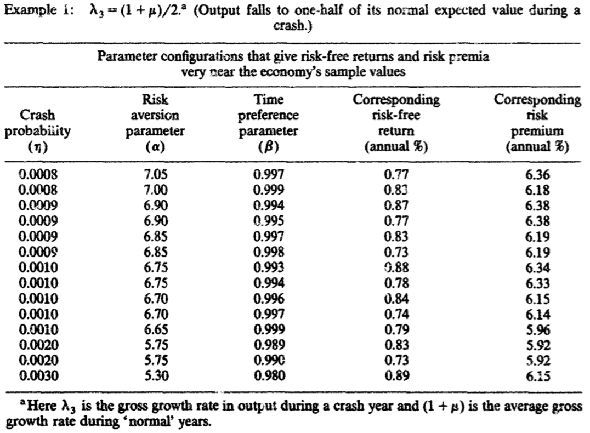{fig-align="center" width="70%"}

## Moderate Crash ($\psi = 0.75$)
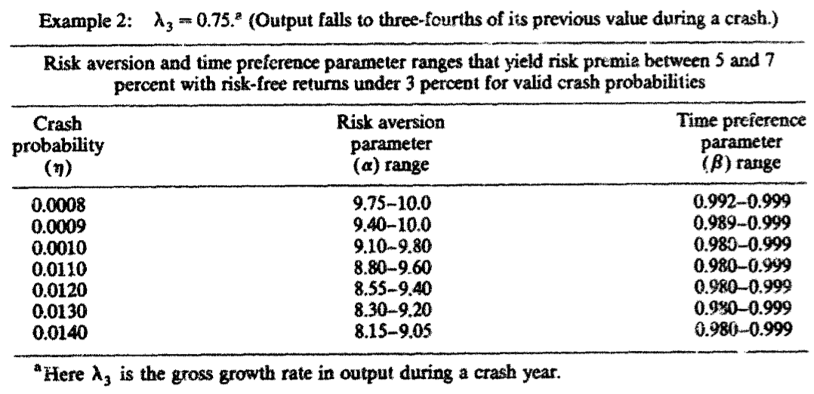{fig-align="center" width="90%"}

## Moderate Crash ($\psi = 0.75$)
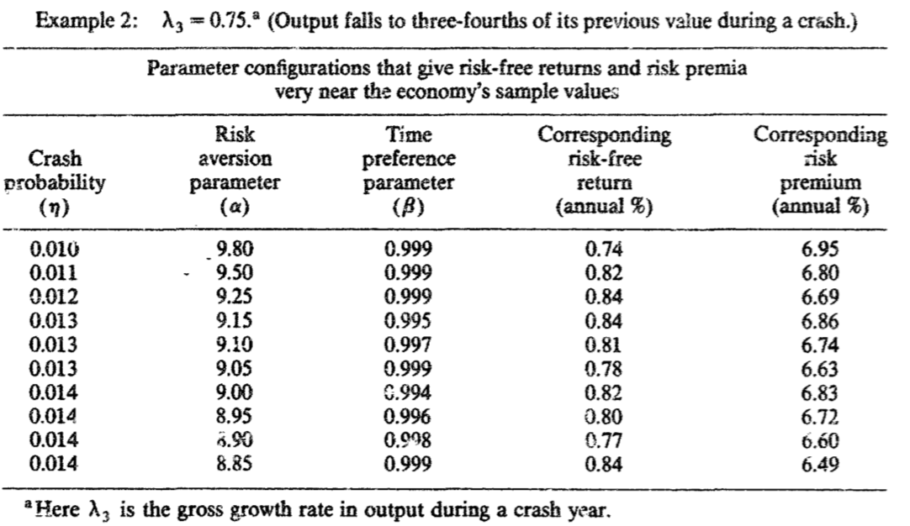{fig-align="center" width="80%"}

## {.standout}
Questions?

# Part II: Barro (2006)

## From Rietz (1988) to Barro (2006): What Is New?

- @Rietz1988: proof-of-concept rare catastrophe calibration
- @Barro2006: identifies disaster frequency/severity from long-run cross-country macro data
- Models disaster size as a random variable (distribution), not one fixed drop
- Shows estimated disaster process quantitatively matches equity premium + low $r_f$
- It is a standard Lucas-tree economy with a few twists: disasters and potential defaults on the risk-free bond
- The state space for consumption growth is now continuous, not discrete

## Primitives
- Representative agent with CRRA utility $u(C) = \frac{C^{1-\theta} - 1}{1-\theta}$
- Dividend process $A_t$ governed by
$$
\log A_{t+1} = \log A_t + \gamma + \sigma u_{t+1} + \nu_{t+1} \log(1 - b_{t+1})
$$  
where $u_t \sim \mathcal{N}(0,1)$ and $\nu_{t+1}\sim \text{Bernoulli}(1-e^{-p})$, everything i.i.d.

. . .

- Let $P_{1t}$ be the price of the *one-period* dividend claim. Market clearing $C_t = A_t$ implies:
$$
P_{1t} = e^{-\rho} \cdot (A_t)^\theta\cdot \mathbb{E}_t\left[A_{t+1}^{1-\theta}\right]
$$

. . .

- The price-dividend ratio is:
$$
\frac{P_{1t}}{A_t} = e^{-\rho} \cdot \mathbb{E}_t\left[\left(\frac{A_{t+1}}{A_t}\right)^{1-\theta}\right]
$$

## International Evidence on Disasters
:::: {.columns align=center}

::: {.column width="50%"}
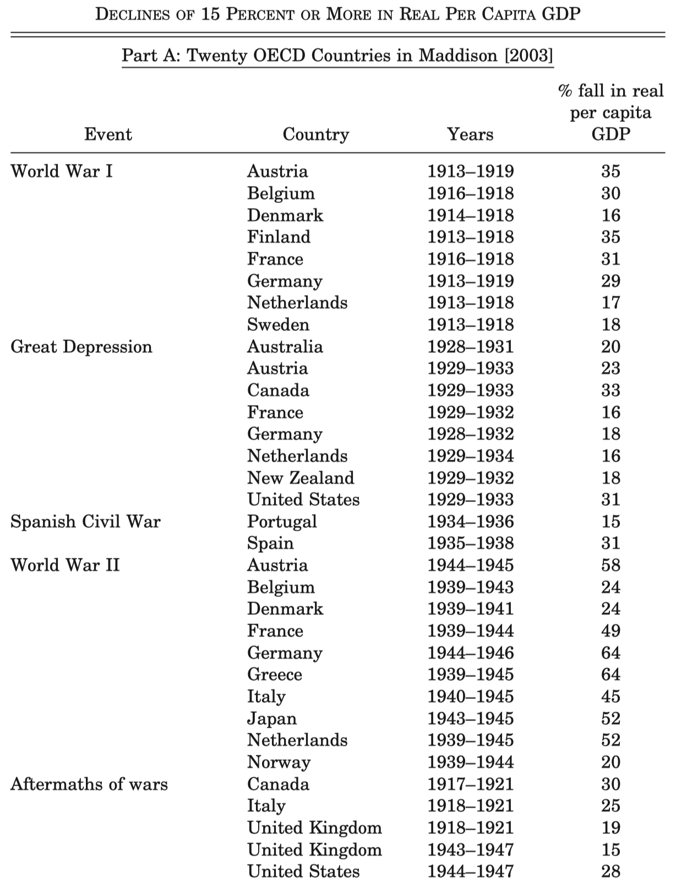{fig-align="center" width="75%"}
:::

::: {.column width="50%"}
- He collected international evidence about episodes of 15\%+ drops in real per capita GDP
- Both developed in emerging countries (see the paper)
:::

::::

## Contraction Size
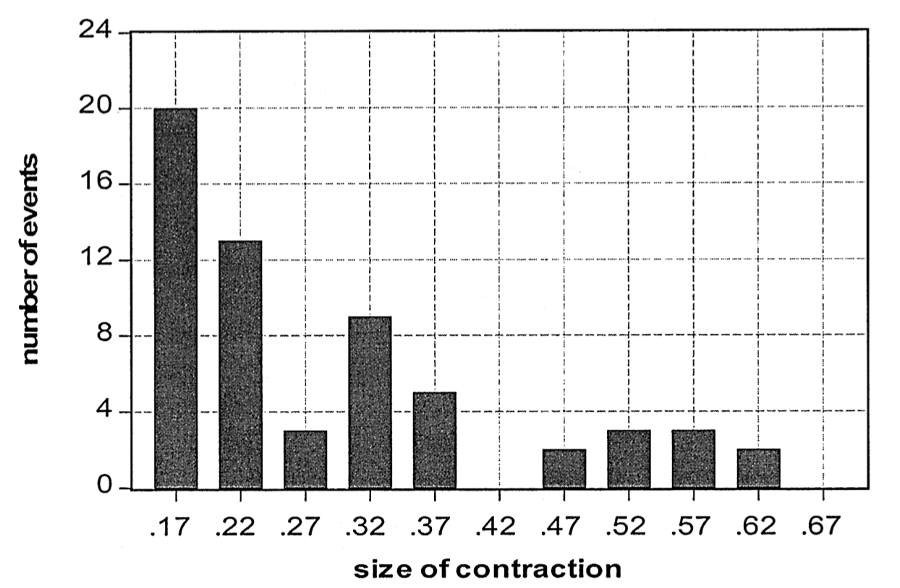{fig-align="center" width="70%"}

## Fixed Income Gets Screwed Too
:::: {.columns align=center}

::: {.column width="60%"}
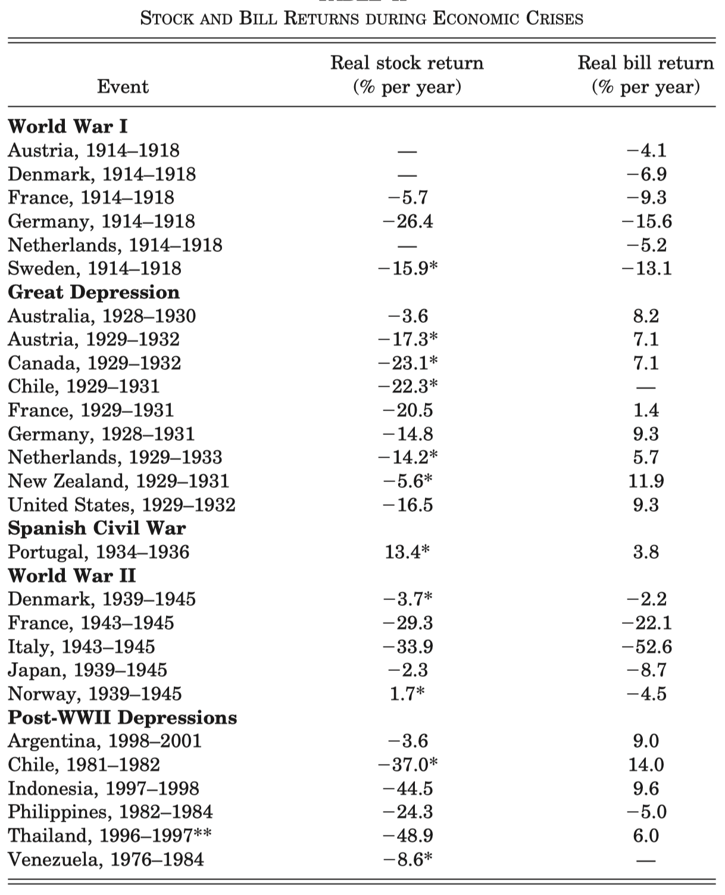{fig-align="center" width="68%"}
:::

::: {.column width="40%"}
- Depression times: stocks go bad, bonds do well
- Wars: everything goes bad
- Are bonds that risk-free?
:::

::::

## Introducing Bond Defaults

- In a disaster, the risk-free bond may default with probability $q$
- Upon a default, the holder looses a fraction $d$

$$
R^b_{1,t} = \begin{cases}
R^f_{1,t} & \text{with no disasters, with probability } e^{-p} \\
R^f_{1,t} & \text{with disasters, but no default, with probability } (1 - e^{-p})(1-q)\\
(1-d)R^f_{1,t} & \text{with disasters and default, with probability } (1 - e^{-p})q
\end{cases}
$$

- In the paper: $d=b$ as a simplifying assumption
- The distribution of $b$ and $d$ are independent of the other shocks and independent over time

## Solving The Model

- Define the gross return on equity as $R_{1,t+1}^e = \frac{A_{t+1}}{P_{1,t}}$
- Exercise: show that the expected equity return is such that

$$
\log \left[\mathbb{E}_t \left( R_{t+1}^e \right) \right]
= \rho + \theta \gamma
  - \frac{1}{2}\theta^2 \sigma^2
  + \theta \sigma^2
  - p \left[ \mathbb{E}\left( (1-b)^{1-\theta} \right) - 1 + \mathbb{E}b \right].
$$

. . .

- The return conditional on no disasters is (please show it too):
$$
\log \left( \mathbb{E}_t \left[ R_{t+1}^e \mid \nu_{t+1}=0 \right] \right)
= \rho + \theta \gamma
  - \frac{1}{2}\theta^2 \sigma^2
  + \theta \sigma^2
  - p \left[ \mathbb{E}\left( (1-b)^{1-\theta} \right) - 1 \right]
$$

. . .

- The risk-free rate is (show this at home too):
$$
\log \left[ \mathbb{E}_t \left( R_{t+1}^b \right) \right]
=
\rho + \theta \gamma - \frac{1}{2}\theta^2 \sigma^2 - p \Bigl[(1-q)\,\mathbb{E}\!\left( (1-b)^{-\theta} \right) + q\,\mathbb{E}\!\left( (1-b)^{1-\theta} \right) + q\,\mathbb{E}b - 1\Bigr]
$$

## The Equity Premium
The risk premium is define as $\log(\mathbb{E}[R^e_{1t}]) - \log(\mathbb{E}[R^b_{1t}])$

$$
\log(\mathbb{E}[R^e_{1t}]) - \log(\mathbb{E}[R^b_{1t}]) = \theta \sigma^2 + p(1-q)\left[\mathbb{E}\!\left((1-b)^{-\theta}\right) - \mathbb{E}\!\left((1-b)^{1-\theta}\right) - \mathbb{E}b\right]
$$

- The first term is the usual one: you're compensated for systematic risk
- The second term increases in $p$ and decreases in $q$. Why?
- The premium is increasing in $\mathbb{E}[b]$ as well. Why?

## What if there is leverage?

- Leveraged firms are riskier: equity holder are *residual* claimants
- Payments to equity holders are even more procyclical
- Leverage makes equity look like a Call Option on the firm's assets

. . .

- Consider a firm with a debt-to-equity ratio of $\lambda$
- Firm's debt pays the risk-free rate, but may "default" if there is a disaster
- Upon a disaster, a fraction $d$ of the assets will disappear with probability $q$

. . .

- @Barro2006 shows that the levered equity premium is given by
$$
\text{levered premium} = (1+\lambda)\left\{\theta\sigma^2 + p(1-q)\left[\mathbb{E}\!\left((1-b)^{-\theta}\right) - \mathbb{E}\!\left((1-b)^{1-\theta}\right) - \mathbb{E}b\right]\right\}
$$

- Using American data, he calibrates it at $\lambda = 0.5$

## Main Result
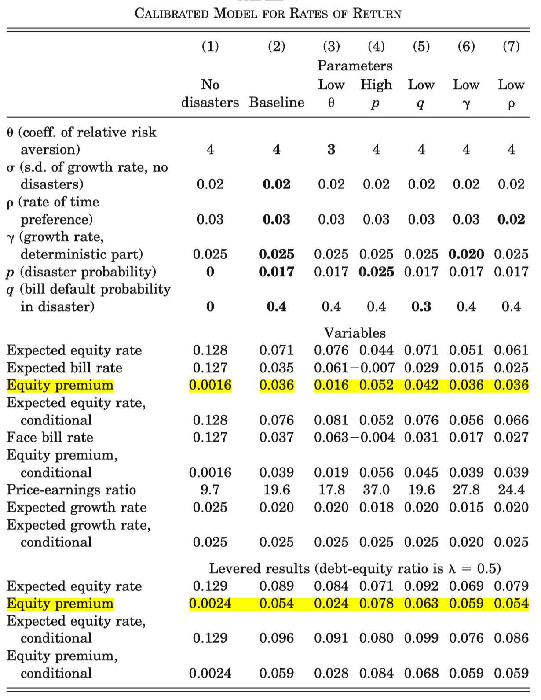{fig-align="center" width="80%"}

## Not Only Fun and Games
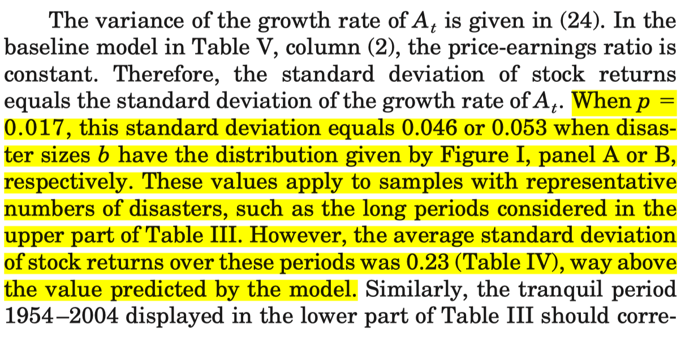{fig-align="center" width="85%"}

## A Conjecture
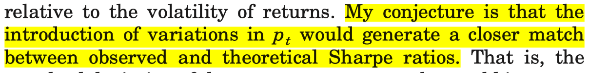{fig-align="center" width="90%"}

## {.standout}
Questions?

# Part III: Wachter (2013)

## Wachter's Core Extension

- Keep disaster-size mechanism from Barro
- Add time-varying disaster probability [@Wachter2013]
- Disaster risk becomes a persistent state variable
- Extra trick: recursive preferences (more on that later)
- Target: premia, valuation ratios, and volatility dynamics

## Time-Varying Disaster Intensity

- The model is written in **continuous time**. A discrete-time analog would be
$$
\lambda_{t+1}=(1-\phi_\lambda)\bar\lambda+\phi_\lambda\lambda_t+\sigma_\lambda\sqrt{\lambda_t}\,\varepsilon_{t+1}^{\lambda}
$$

- $\lambda_t$: conditional disaster intensity
- Persistence creates long-lived disaster scares
- Shocks to $\lambda_t$ move discount rates

## Consumption Growth with Stochastic Intensity

$$
\Delta \log C_{t+1}=g+\sigma\varepsilon_{t+1}+\nu_{t+1}\log(1-b_{t+1}),\qquad \mathbb{P}_t(\nu_{t+1}=1)=\lambda_t
$$

- Same jump-size logic as Barro
- Disaster arrival risk varies over time
- Consumption decreases during disasters as Poisson shocks arrive
- Conditional tail risk drives conditional premia

## Equity Risk Premium and Volatility

::::{.columns align=center}

:::{.column}
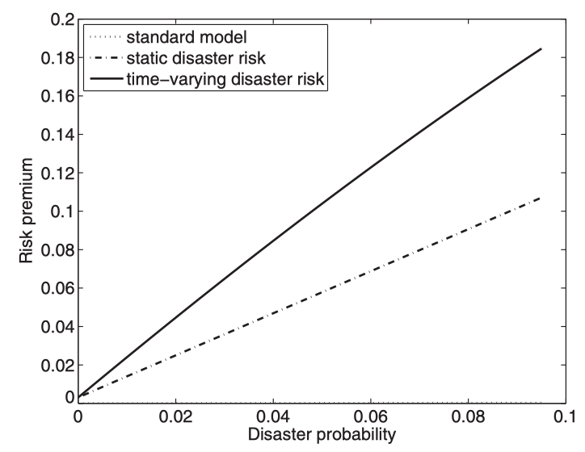
:::

:::{.column}
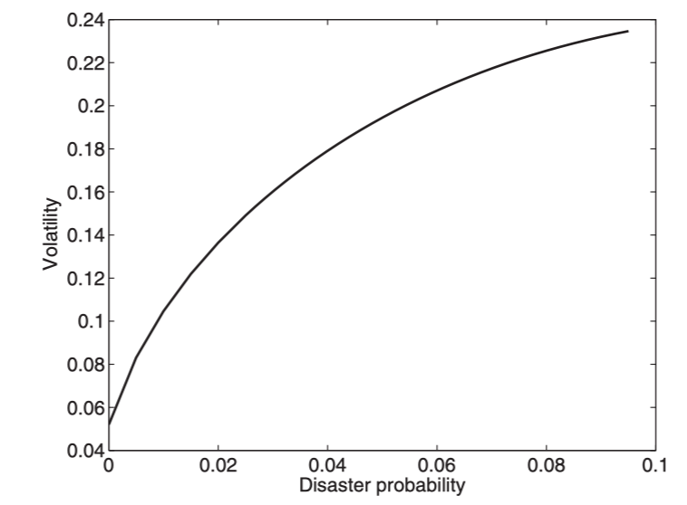
:::
::::

- Time-varying disaster risk moves *both* the premium and volatility
- She was able to tackle *both* the equity risk premium puzzle and the volatility puzzle

## Implied Disaster Probability
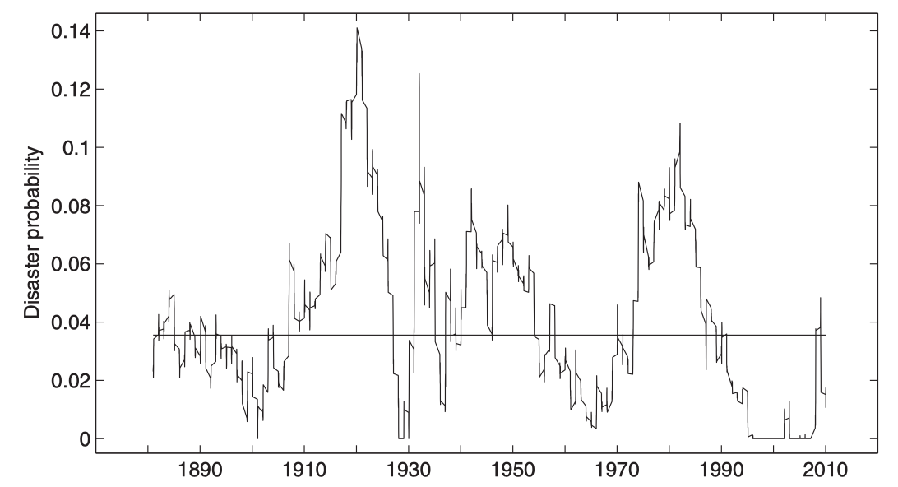{fig-align="center" width="90%"}

## {.standout}
Questions?

## Taking Stock

- Rietz: tails can solve premium puzzles in principle
- Barro: key innovation is data-disciplined disaster frequencies and sizes
- Wachter: time-varying disaster probability adds conditional dynamics
- Main debate: quantitative fit vs tail-risk identification limits

## {.standout}
Questions?

## Readings and References {.noframenumbering .allowframebreaks}
\footnotesize
