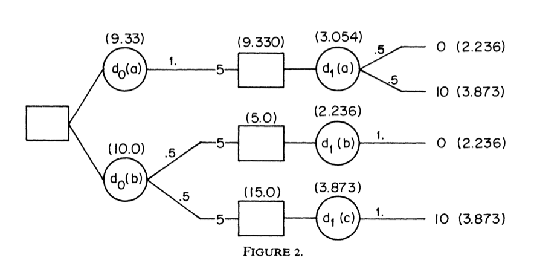
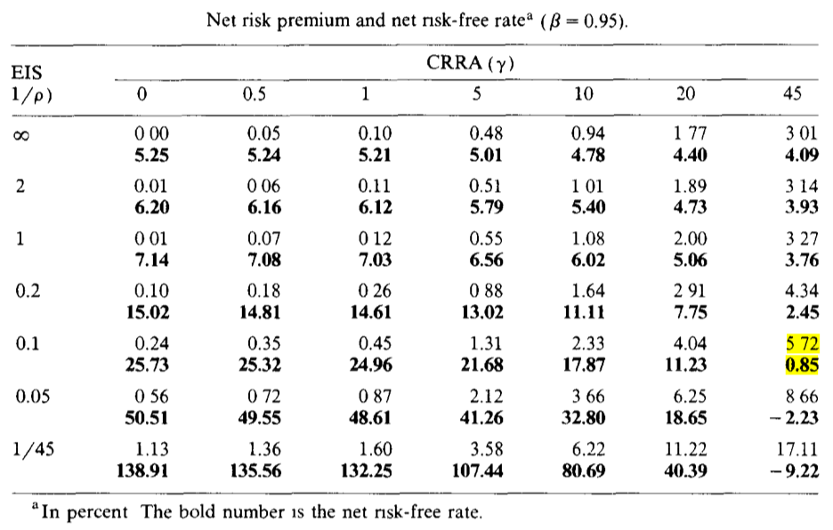
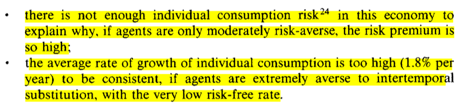

## Intro

- We covered two ways to solve the equity premium puzzle: habits and disasters
- Habits can be relatively hard to microfound depending on who you ask...
- Disaster models are super hard to calibrate...
- Epstein and Zin [-@EpsteinZin1989; -@EpsteinZin1991] adapted @Kreps1978 to Asset Pricing
- Risk aversion and intertemporal substitution become disentangled

## Flight Plan

- Basics from @Kreps1978 -- please take Leandro's class if you want axioms and fancy things!
- Preferences following the parametrization in @EpsteinZin1989
- Derivation of the SDF as in @EpsteinZin1991
- Empirical performance [@EpsteinZin1991; @Weil1989]

# Building Blocks

## What is Risk Aversion?

- This is essentially how you rank risky bets (lotteries)
- You don't need the concept of *time* to think about risk aversion

. . .

- $X$: a set of outcomes; $\Delta(X)$: the set of lotteries over $X$ (the simplex)
- Let $\succeq$ be a preference relation over $\Delta(X)$
- You are **risk-averse** if, for any $p \in \Delta(X)$, you have $\delta_{\mathbb{E}[p]} \succeq p$

## What Von-Neumann and Morgenstern Taught Us
- Typical assumptions: $\succeq$ is complete, transitive, and continuous
- Independence axiom: if $p \succeq q$, then for any $r$ and $\alpha \in (0,1)$, we have $\alpha p + (1-\alpha) r \succeq \alpha q + (1-\alpha) r$

. . .

- Under independence, $\succeq$ can be represented by a utility function $U: \Delta(X) \to \mathbb{R}$ such that
$$
U(p) = \sum_{x \in X} \pi(x) u(x)
$$
where $\pi(x)$ is the probability of outcome $x$ and $u(x)$ is the utility of outcome $x$
- The preferences we will cover in this lecture will violate exactly this axiom, stay tuned!

## More or Less Risk Averse?

- The **Certainty Equivalent** of $p \in \Delta(X)$ is the amount of money $c$ such that $\delta_c \sim p$
$$
CE(p) \equiv \{c \in \mathbb{R} : \delta_c \sim p\}
$$

. . .

- With a slight abuse of notation:
$$
u(CE(p)) = \mathbb{E}[u(x)] \iff CE(p) = u^{-1}(\mathbb{E}[u(x)])
$$

. . .

- John is (weakly) **more risk-averse** than Mary if $CE_J(p) \leq CE_M(p)$ for all $p \in \Delta(X)$

- Pratt showed that this is all about how concave $u$ is!
- Concavity is measured by second derivatives... but these are not scale-free!
- We typically measure risk aversion by $-u''(.)/u'(.)$ or $-x\cdot u''(x)/u'(x)$
- Many prominent utility functions: CARA, CRRA, HARA, ...

## The Special Case of CRRA

- In Macro, we often use the CRRA utility function:
$$
u(C) = \frac{C^{1-\gamma} - 1}{1-\gamma}
$$
- The parameter $\gamma$ is the coefficient of relative risk aversion (RRA)

$$
\frac{-c\cdot u''(c)}{u'(c)} = \gamma
$$

- Relative risk aversion is constant across all levels of consumption

. . . 

- The real reason people like this in Macro: homothetic preferences
- If $x \succeq y$, then $\alpha x \succeq \alpha y$ for any $\alpha > 0$ (Indifference curves are radially symmetric)

. . .

- Optimal portfolio weights are independent of wealth (with complete markets)
- Equilibrium prices (and returns) depend on *growth rates*, not levels

## {.standout}
Questions?

## Intertemporal Substitution

- You don't need the concept of *uncertainty* to think about intertemporal substitution
- Think about two periods and a consumer choosing optimal consumption:
```{=latex}
\begin{equation*}
\max_{C_1, C_2} u(C_1) + \beta u(C_2) \quad \text{s.t.} \quad C_1 + \frac{C_2}{1+r} = W
\end{equation*}
```

. . .

- The relative price of consumption between the periods is $1+r$
- If $r$ goes up, you consume less today and save more... but **how much more**?

. . .

- **Elasticity of Intertemporal Substitution (EIS)**: $\frac{d\log(c2/c1)}{d\log(1+r)} > 0$

. . .

- Exercise: show that for CRRA preferences, the EIS is $1/\gamma$

## Risk Aversion vs Intertemporal Substitution

- With CRRA preferences, high $\gamma \implies$ high risk aversion
- But high $\gamma \implies$ low EIS $\implies$ low willingness to substitute consumption
- Only two possibilities:
  - High $\gamma$: very risk-averse, hates shifting consumption around
  - Low $\gamma$: not very risk-averse, and very willing to shift consumption around

. . .

- If you bump up $\gamma$ to make the consumer afraid of equity...
- She will be really upset about shifting consumption around!
- You have to make the relative price of consuming tomorrow low $\implies$ high risk-free rate!
- The prize for waiting must be large... risk-free rate puzzle from @Weil1989!

## {.standout}
Questions?

# A New Class of Preferences Comes to Town

## Do We Care About *When* Uncertainty is Resolved?

- With expected utility, only probabilities and outcomes matter
- The timing of uncertainty is irrelevant
- But what if you care about *when* uncertainty is resolved?

. . .

- An irreversible medical condition... do you want to find out now or later?
- At the slot machine in Vegas... do you want to wait and gamble, or to resolve it immediately?
- It's already decided whether you get tenured or not... do you want to find out now or later?

## Kreps-Porteus Preferences

- @Kreps1978: axiomatic characterization of preferences over lotteries _and_ timing
- In the EU framework, "time" only matters because it induces other _states_...
- Example: flip a coin, consume 5 at $t=0$, 10 at $t=1$ if heads, 0 at $t=1$ if tails 
- Do you want to find out the outcome of the coin flip at $t=0$ or at $t=1$?

. . .

- Under EU, you should be indifferent between options
- KP preferences allow you to prefer one over the other

. . .

- EU: preferences over probability distributions
- KP: preferences over "filtrations" -- information structures
- KP recover EU when the agent does not care about timing

## Quick Look Into Their Setup (Skipping Super Technical Terms)
- Time is discrete $t \in \{0, 1, 2, \dots, T\}$
- For every $t$, there is a payoff space $Z_t$
- $D_T$ is the set of probability measures over $Z_T$ (lotteries at time $T$)

. . .

- $X_t$: the set of all nonempty closed subsets of $D_t$
- $D_{T-1} \equiv Z_{T-1}\times X_T$

. . .

- In general: $D_t \equiv Z_t\times X_{t+1}, \forall t < T$
- Your preference relation $\succeq$ ranks elements of $D_t$ for all $t$
  
. . .

- Usual stuff: completeness, transitivity, continuity, monotonicity, ...
- If you want some stuff, check the paper!

## Example
{fig-align="center" width="75%"}

## The Representation Theorem
- In a finite decision tree, suppose $U_t$ is your continuation value 
- $U_{t+1}$: the _random_ (from the point of view of $t$) continuation value tomorrow
- Let $\mu_t(U_{t+1})$ be the certainty equivalent of $U_{t+1}$
- Interpretation: money you get right now, for sure, to stop playing

. . .

- Axioms from @Kreps1978 $\implies$ there exists an "aggregator" function $f$ such that
$$
U_t = f(Z_t, \mu_t(U_{t+1}))
$$

## Intuition

- $\mu_t(.)$ encodes how risk-averse you are: the more risk-averse, the lower $\mu_t(U_{t+1})$ is
- The aggregator measures how much you trade-off payoff today vs keep playing
- But the continuation value is already summarized by $\mu_t(.)$

. . .

- If $f$ is linear in the second argument and $\mu_t(U_{t+1}) = \mathbb{E}_t[U_{t+1}]$ we recover expected utility!

## Epstein and Zin (1989)

- @EpsteinZin1989 made the whole setup operational
- They extended @Kreps1978 to the infinite horizon case
- Super non-trivial since there is no "end date"... continuation becomes a fixed point problem

. . .

- They specialize functional forms:
```{=latex}
\begin{gather*}
f(x,y) \equiv \left((1-\beta)x^{1-\rho} + \beta y^{1-\rho}\right)^{\frac{1}{1-\rho}} \\
\mu_t(U_{t+1}) \equiv \left(\mathbb{E}_t[U_{t+1}^{1-\alpha}]\right)^{\frac{1}{1-\alpha}}
\end{gather*}
```
- $\alpha$ controls risk aversion, $\rho$ controls intertemporal substitution

# Heuristic Derivation of the SDF

- @EpsteinZin1991 took it to the data and showed how to use the implied SDF
- We will follow a heuristic derivation from François Gourio's lecture notes (see Github)
- We will assume, just to make math clear, that we have a countable state space
- Expectations will become sums weighted by conditional probabilities $\pi_t(s_{t+1})$

. . .

$$
\mu_t(U_{t+1}) = \left(\sum_{s_{t+1}}\pi_t(s_{t+1})\, U_{t+1}(s_{t+1})^{1-\alpha}\right)^{\frac{1}{1-\alpha}}
$$

## The Recursion

- Substituting $\mu_t$ into $f$, the Epstein-Zin recursion is:
$$
U_t = \left[(1-\beta)C_t^{1-\rho} + \beta\left(\sum_{s_{t+1}}\pi_t(s_{t+1})\, U_{t+1}(s_{t+1})^{1-\alpha}\right)^{\frac{1-\rho}{1-\alpha}}\right]^{\frac{1}{1-\rho}}
$$

. . .

- Let $q_t(s_{t+1})$ be the time-$t$ price of an Arrow-Debreu security
- If you buy one unit, your utility changes by $\partial U_{t}/\partial C_{t+1}(s_{t+1})$
- You pay $q_t(s_{t+1})$ and each unit of consumption hurts you by $\partial U_{t}/\partial C_{t}(s_{t})$

. . .

- At the margin $\dfrac{\partial U_{t}}{\partial C_{t+1}(s_{t+1})} = q_t(s_{t+1}) \cdot \dfrac{\partial U_{t}}{\partial C_{t}(s_{t})}, \forall s_{t+1}, s_t, t$
- For any asset $i$ with return $R_{i,t+1}(s_{t+1})$ in state $s_{t+1}$, we have

\vspace{-1.5em}
$$
\mathbb{E}_t\left[M_{t+1}\, R_{i,t+1}\right] = \sum_{s_{t+1}} \pi_t(s_{t+1})\, M_{t+1}(s_{t+1})\, R_{i,t+1}(s_{t+1}) =\sum_{s_{t+1}} q_t(s_{t+1})\cdot R_{i, t+1}(s_{t+1}) = 1
$$

## Marginal Utilities

- Raise both sides of the recursion to the power $1-\rho$:
$$
U_t^{1-\rho} = (1-\beta)\,C_t^{1-\rho} + \beta\,\mu_t^{1-\rho}
$$
- Differentiate w.r.t. $C_t$:
$$
\frac{\partial U_t}{\partial C_t} = (1-\beta)\left(\frac{C_t}{U_t}\right)^{-\rho}
$$

. . .

- For $C_{t+1}(s_{t+1})$, chain rule: $\;\dfrac{\partial U_t}{\partial C_{t+1}(s_{t+1})} = \dfrac{\partial U_t}{\partial \mu_t}\cdot\dfrac{\partial \mu_t}{\partial U_{t+1}(s_{t+1})}\cdot\dfrac{\partial U_{t+1}(s_{t+1})}{\partial C_{t+1}(s_{t+1})}$
```{=latex}
\begin{gather*}
\frac{\partial U_t}{\partial \mu_t} = \beta\left(\frac{\mu_t}{U_t}\right)^{-\rho}, \qquad
\frac{\partial \mu_t}{\partial U_{t+1}(s_{t+1})} = \pi_t(s_{t+1})\left(\frac{U_{t+1}(s_{t+1})}{\mu_t}\right)^{-\alpha}, \\
\frac{\partial U_{t+1}(s_{t+1})}{\partial C_{t+1}(s_{t+1})} = (1-\beta)\left(\frac{C_{t+1}(s_{t+1})}{U_{t+1}(s_{t+1})}\right)^{-\rho}
\end{gather*}
```

## The SDF

The ratio of marginal utilities yields:

\vspace{-1.5em}
$$
q_t(s_{t+1}) = \frac{\partial U_t/\partial C_{t+1}(s_{t+1})}{\partial U_t/\partial C_{t}(s_{t})} = \beta\pi_t(s_{t+1})\left(\frac{C_{t+1}(s_{t+1})}{C_t}\right)^{-\rho}\left(\frac{U_{t+1}(s_{t+1})}{\mu_t}\right)^{\rho - \alpha}
$$

- We are left with:
$$
M_{t+1}(s_{t+1}) = \beta\left(\frac{C_{t+1}(s_{t+1})}{C_t}\right)^{-\rho}\left(\frac{U_{t+1}(s_{t+1})}{\mu_t}\right)^{\rho - \alpha}
$$

. . .

- When $\alpha = \rho$: the last term vanishes and we recover standard CRRA
$$
M_{t+1} = \beta\left(\frac{C_{t+1}}{C_t}\right)^{-\rho}
$$

. . .

- Problem: $U_{t+1}(s_{t+1})/\mu_t$ is not directly observable
- We will deal with this later using the return on the "wealth portfolio"

## {.standout}
Questions?

# The Wealth Portfolio Trick

## The Problem

- Recall: we derived
$$
M_{t+1}(s_{t+1}) = \beta\left(\frac{C_{t+1}(s_{t+1})}{C_t}\right)^{-\rho}\left(\frac{U_{t+1}(s_{t+1})}{\mu_t}\right)^{\rho - \alpha}
$$
- The ratio $U_{t+1}(s_{t+1})/\mu_t$ involves the continuation value — not observable!
- **Idea**: link it to the return on a traded portfolio

## The Wealth Portfolio

- Let $W_t$ be total wealth: the value of all future consumption
- Budget constraint (Gourio, Section 3):
$$
W_{t+1}(s_{t+1}) = (W_t - C_t)\, R_{a,t+1}(s_{t+1})
$$
- Consume $C_t$ out of $W_t$, invest the rest at the return $R_{a,t+1}$

. . .

- By homotheticity of EZ preferences: $U_t$ is homogeneous of degree 1 in $W_t$
- Value function takes the form $U_t = \phi(s_t)\, W_t$, i.e., $\phi$ depends on the state, not on wealth

## Using Homogeneity

- Using $U_{t+1}(s_{t+1}) = \phi(s_{t+1})\, (W_t - C_t)\, R_{a,t+1}(s_{t+1})$:

$$
\frac{U_{t+1}(s_{t+1})}{\mu_t} = \frac{\phi(s_{t+1})\, R_{a,t+1}(s_{t+1})}{\left(\mathbb{E}_t\left[\phi(s_{t+1})^{1-\alpha}\, R_{a,t+1}(s_{t+1})^{1-\alpha}\right]\right)^{\frac{1}{1-\alpha}}}
$$

- Note: $(W_t - C_t)$ is known at $t$ and cancels immediately

. . .

- But $\phi(s_{t+1})$ is **random** — it does not cancel!
- We need one more step...

## Pinning Down $\phi$

- Define $\Phi_t \equiv \left(\mathbb{E}_t\left[(\phi(s_{t+1})\, R_{a,t+1})^{1-\alpha}\right]\right)^{1/(1-\alpha)}$, so $\mu_t = (W_t - C_t)\,\Phi_t$
- FOC for $C_t$ (optimality of consumption-savings):
$$
(1-\beta)\, C_t^{-\rho} = \beta\, (W_t - C_t)^{-\rho}\, \Phi_t^{1-\rho}
$$

. . .

- Substitute the FOC into the recursion $U_t^{1-\rho} = (1-\beta)C_t^{1-\rho} + \beta(W_t - C_t)^{1-\rho}\Phi_t^{1-\rho}$:
$$
\phi(s_t)^{1-\rho}\, W_t^{1-\rho} = (1-\beta)\,C_t^{-\rho}\,W_t \implies \phi(s_t)^{1-\rho} = (1-\beta)\left(\frac{W_t}{C_t}\right)^{\rho}
$$

## The Key Identity

- Same relation at $t+1$: $\;\phi(s_{t+1})^{1-\rho} = (1-\beta)(W_{t+1}/C_{t+1})^{\rho}$
- FOC rearranged: $\;\Phi_t^{1-\rho} = \frac{1-\beta}{\beta}\left(\frac{W_t - C_t}{C_t}\right)^{\rho}$
- Take the ratio and use $R_{a,t+1} = W_{t+1}/(W_t - C_t)$:
$$
\frac{\phi(s_{t+1})^{1-\rho}}{\Phi_t^{1-\rho}} = \beta\, R_{a,t+1}^{\rho}\left(\frac{C_t}{C_{t+1}}\right)^{\rho}
$$

. . .

- Since $\left(\frac{U_{t+1}}{\mu_t}\right)^{1-\rho} = \frac{\phi(s_{t+1})^{1-\rho}}{\Phi_t^{1-\rho}}\, R_{a,t+1}^{1-\rho}$:

$$
\boxed{\left(\frac{U_{t+1}}{\mu_t}\right)^{1-\rho} = \beta\left(\frac{C_{t+1}}{C_t}\right)^{-\rho} R_{a,t+1}}
$$

- All $\phi$ terms have cancelled!

## The Epstein-Zin SDF

- Define $\theta \equiv \dfrac{1-\alpha}{1-\rho}$, and note $\rho - \alpha = (1-\rho)(\theta - 1)$
- Raise the key identity to power $\theta - 1$:
$$
\left(\frac{U_{t+1}}{\mu_t}\right)^{\rho-\alpha} = \beta^{\theta-1}\left(\frac{C_{t+1}}{C_t}\right)^{-\rho(\theta-1)} R_{a,t+1}^{\theta-1}
$$

. . .

- Substitute into $M_{t+1} = \beta(C_{t+1}/C_t)^{-\rho}(U_{t+1}/\mu_t)^{\rho-\alpha}$:

$$
\boxed{M_{t+1} = \beta^\theta\left(\frac{C_{t+1}}{C_t}\right)^{-\rho\,\theta}\, R_{a,t+1}^{\theta - 1}}
$$

. . .

- $\alpha = \rho$ $(\theta = 1)$: $\;M_{t+1} = \beta\left(\frac{C_{t+1}}{C_t}\right)^{-\rho}$ — standard CRRA
- $\alpha \neq \rho$: SDF depends on consumption growth **and** the wealth return

# Meeting the Data

- Empirically, what is the return on the wealth portfolio?
- The wealth $W_t$ is the price of the whole (optimal) consumption stream
$$
W_t = c_t + \mathbb{E}_{t}[M_{t+1}W_{t+1}] = \sum_{i=0}^\infty \mathbb{E}_t\left[\left(\prod_{j=0}^i M_{t+j}\right)\, c_{t+i}\right], \qquad M_0=1
$$
- Think about $W_t$ as the amount of money you need today to sustain your optimal consumption stream

. . .

- That *has* to include human capital, real estate, money you expect to inherit, etc.
- Not only financial wealth like stocks and bonds!
- Measuring $R_{a, t+1}$ is super tricky (impossible?)! 

## GMM Strikes Back

- In @EpsteinZin1991 there are $N$ risky assets
- The consumer forms optimal portfolios of these assets
- The return of the optimal portfolio is $R_{a, t+1}$

. . .

For any asset $i$:
$$
\mathbb{E}_t\left[M_{t+1} R_{i, t+1}\right] = \beta^\theta \mathbb{E}_t\left[\left(\frac{C_{t+1}}{C_t}\right)^{-\rho\,\theta} R_{a,t+1}^{\theta - 1} R_{i, t+1}\right] = 1
$$

- If we observe returns, we GMM our way to estimate all parameters!
- Important: risk premia will stem from _both_ correlation with consumption growth and correlation with $R_{a, t+1}$

## Empirical Implementation

- @EpsteinZin1991 used the NYSE value-weighted return as a proxy for $R_{a, t+1}$
- Also 5 stock indices from different industries as the other assets + risk-free bond
- Estimate everything using GMM with different instruments (see the paper)
- Whenever looking at results like these, take care with different parametrizations!!!

## Estimates
```{=latex}
\begin{table}[htbp]
\centering
\scriptsize
\begin{tabular}{lcccccc}
\hline\hline
& \multicolumn{3}{c}{1959:4--1986:12} 
& \multicolumn{3}{c}{1959:4--1978:12} \\
\cline{2-4} \cline{5-7}
& INST1 & INST2 & INST3 & INST1 & INST2 & INST3 \\
\hline
\multicolumn{7}{c}{\textit{Nondurables}} \\
\hline
$\delta = (1/\beta) - 1$
& .0033 & .0033 & -.0015 
& .0006 & .0006 & -.0040 \\
& (.0018) & (.0018) & (.0036) 
& (.0031) & (.0031) & (.0065) \\[4pt]

$\gamma$ (= $\alpha/\rho$)
& -.0108 & -.0146 & -.0235 
& -.0122 & -.0122 & -.0065 \\
& (.0564) & (.0564) & (.0746) 
& (.0659) & (.0659) & (.0889) \\[4pt]

$\sigma = 1/(1-\rho)$ (EIS)
& .8652 & .8158 & .1754 
& .8499 & .7973 & .2392 \\
& (.5429) & (.5021) & (.0728) 
& (.6391) & (.5948) & (.0950) \\[4pt]

1 - $\alpha$ (Risk aversion)
& .0016 & .0033 & .1106 
& .0052 & .0031 & .0207 \\
& (.0127) & (.0182) & (.3402) 
& (.0307) & (.0251) & (.2790) \\[6pt]

$J(12)$ 
& 19.04 & 24.20 & 8.054 
& 18.54 & 18.69 & 10.22 \\
& [.088] & [.019] & [.781] 
& [.100] & [.096] & [.597] \\[4pt]

$J(13)-J(12)$ 
& 157.17 & 165.73 & 7.941 
& 141.46 & 148.39 & 6.760 \\
& [.000] & [.000] & [.005] 
& [.000] & [.000] & [.009] \\[4pt]

GH(15) 
&  &  &  
& 16.40 & 15.40 & 17.94 \\
&  &  &  
& [.356] & [.423] & [.266] \\

\hline\hline
\end{tabular}
\end{table}
```

## Can Kreps-Porteus Preferences Solve the Equity Premium Puzzle?
- @EpsteinZin1991 didn't answer this question. @Weil1989 tried to answer it.
- A Lucas-tree economy with two states, one risky asset, like @Mehra1985
- Main change: EZ preferences so we can play with risk aversion _and_ intertemporal substitution
- Calibration followed @Mehra1985

. . .

Two major insights from @Weil1989:

- If consumption has i.i.d growth, even with EZ preferences, you cannot solve the puzzle
- With the Markov Chain calibration from @Mehra1985, we still need high risk aversion and crazy small EIS

## Take a look

{fig-align="center" width="75%"}

## Equity Risk Premium and Risk-Free Rate (Bold)

```{=latex}
\begin{table}[htbp]
\centering
\scriptsize
\begin{tabular}{l ccccccc}
\hline\hline
EIS & \multicolumn{7}{c}{CRRA ($\gamma$)} \\
\cline{2-8}
$1/\rho$ & 0 & 0.5 & 1 & 5 & 10 & 20 & 45 \\
\hline
$\infty$ & 0.00 & 0.05 & 0.10 & 0.48 & 0.94 & 1.77 & 3.01 \\
         & \textbf{5.25} & \textbf{5.24} & \textbf{5.21} & \textbf{5.01} & \textbf{4.78} & \textbf{4.40} & \textbf{4.09} \\[4pt]
2        & 0.01 & 0.06 & 0.11 & 0.51 & 1.01 & 1.89 & 3.14 \\
         & \textbf{6.20} & \textbf{6.16} & \textbf{6.12} & \textbf{5.79} & \textbf{5.40} & \textbf{4.73} & \textbf{3.93} \\[4pt]
1        & 0.01 & 0.07 & 0.12 & 0.55 & 1.08 & 2.00 & 3.27 \\
         & \textbf{7.14} & \textbf{7.08} & \textbf{7.03} & \textbf{6.56} & \textbf{6.02} & \textbf{5.06} & \textbf{3.76} \\[4pt]
0.2      & 0.10 & 0.18 & 0.26 & 0.88 & 1.64 & 2.91 & 4.34 \\
         & \textbf{15.02} & \textbf{14.81} & \textbf{14.61} & \textbf{13.02} & \textbf{11.11} & \textbf{7.75} & \textbf{2.45} \\[4pt]
0.1      & 0.24 & 0.35 & 0.45 & 1.31 & 2.33 & 4.04 & \cellcolor{yellow}5.72 \\
         & \textbf{25.73} & \textbf{25.32} & \textbf{24.96} & \textbf{21.68} & \textbf{17.87} & \textbf{11.23} & \cellcolor{yellow}\textbf{0.85} \\[4pt]
0.05     & 0.56 & 0.72 & 0.87 & 2.12 & 3.66 & 6.25 & 8.66 \\
         & \textbf{50.51} & \textbf{49.55} & \textbf{48.61} & \textbf{41.26} & \textbf{32.80} & \textbf{18.65} & \textbf{-2.23} \\[4pt]
$1/45$   & 1.13 & 1.36 & 1.60 & 3.58 & 6.22 & 11.22 & 17.11 \\
         & \textbf{138.91} & \textbf{135.56} & \textbf{132.25} & \textbf{107.44} & \textbf{80.69} & \textbf{40.39} & \textbf{-9.22} \\
\hline\hline
\end{tabular}
\end{table}
```

## The Way Forward
Two fundamental problems:

{fig-align="center" width="75%"}

. . .

- How to increase risk in consumption growth: disasters, long-run risks, models with job loss ...
- Or introduce very imperfect insurance markets (e.g. incomplete markets, borrowing constraints, ...)
- Another idea: heterogenous shocks across the population

. . .

- Next class: long-run risks!

## {.standout}
Questions?


## Readings and References {.noframenumbering .allowframebreaks}
\footnotesize
- Campbell, Chap. 6
