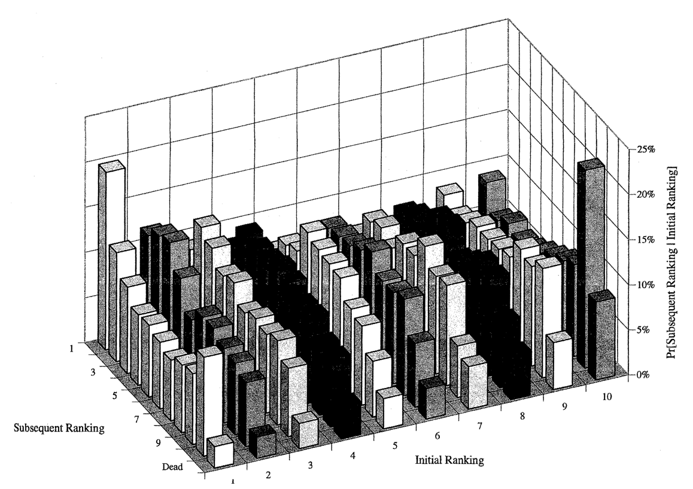
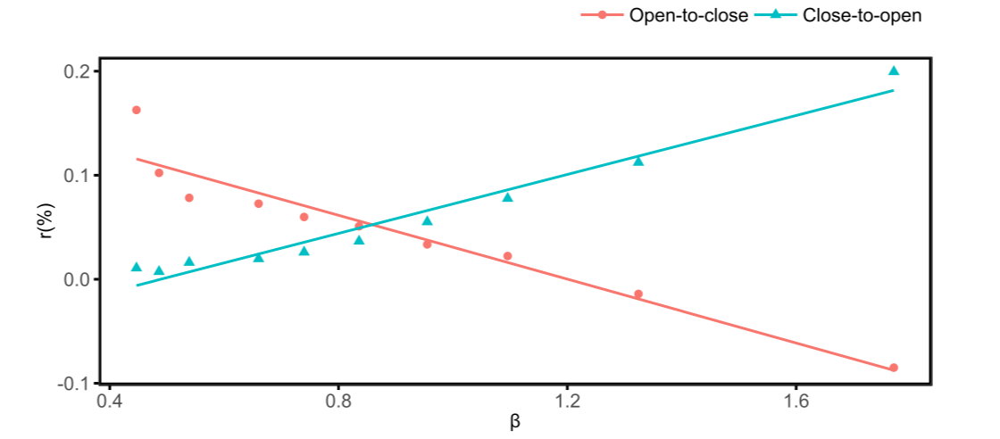
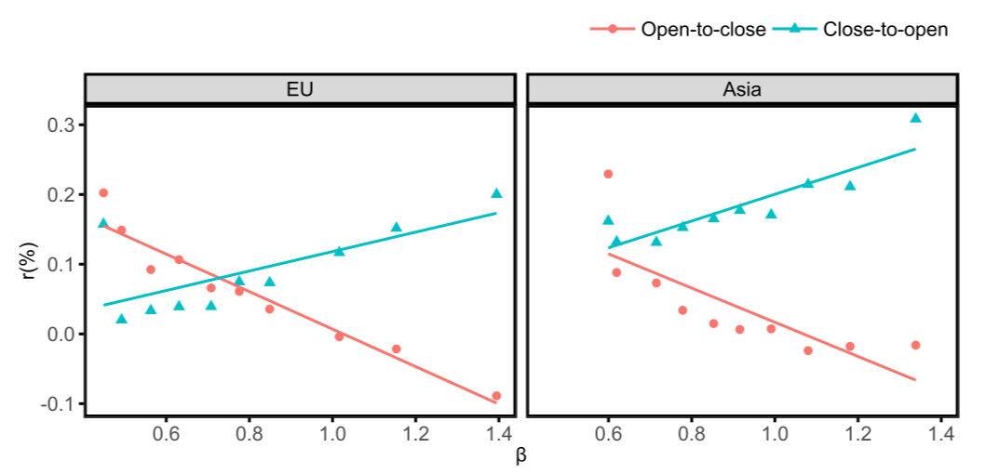
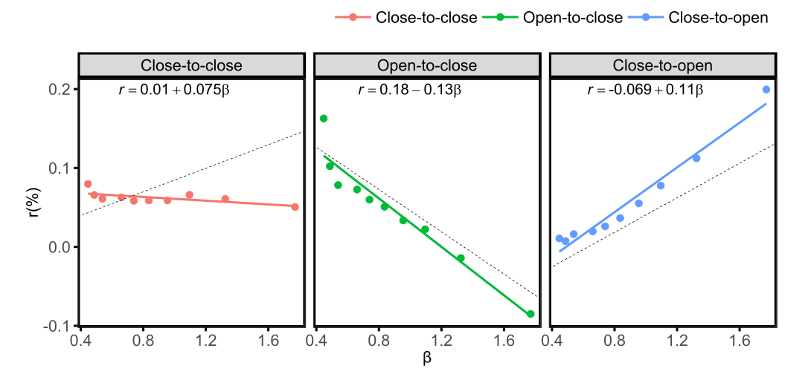
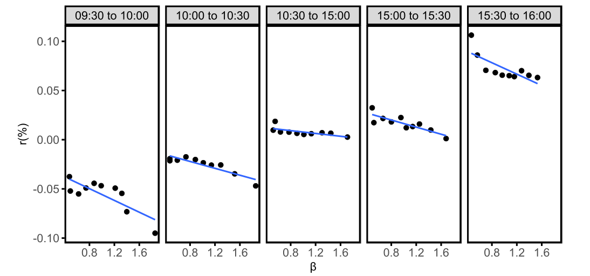

# Intro

## Intro

- Last lecture gave us the first cracks in single-beta CAPM
- Today we will kill the CAPM and replace it with something else...
- Main theme: size and value move from "anomalies" to new factors
- Momentum gets momentum!
- @Hendershott2020: tales of night and day

## Flight Plan

- Step 1: why @FamaFrench1992 became the "death of CAPM" moment
- Step 2: how @FamaFrench1993 turned characteristics into traded factors
- Step 3: momentum and the next challenge [@JegadeeshTitman1993; @Carhart1997]
- Step 4: who is awake and trading to generate anomalies? [@Hendershott2020]

# Part I: The CAPM Break

## Fama-French (1992): Question and Setup

- Core question: does market beta explain average returns in the cross-section? [@FamaFrench1992]
- Benchmark implication under CAPM: beta should dominate characteristics
- @Banz1981 had already shown the size effect: small firms earn higher returns
- @Rosenberg1985 had shown the value effect: high book-to-market firms earn higher returns
- The complicated part is ensuring that single-sort on characteristics do not proxy for $\beta$!

## FF (1992): Portfolio-Sorting Design

- Each June, they would compute $\beta$ for each stock using past data
- Form 10 portfolios sorted on deciles of market-cap (size)
- Inside each portfolio create 10 portfolios sorted on $\beta$: 100 portfolios in total
- Keep track of returns of each portfolio and redo it next June
- You get 100 time series of portfolio returns
- Compute the $\beta$ for each portfolio and let $\beta_{i,t} \equiv \beta_{p(i,t)}$
- $p(i,t) \in \{1,2,3,\ldots, 100\}$: portfolio where stock $i$ belongs at time $t$

## FF (1992): Beta vs Size
```{=latex}
\begin{table}[ht]
\centering
\small
\begin{tabular}{lccccccccccc}
\toprule
 & All & Low-$\beta$ & $\beta$-2 & $\beta$-3 & $\beta$-4 & $\beta$-5 & $\beta$-6 & $\beta$-7 & $\beta$-8 & $\beta$-9 & High-$\beta$ \\
\midrule
All      & 1.25 & 1.34 & 1.29 & 1.36 & 1.31 & 1.33 & 1.28 & 1.24 & 1.21 & 1.25 & 1.14 \\
Small-ME & 1.52 & 1.71 & 1.57 & 1.79 & 1.61 & 1.50 & 1.50 & 1.37 & 1.63 & 1.50 & 1.42 \\
ME-2     & 1.29 & 1.25 & 1.42 & 1.36 & 1.39 & 1.65 & 1.61 & 1.37 & 1.31 & 1.34 & 1.11 \\
ME-3     & 1.24 & 1.12 & 1.31 & 1.17 & 1.70 & 1.29 & 1.10 & 1.31 & 1.36 & 1.26 & 0.76 \\
ME-4     & 1.25 & 1.27 & 1.13 & 1.54 & 1.06 & 1.34 & 1.06 & 1.41 & 1.17 & 1.35 & 0.98 \\
ME-5     & 1.29 & 1.34 & 1.42 & 1.39 & 1.48 & 1.42 & 1.18 & 1.13 & 1.27 & 1.18 & 1.08 \\
ME-6     & 1.17 & 1.08 & 1.53 & 1.27 & 1.15 & 1.20 & 1.21 & 1.18 & 1.04 & 1.07 & 1.02 \\
ME-7     & 1.07 & 0.95 & 1.21 & 1.26 & 1.09 & 1.18 & 1.11 & 1.24 & 0.62 & 1.32 & 0.76 \\
ME-8     & 1.10 & 1.09 & 1.05 & 1.37 & 1.20 & 1.27 & 0.98 & 1.18 & 1.02 & 1.01 & 0.94 \\
ME-9     & 0.95 & 0.98 & 0.88 & 1.02 & 1.14 & 1.07 & 1.23 & 0.94 & 0.82 & 0.88 & 0.59 \\
Large-ME & 0.89 & 1.01 & 0.93 & 1.10 & 0.94 & 0.93 & 0.89 & 1.03 & 0.71 & 0.74 & 0.56 \\
\bottomrule
\end{tabular}
\end{table}
```

## FF (1992): Beta vs Book-to-Market Ratio
```{=latex}
\begin{table}[htbp]
\centering
\scriptsize
\begin{tabular}{lrrrrrrrrrrrr}
\toprule
Portfolio & 1A & 1B & 2 & 3 & 4 & 5 & 6 & 7 & 8 & 9 & 10A & 10B \\
\midrule
Return       & 0.30  & 0.67  & 0.87  & 0.97  & 1.04  & 1.17  & 1.30  & 1.44  & 1.50  & 1.59  & 1.92  & 1.83 \\
$\beta$      & 1.36  & 1.34  & 1.32  & 1.30  & 1.28  & 1.27  & 1.27  & 1.27  & 1.27  & 1.29  & 1.33  & 1.35 \\
$\ln(ME)$    & 4.53  & 4.67  & 4.69  & 4.56  & 4.47  & 4.38  & 4.23  & 4.06  & 3.85  & 3.51  & 3.06  & 2.65 \\
$\ln(BE/ME)$ & $-$2.22 & $-$1.51 & $-$1.09 & $-$0.75 & $-$0.51 & $-$0.32 & $-$0.14 & 0.03  & 0.21  & 0.42  & 0.66  & 1.02 \\
$\ln(A/ME)$  & $-$1.24 & $-$0.79 & $-$0.40 & $-$0.05 & 0.20  & 0.40  & 0.56  & 0.71  & 0.91  & 1.12  & 1.35  & 1.75 \\
$\ln(A/BE)$  & 0.94  & 0.71  & 0.68  & 0.70  & 0.71  & 0.71  & 0.70  & 0.68  & 0.70  & 0.70  & 0.70  & 0.73 \\
$E/P$ dummy  & 0.29  & 0.15  & 0.10  & 0.08  & 0.08  & 0.08  & 0.09  & 0.09  & 0.11  & 0.15  & 0.22  & 0.36 \\
$E(+)/P$     & 0.03  & 0.04  & 0.06  & 0.08  & 0.09  & 0.10  & 0.11  & 0.11  & 0.12  & 0.12  & 0.11  & 0.10 \\
Firms        & 89    & 98    & 209   & 222   & 226   & 230   & 235   & 237   & 239   & 239   & 120   & 117  \\
\bottomrule
\end{tabular}
\end{table}
```

## FF (1992): Size vs BE/ME Interaction
```{=latex}
\begin{table}[htbp]
\centering
\begin{tabular}{lrrrrrrrrrrr}
\hline
 & All & Low & 2 & 3 & 4 & 5 & 6 & 7 & 8 & 9 & High \\
\hline
All & 1.23 & 0.64 & 0.98 & 1.06 & 1.17 & 1.24 & 1.26 & 1.39 & 1.40 & 1.50 & 1.63 \\
Small-ME & 1.47 & 0.70 & 1.14 & 1.20 & 1.43 & 1.56 & 1.51 & 1.70 & 1.71 & 1.82 & 1.92 \\
ME-2 & 1.22 & 0.43 & 1.05 & 0.96 & 1.19 & 1.33 & 1.19 & 1.58 & 1.28 & 1.43 & 1.79 \\
ME-3 & 1.22 & 0.56 & 0.88 & 1.23 & 0.95 & 1.36 & 1.30 & 1.30 & 1.40 & 1.54 & 1.60 \\
ME-4 & 1.19 & 0.39 & 0.72 & 1.06 & 1.36 & 1.13 & 1.21 & 1.34 & 1.59 & 1.51 & 1.47 \\
ME-5 & 1.24 & 0.88 & 0.65 & 1.08 & 1.47 & 1.13 & 1.43 & 1.44 & 1.26 & 1.52 & 1.49 \\
ME-6 & 1.15 & 0.70 & 0.98 & 1.14 & 1.23 & 0.94 & 1.27 & 1.19 & 1.19 & 1.24 & 1.50 \\
ME-7 & 1.07 & 0.95 & 1.00 & 0.99 & 0.83 & 0.99 & 1.13 & 0.99 & 1.16 & 1.10 & 1.47 \\
ME-8 & 1.08 & 0.66 & 1.13 & 0.91 & 0.95 & 0.99 & 1.01 & 1.15 & 1.05 & 1.29 & 1.55 \\
ME-9 & 0.95 & 0.44 & 0.89 & 0.92 & 1.00 & 1.05 & 0.93 & 0.82 & 1.11 & 1.04 & 1.22 \\
Large-ME & 0.89 & 0.93 & 0.88 & 0.84 & 0.71 & 0.79 & 0.83 & 0.81 & 0.96 & 0.97 & 1.18 \\
\hline
\end{tabular}
\end{table}
```

## FF (1992): Evidence Based on Fama-MacBeth Regressions
```{=latex}
\begin{table}[htbp]
\centering
\begin{tabular}{lrrrrrrrrr}
\hline
 & \multicolumn{3}{c|}{7/63--12/90 (330 Mos.)} & \multicolumn{3}{c|}{7/63--12/76 (162 Mos.)} & \multicolumn{3}{c}{1/77--12/90 (168 Mos.)} \\
 \hline
Variable & Mean & Std & $t$(Mn) & Mean & Std & $t$(Mn) & Mean & Std & $t$(Mn) \\
\hline
\multicolumn{10}{c}{$R_{it} = a + b_{2,t}\ln(\text{ME}_{it}) + b_{3,t}\ln(\text{BE}/\text{ME}_{it}) + e_{it}$} \\
\hline
$a$ & 1.77 & 8.51 & 3.77 & 1.86 & 10.10 & 2.33 & 1.69 & 6.67 & 3.27 \\
$b_2$ & $-0.11$ & 1.02 & $-1.99$ & $-0.16$ & 1.25 & $-1.62$ & $-0.07$ & 0.73 & $-1.16$ \\
$b_3$ & 0.35 & 1.45 & 4.43 & 0.36 & 1.53 & 2.96 & 0.35 & 1.37 & 3.30 \\
\hline
\multicolumn{10}{c}{$R_{it} = a + b_{1,t}\beta_{it} + b_{2,t}\ln(\text{ME}_{it}) + b_{3,t}\ln(\text{BE}/\text{ME}_{it}) + e_{it}$} \\
\hline
$a$ & 2.07 & 5.75 & 6.55 & 1.73 & 6.22 & 3.54 & 2.40 & 5.25 & 5.92 \\
$b_1$ & $-0.17$ & 5.12 & $-0.62$ & 0.10 & 5.33 & 0.25 & $-0.44$ & 4.91 & $-1.17$ \\
$b_2$ & $-0.12$ & 0.89 & $-2.52$ & $-0.15$ & 1.03 & $-1.91$ & $-0.09$ & 0.74 & $-1.64$ \\
$b_3$ & 0.33 & 1.24 & 4.80 & 0.34 & 1.36 & 3.17 & 0.31 & 1.10 & 3.67 \\
\hline
\end{tabular}
\end{table}
```

## FF (1992): Why "Death of CAPM"?

- CAPM is not rejected by one odd portfolio, but by broad return structure
- Beta does not span expected returns once size and value are present
- The average $\beta_{1}$ was in fact **negative** even though indistinguishable from zero
- The profession reads this as a model-level failure, not a small fix
- This was a *major* blow to the CAPM!

## {.standout}
Questions?

# Part II: From Characteristics to Factors

## Motivation

- @FamaFrench1992 showed that sorting stocks based on characteristics produced return patterns CAPM can't handle
- This kills CAPM... so what's next?

. . .

- @FamaFrench1993 proposed a new factor model, meant to *substitute CAPM*
- A model based on 3 factors: the market, one size factor, and one book-to-market factor
- This is saying that your SDF moves as a function of the market $+$ something else
- How to construct this "something else"? Mimicking portfolios!

## The End Goal
Recall that a 3-factor model for (excess) returns implies:
$$
R_{i, t} - R_{f,t} = \alpha_i + \beta_{i,1}F_{1,t} + \beta_{i,2}F_{2,t} + \beta_{i,3}F_{3,t} + \varepsilon_{i,t}
$$

- Such model will price assets if $\alpha_i = 0$ for all $i \implies$ remember @Ross1976!

. . . 

- Like the CAPM, this would imply that $R_{i, t} - R_{f,t}$ is only a function of factor exposures!
- A candidate for $F_{1,t}$ is the market factor, a proxy for "return on wealth"
- @FamaFrench1993 constructed $F_{2,t}$ and $F_{3,t}$ to capture size and value patterns

## SMB and HML Construction (Compact Version)

- They divide stocks, every June, into 6 groups along 2 dimensions:
    - Size: small (below median) and big (above median)
    - Book-to-market: low (bottom 30%), neutral (30-70%), and high (top 30%)
- Six final portfolios: $SL_t$, $SN_t$, $SH_t$, $BL_t$, $BN_t$, and $BH_t$

. . .

Define the following:
$$
\mathrm{SMB}_t = \frac{1}{3}(SL_t+SN_t+SH_t)-\frac{1}{3}(BL_t+BN_t+BH_t)
$$

$$
\mathrm{HML}_t = \frac{1}{2}(SH_t+BH_t)-\frac{1}{2}(SL_t+BL_t)
$$

- SMB = small minus big returns, HML = high minus low book-to-market returns
- You can actually trade these portfolios

## Three-Factor Regression and Alpha Restriction
They run the following time-series regression for each test asset $i$
$$
R_{i,t}-R_{f,t}=\alpha_i+\beta_{iM}(R_{M,t}-R_{f,t})+\beta_{iS}\,\mathrm{SMB}_t+\beta_{iH}\,\mathrm{HML}_t+\varepsilon_{i,t}
$$

- Pricing success means intercepts close to zero across test assets

. . .

What assets to test?

- They build 25 test portfolios
- These are 5x5 portfolios sorted on size and book-to-market
- Individual stocks used only to construct factors

. . .

- What do you think is the argument against running this on individual stocks?

## FF (1993): Restricted Model and Alpha Patterns
First, a restricted regression: $R_{i,t} - R_{f,t} = a_i + b_i[R_{M,t} - R_{f,t}] + e(t)$

```{=latex}
\begin{table}
\centering
\footnotesize
\begin{tabular}{l|ccccc|ccccc}
\hline
& \multicolumn{5}{c|}{$a$} & \multicolumn{5}{c}{$t(a)$} \\
Size/ BE/ME & Low & 2 & 3 & 4 & High & Low & 2 & 3 & 4 & High \\
\hline
Small & $-0.22$ & $0.15$ & $0.30$ & $0.42$ & $0.54$ & $-0.90$ & $0.73$ & $1.54$ & $2.19$ & $2.53$ \\
2 & $-0.18$ & $0.17$ & $0.36$ & $0.39$ & $0.53$ & $-1.00$ & $1.05$ & $2.35$ & $2.79$ & $3.01$ \\
3 & $-0.16$ & $0.15$ & $0.23$ & $0.39$ & $0.50$ & $-1.12$ & $1.25$ & $1.82$ & $3.20$ & $3.19$ \\
4 & $-0.05$ & $-0.14$ & $0.12$ & $0.35$ & $0.57$ & $-0.50$ & $-1.50$ & $1.20$ & $2.91$ & $3.71$ \\
Big & $-0.04$ & $-0.07$ & $-0.07$ & $0.20$ & $0.21$ & $-0.49$ & $-0.95$ & $-0.70$ & $1.89$ & $1.41$ \\
\hline
\end{tabular}
\end{table}
```
\vspace{1cm}
- Notice how $\hat{a}$ is monotonic!
- It increases with BE/ME and decreases with size

## FF (1993): Key Figure Placeholder
The full model: $R_{i,t} - R_{f,t} = a_i + b_i[R_{M,t} - R_{f,t}] + s_iSMB_t + h_iHML_t + e_i(t)$

```{=latex}
\begin{table}
\centering
\scriptsize
\begin{tabular}{l|ccccc|ccccc}
\hline
& \multicolumn{5}{c|}{$a$} & \multicolumn{5}{c}{$t(a)$} \\
Size/ BE/ME & Low & 2 & 3 & 4 & High & Low & 2 & 3 & 4 & High \\
\hline
Small & $-0.34$ & $-0.12$ & $-0.05$ & $0.01$ & $0.00$ & $-3.16$ & $-1.47$ & $-0.73$ & $0.22$ & $0.14$ \\
2 & $-0.11$ & $-0.01$ & $0.08$ & $0.03$ & $0.02$ & $-1.24$ & $-0.20$ & $1.04$ & $0.51$ & $0.34$ \\
3 & $-0.11$ & $0.04$ & $-0.04$ & $0.05$ & $0.05$ & $-1.42$ & $0.47$ & $-0.47$ & $0.71$ & $0.56$ \\
4 & $0.09$ & $-0.22$ & $-0.08$ & $0.03$ & $0.13$ & $1.07$ & $-2.65$ & $-0.99$ & $0.33$ & $1.24$ \\
Big & $0.21$ & $-0.05$ & $-0.13$ & $-0.05$ & $-0.16$ & $3.27$ & $-0.67$ & $-1.46$ & $-0.69$ & $-1.41$ \\
\hline
\end{tabular}
\end{table}
```
\vspace{1cm}
- Estimated intercepts are much smaller and mostly insignificant
- In the paper: they also do the test by @GibbonsRossShanken1989
   The $R^2$ in the regressions is frequently above 90%

## FF (1993): Some Comments

- They were able to construct portfolios that the CAPM couldn't price...
- But their new model could!
- Don't expect neat structural theories of why this worked

. . .

- Taken at face value, there is no reason to use CAPM after this paper
- The 3-factor model should be used to estimate cost of capital, for example
- The alpha from the 3-factor model should be the metric for performance evaluation

## {.standout}
Questions?

# Part III: Momentum and the Interpretation Fight

## Jegadeesh-Titman (1993): Momentum Design

- @DeBondtThaler1985: losers will be winners, and winners will be losers
- Horizon matters: past performance over 3-5 years, future performance over 3-5 years
- At odds with the evidence from @Grinblatt1989 who studies different mutual funds

. . .

- @JegadeeshTitman1993: analyzed strategies based on shorter periods for returns: 3-12 months
- At time $t$: Evaluate post-formation returns over the following months
- Core result: return continuation is economically large

## Jegadeesh-Titman (1993): Main Result

::: {.columns}

::: {.column width="54%"}
```{=latex}
\begin{table}
\centering
\tiny
\begin{tabular}{l|ccccc}
\hline
J & K = & 3 & 6 & 9 & 12 \\
\hline
\multirow{3}{*}{3} & Sell & 0.0108 & 0.0091 & 0.0092 & 0.0087 \\
& & (2.16) & (1.87) & (1.92) & (1.87) \\
& Buy & 0.0140 & 0.0149 & 0.0152 & 0.0156 \\
& & (3.57) & (3.78) & (3.83) & (3.89) \\
& Buy-sell & \colorbox{yellow}{0.0032} & 0.0058 & 0.0061 & 0.0069 \\
& & (1.10) & (2.29) & (2.69) & (3.53) \\
\hline
\multirow{3}{*}{6} & Sell & 0.0087 & 0.0079 & 0.0072 & 0.0080 \\
& & (1.67) & (1.56) & (1.48) & (1.66) \\
& Buy & 0.0171 & 0.0174 & 0.0174 & 0.0166 \\
& & (4.28) & (4.33) & (4.31) & (4.13) \\
& Buy-sell & \colorbox{yellow}{0.0084} & 0.0095 & 0.0102 & 0.0086 \\
& & (2.44) & (3.07) & (3.76) & (3.36) \\
\hline
\multirow{3}{*}{9} & Sell & 0.0077 & 0.0065 & 0.0071 & 0.0082 \\
& & (1.47) & (1.29) & (1.43) & (1.66) \\
& Buy & 0.0186 & 0.0186 & 0.0176 & 0.0164 \\
& & (4.56) & (4.53) & (4.30) & (4.03) \\
& Buy-sell & \colorbox{yellow}{0.0109} & 0.0121 & 0.0105 & 0.0082 \\
& & (3.03) & (3.78) & (3.47) & (2.89) \\
\hline
\multirow{3}{*}{12} & Sell & 0.0060 & 0.0065 & 0.0075 & 0.0087 \\
& & (1.17) & (1.29) & (1.48) & (1.74) \\
& Buy & 0.0192 & 0.0179 & 0.0168 & 0.0155 \\
& & (4.63) & (4.36) & (4.10) & (3.81) \\
& Buy-sell & \colorbox{yellow}{0.0131} & 0.0114 & 0.0093 & 0.0068 \\
& & (3.74) & (3.40) & (2.95) & (2.25) \\
\hline
\end{tabular}
\end{table}
```
:::

::: {.column width="46%"}
- Winners minus losers is positive in almost all $J$-$K$ combinations
- The effect is strongest for intermediate horizons (about 6-12 months)
- t-stats for buy-sell are often above 2, so not just noise
- This is hard to reconcile with a pure CAPM story
:::

:::

## Isn't It Just Beta?
```{=latex}
\begin{table}
\centering
\begin{tabular}{lcc}
\hline
Portfolio (sorted on 6-month past returns)& Beta & Average Market Capitalization \\
\hline
P1 & 1.36 & 208.24 \\
P2 & 1.19 & 480.07 \\
P3 & 1.14 & 545.31 \\
P4 & 1.11 & 618.85 \\
P5 & 1.09 & 692.89 \\
P6 & 1.08 & 702.51 \\
P7 & 1.09 & 738.09 \\
P8 & 1.12 & 758.87 \\
P9 & 1.17 & 680.18 \\
P10 & 1.28 & 495.13 \\
P10--P1 & $-$0.08 & --- \\
\hline
\end{tabular}
\end{table}
```

## Average Returns By Past Performance Controlling For Beta and Size
```{=latex}
\begin{table}
\centering
\tiny
\begin{tabular}{lccccccc}
\hline
& All & S1 & S2 & S3 & $\beta_1$ & $\beta_2$ & $\beta_3$ \\
\hline
P1 & 0.0079 & 0.0083 & 0.0047 & 0.0082 & 0.0129 & 0.0097 & 0.0052 \\
& (1.56) & (1.35) & (0.99) & (2.22) & (2.92) & (2.01) & (0.95) \\
P2 & 0.0112 & 0.0117 & 0.0102 & 0.0098 & 0.0140 & 0.0128 & 0.0086 \\
& (2.78) & (2.29) & (2.54) & (3.08) & (4.38) & (3.37) & (1.83) \\
P3 & 0.0125 & 0.0152 & 0.0125 & 0.0105 & 0.0132 & 0.0133 & 0.0102 \\
& (3.40) & (3.23) & (3.34) & (3.53) & (4.59) & (3.77) & (2.28) \\
P4 & 0.0124 & 0.0163 & 0.0130 & 0.0105 & 0.0134 & 0.0128 & 0.0110 \\
& (3.59) & (3.59) & (3.58) & (3.66) & (5.02) & (3.82) & (2.50) \\
P5 & 0.0128 & 0.0164 & 0.0134 & 0.0109 & 0.0135 & 0.0135 & 0.0121 \\
& (3.87) & (3.74) & (3.83) & (3.85) & (5.14) & (4.15) & (2.86) \\
P6 & 0.0134 & 0.0174 & 0.0146 & 0.0102 & 0.0135 & 0.0142 & 0.0122 \\
& (4.14) & (4.08) & (4.22) & (3.66) & (5.23) & (4.38) & (2.92) \\
P7 & 0.0136 & 0.0175 & 0.0143 & 0.0109 & 0.0136 & 0.0142 & 0.0126 \\
& (4.19) & (4.13) & (4.12) & (3.90) & (5.09) & (4.43) & (3.01) \\
P8 & 0.0143 & 0.0174 & 0.0148 & 0.0111 & 0.0143 & 0.0146 & 0.0132 \\
& (4.30) & (4.11) & (4.16) & (3.86) & (5.12) & (4.44) & (3.15) \\
P9 & 0.0153 & 0.0183 & 0.0154 & 0.0126 & 0.0165 & 0.0156 & 0.0141 \\
& (4.36) & (4.28) & (4.11) & (4.17) & (5.34) & (4.56) & (3.28) \\
P10 & 0.0174 & 0.0182 & 0.0173 & 0.0157 & 0.0191 & 0.0176 & 0.0160 \\
& (4.33) & (3.99) & (4.11) & (4.41) & (5.17) & (4.53) & (3.50) \\
P10--P1 & 0.0095 & 0.0099 & 0.0126 & 0.0075 & 0.0062 & 0.0079 & 0.0108 \\
& (3.07) & (2.77) & (4.57) & (3.03) & (2.05) & (2.64) & (3.35) \\
\hline
$F$-Statistics$^a$ & 2.83 & 2.65 & 4.51 & 4.38 & 2.51 & 1.99 & 1.69 \\
$p$-Value & (0.00) & (0.00) & (0.00) & (0.00) & (0.01) & (0.04) & (0.09) \\
\hline
\end{tabular}
\end{table}
```


## Carhart (1997): Four-Factor Extension

$$
R_{i,t}-R_{f,t}=\alpha_i+\beta_M MKT_t+\beta_S SMB_t+\beta_H HML_t+\beta_U UMD_t+\varepsilon_{i,t}
$$

- Add a momentum factor (UMD) to FF3
- UMD stands for "up minus down"
- Constructed as a long-short portfolio based on past 12-month returns
- Up = top 30% winners, down = bottom 30% losers
- This four-factor model became the standard mutual-fund benchmark
- It is mainly an empirical benchmark, not a full structural theory

## CAPM Alphas: 1A = highest past-year returns

```{python}
import matplotlib.pyplot as plt
plt.rcParams["font.family"] = "Arial"
import numpy as np

# Portfolios
portfolios = [
    "1A","1B","1C","1(high)","2","3","4","5",
    "6","7","8","9","10(low)","10A","10B","10C"
]

# CAPM alpha (%)
capm_alpha = [
    0.27,0.22,0.17,0.22,0.14,-0.01,0.02,-0.05,
    -0.02,-0.06,-0.10,-0.21,-0.45,-0.19,-0.42,-0.74
]

# CAPM t-stats
capm_t = [
    2.06,2.00,1.70,2.10,1.75,-0.08,0.33,-1.10,
    -0.46,-1.39,-1.86,-3.24,-4.58,-2.05,-3.84,-5.06
]

# 4-factor alpha (%)
ff4_alpha = [
    -0.11,-0.10,-0.15,-0.12,-0.10,-0.18,-0.12,-0.14,
    -0.12,-0.14,-0.13,-0.20,-0.40,-0.19,-0.37,-0.64
]

# 4-factor t-stats
ff4_t = [
    -1.11,-1.08,-1.92,-1.60,-1.78,-3.65,-2.81,-3.31,
    -2.82,-3.09,-2.52,-3.11,-4.33,-2.16,-3.45,-4.49
]

x = np.arange(len(portfolios))

#################################
# FIGURE 1 — CAPM ALPHAS
#################################

plt.figure(figsize=(9,4))

bars = plt.bar(x, capm_alpha)

plt.gca().set_axisbelow(True)

for i,bar in enumerate(bars):
    plt.text(
        bar.get_x() + bar.get_width()/2,
        bar.get_height() + 0.05*np.sign(bar.get_height()+1e-6),
        f"({capm_t[i]:.2f})",
        ha='center',
        va='bottom',
        fontsize=9
    )

plt.axhline(0,linewidth=1, color="k")
plt.grid(alpha=0.3)
plt.xticks(x,portfolios)
plt.xlabel("Portfolio (Winner to Loser in 12 months)")
plt.ylim(-0.8,0.4)
plt.ylabel("CAPM Alpha (%)")
plt.title("CAPM Alphas Across Portfolios (t-stats)")
plt.tight_layout()
plt.show()
```

## Four-Factor Model Alphas: 1A = highest past-year returns

```{python}
plt.figure(figsize=(10,4))

bars = plt.bar(x, ff4_alpha, ec="k")

plt.gca().set_axisbelow(True)

for i,bar in enumerate(bars):
    plt.text(
        bar.get_x() + bar.get_width()/2,
        bar.get_height() + 0.04*np.sign(bar.get_height()+1e-6),
        f"({ff4_t[i]:.2f})",
        ha='center',
        va='bottom',
        fontsize=9
    )

plt.axhline(0,linewidth=1, color="k")
plt.xticks(x,portfolios)
plt.ylabel("4-Factor Alpha (%)")
plt.xlabel("Portfolio (Winner to Loser in 12 months)")
plt.ylim(-0.8,0)
plt.title("4-Factor Model Alphas Across Portfolios (t-stats)")
plt.tight_layout()
plt.grid(alpha=0.3)
plt.show()
```

## Carhart (1997): Why Are Funds So Bad?
For each individual fund, compute:
$$
\alpha_{i,t} = R_{i, t} - R_{f,t} - \hat{\beta}_{M,i}(R_{M,t} - R_{f,t}) - \hat{\beta}_{S,i}SMB_t - \hat{\beta}_{H,i}HML_t - \hat{\beta}_{U,i}UMD_t
$$

. . .

For any characteristic $x_{i,t}$, regress $\alpha_{i,t} = a + b x_{i,t} + \varepsilon_{i,t}$

```{=latex}
\begin{table}[t]
\centering
\begin{tabular}{lcc}
\hline
\multicolumn{1}{l}{Independent Variables} & Estimate & $t$-statistic \\
\hline
Expense ratio ($t$)            & -1.54 & (-5.99) \\
Turnover ($t$) (Mturn)         & -0.95 & (-2.36) \\
$\ln$ TNA ($t$-1)              & -0.05 & (-0.66) \\
Maximum Load ($t$-1)           & -0.11 & (-3.55) \\
Buy turnover ($t$)             & -0.43 & (-1.16) \\
Sell turnover ($t$)            & -1.26 & (-3.00) \\
\hline
\end{tabular}
\end{table}
```

## Carhart Became the Benchmark

- It captures momentum that FF3 leaves behind
- It is simple, tradable, and easy to implement in regressions
- It improved performance evaluation for funds and strategies
- Terrible funds stay terrible, great funds stay great, but everyone else is kind of random
- It still leaves interpretation open: risk compensation or mispricing?

## Contingency Matrix
{fig-align="center" width="65%"}

## Key Takeaways from Carhart (1997)
- Most mutual funds destroy value, especially the very expensive ones
- Avoid funds with poor track record
- Measure performance against the 4-factor model, not CAPM
- Fees and transaction costs matter a lot
- Cynical take: work for a mutual fund, but save through an ETF

## {.standout}
Questions?

# Part IV: Is CAPM Really Dead? Or Just Sleeping?

## Day vs Night Returns

- CAPM tests and everything we did typically use monthly returns
- You can do everything at daily frequency too...
- And even intraday! @Hendershott2020 is a fun paper to read!

. . .

{fig-align="center" width="80%"}

## This is not only in the US
{fig-align="center" width="90%"}

## Different Timings
{fig-align="center" width="90%"}

## Intraday
{fig-align="center" width="90%"}

## Wrap-Up

- @FamaFrench1992 showed that CAPM fails to price returns sorted on size and book-to-market
- @FamaFrench1993 proposed a 3-factor model that can price those returns
- @JegadeeshTitman1993 documented momentum in returns, which is not captured by CAPM or FF3
- @Carhart1997 added a momentum factor to FF3, creating the 4-factor model
- @Hendershott2020: it's only really sleepy!


## Readings and References {.noframenumbering .allowframebreaks}
\footnotesize
