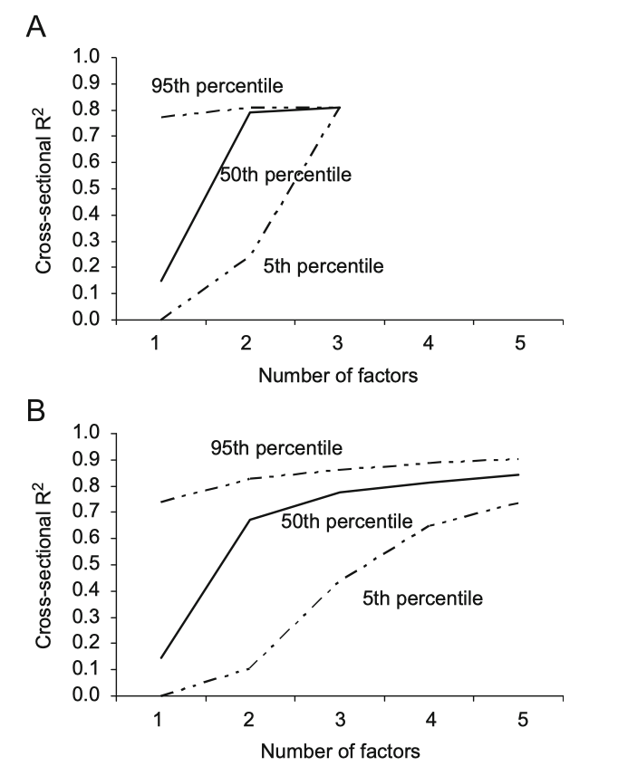
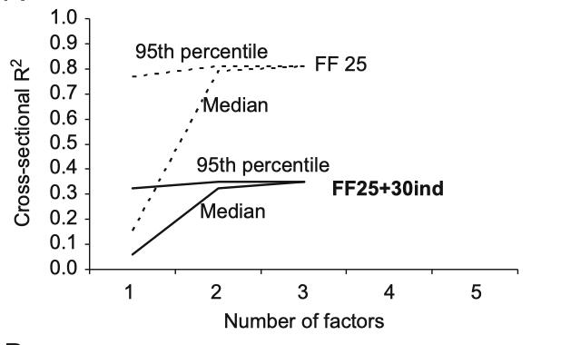

# Intro

## Intro

- Last lecture gave us traded factors: market, SMB, HML, and momentum [@FamaFrench1993; @Carhart1997]
- Today: what do those factors actually represent?
- Risk exposures?
- Or firm characteristics dressed up as factors?

. . .

- What if betas are moving around and we are mismeasuring them?
- Building blocks for a modern view of this debate [@KellyPruittSu2019]

## Flight Plan

- Part I: what is being priced? [@FamaFrench1993; @DanielTitman1997]
- Part II: the empire strikes back [@DavisFamaFrench2000]
- Part III: what if betas are moving around? [@Ferson1999]
- Part IV: pricing the 25 portfolios is easy like Sunday morning [@LewellenNagelShanken2010]
- Part V (next class): a modern reconciliation [@KellyPruittSu2019]

# Part I: What Is Being Priced?

## Two Competing Stories

- @FamaFrench1993 showed that SMB and HML help price test portfolios
- But pricing success does not pin down economic interpretation
- A factor can work in the data for more than one reason

. . .

- @DanielTitman1997 challenged the risk-based reading of SMB and HML
- Story 1 [@FamaFrench1993]: expected returns are driven by factor loadings, the betas generate premia
- Story 2 [@DanielTitman1997]: expected returns are driven by characteristics directly

## Mathematical Interpretation

@FamaFrench1993 propose that: 
$$
\mathbb{E}[R_{i,t}-R_{f,t}]= \beta_i^\top \lambda
$$
where $\lambda$ is a vector of factor premia.

- Important: the only "charachteristics" that matter are the betas!

. . .

@DanielTitman1997 propose that:
$$
\mathbb{E}[R_{i,t}-R_{f,t}]= g(z_i)
$$
where $z_i$ is a vector of characteristics (size, leverage, profitability, book-to-market ratio, ...) and $g$ is an unknown function.

. . .

- What @Ross1976 would say about this discussion?

## Let's Watch a Video {.center}

:::{.center}
\centering

[Click here](https://www.youtube.com/watch?v=q98MTDjmG2A)

Time: 2:00–6:50

Let's try to reflect on the manager's idea through these two different lenses!
:::

## An Ideal Test

- Imagine we could see two firms with the *same* factor loadings but *different* characteristics
- Under @FamaFrench1993, they should have the same expected return
- Under @DanielTitman1997, they *could* have different expected returns

. . .

- Problem: empirically, this is essentially impossible to find
- Characteristics and factor loadings are highly correlated in the data -- almost by construction
- DT97's key contribution: design a test that tries to break this link

## Daniel and Titman: The Design

- Construct 9 portfolios by sorting stocks on size and book-to-market (3x3)
- Each June at time $t$, estimate the 3-factor model for each stock using past data
- For each of the 9 portfolios, create 5 sub-portfolios based on the estimated $\beta_{HML}$
- Total: 45 portfolios sorted on (size, book-to-market, and HML beta)

. . .

- Under Story 2 (characteristics), the sub-portfolios should have similar returns
- Under Story 1 (covariances), the sub-portfolios should have different returns that track their HML betas

## Characteristic-Matched Portfolios

- Let $R_{s, b, h}$ denote the return of the portfolio with size sort $s$, book-to-market sort $b$, and HML beta sort $h$
- $h=1$ is the lowest HML beta, $h=5$ is the highest

. . .

- Define the "characteristic-matched" portfolio return $C_{s, b}$ as

$$
C_{s,b} \equiv \underbrace{R_{s, b, 1} + R_{s, b, 2}}_{\text{low HML beta}} - \underbrace{R_{s, b, 4} - R_{s, b, 5}}_{\text{high HML beta}}
$$

- There are 9 of these portfolios, one for each (size, book-to-market) cell

## The Test
- Consider estimating
$$
C_{s,b} = \alpha_{s,b} + \beta_{s,b,Mkt}\cdot MKT_t +  \beta_{s,b,SMB}\cdot SMB_t + \beta_{s,b,HML} \cdot HML_t + \varepsilon_{s,b}
$$

- If FF93 is right, we should find $\alpha_{s,b} \approx 0$
- They show that SMB and MKT loadings are similar across $R_{s,b,h}$
- So we would expect $\mathbb{E}[C_{s,b}] < 0$ under FF93

. . .

But if DT97 is right...

- We should find $\alpha_{s,b} > 0$ since $\alpha_{s,b}$ = (true premium) - (what FF93 implies)
- We should also find $\mathbb{E}[C_{s,b}] \approx 0$

## Empirical Results - MKT Betas

```{=latex}
\begin{table}[htbp]
\centering
\begin{tabular}{cc ccccc}
\toprule
\multicolumn{2}{c}{Char Port} 
  & \multicolumn{5}{c}{$\hat{\beta}_{\text{Mkt}}$} \\
\cmidrule(lr){1-2}\cmidrule(lr){3-7}
BM & SZ & 1 & 2 & 3 & 4 & 5 \\
\midrule
1 & 1 & 1.12 & 1.03 & 1.07 & 1.04 & 1.15 \\
1 & 2 & 1.14 & 1.03 & 1.03 & 1.07 & 1.08 \\
1 & 3 & 0.99 & 0.98 & 0.95 & 1.04 & 1.04 \\
\addlinespace
2 & 1 & 0.99 & 0.93 & 0.95 & 0.95 & 1.08 \\
2 & 2 & 1.06 & 0.96 & 0.94 & 1.01 & 1.06 \\
2 & 3 & 0.97 & 1.02 & 0.96 & 1.04 & 1.07 \\
\addlinespace
3 & 1 & 1.01 & 0.92 & 0.94 & 1.05 & 1.17 \\
3 & 2 & 1.05 & 0.99 & 0.98 & 1.02 & 1.20 \\
3 & 3 & 1.02 & 1.03 & 0.99 & 1.03 & 1.15 \\
\addlinespace
\multicolumn{2}{c}{Average} & 1.04 & 0.99 & 0.98 & 1.03 & 1.11 \\
\bottomrule
\end{tabular}
\end{table}
```

## Empirical Results - HML and SMB Betas

```{=latex}
\begin{table}[htbp]
\centering
\footnotesize
\begin{tabular}{cc ccccc ccccc}
\toprule
\multicolumn{2}{c}{Char Port} 
  & \multicolumn{5}{c}{$\hat{\beta}_{\text{HML}}$} 
  & \multicolumn{5}{c}{$\hat{\beta}_{\text{SMB}}$} \\
\cmidrule(lr){1-2}\cmidrule(lr){3-7}\cmidrule(lr){8-12}
BM & SZ & 1 & 2 & 3 & 4 & 5 
       & 1 & 2 & 3 & 4 & 5 \\
\midrule
1 & 1 & $-$0.40 & $-$0.38 & $-$0.11 & $-$0.04 &  0.25
       &  1.23 &  1.07 &  1.07 &  1.18 &  1.39 \\
1 & 2 & $-$0.60 & $-$0.32 & $-$0.18 & $-$0.05 &  0.05
       &  0.81 &  0.55 &  0.62 &  0.55 &  0.61 \\
1 & 3 & $-$0.70 & $-$0.44 & $-$0.22 & $-$0.11 & $-$0.02
       & $-$0.14 & $-$0.17 & $-$0.16 & $-$0.08 &  0.04 \\
\addlinespace
2 & 1 &  0.02 &  0.19 &  0.32 &  0.35 &  0.48
       &  1.19 &  0.95 &  0.94 &  0.89 &  1.15 \\
2 & 2 &  0.17 &  0.23 &  0.28 &  0.36 &  0.49
       &  0.54 &  0.45 &  0.44 &  0.47 &  0.72 \\
2 & 3 &  0.03 &  0.24 &  0.22 &  0.31 &  0.49
       & $-$0.22 & $-$0.25 & $-$0.15 & $-$0.10 & $-$0.07 \\
\addlinespace
3 & 1 &  0.42 &  0.50 &  0.57 &  0.75 &  0.91
       &  1.24 &  1.01 &  0.95 &  1.04 &  1.25 \\
3 & 2 &  0.40 &  0.58 &  0.56 &  0.72 &  0.82
       &  0.61 &  0.43 &  0.37 &  0.43 &  0.69 \\
3 & 3 &  0.45 &  0.56 &  0.67 &  0.81 &  1.00
       & $-$0.06 & $-$0.15 & $-$0.17 &  0.05 &  0.10 \\
\addlinespace
\multicolumn{2}{c}{Average}
       & $-$0.02 &  0.13 &  0.23 &  0.34 &  0.50
       &  0.58 &  0.43 &  0.43 &  0.49 &  0.65 \\
\bottomrule
\end{tabular}
\end{table}
```

## Empirical Results - Main Table

```{=latex}
\begin{table}[htbp]
\centering
\begin{tabular}{ll ccccc}
\toprule
\multicolumn{2}{c}{Char Port} 
  & \multicolumn{5}{c}{Char-Balanced Portfolio: $t$-Statistics} \\
\cmidrule(lr){1-2}\cmidrule(lr){3-7}
BM & SZ & $\hat{\alpha}$ & $\beta_{\text{Mkt}}$ & $\beta_{\text{SMB}}$ & $\beta_{\text{HML}}$ & $R^2$ \\
\midrule
1 & 1 &  1.43 & $-$0.43 & $-$2.69 & $-$9.21 & 31.48 \\
1 & 2 &  0.50 &    0.18 &    1.98 & $-$8.99 & 31.48 \\
1 & 3 & $-$0.48 & $-$1.62 & $-$2.52 & $-$8.57 & 27.11 \\
\addlinespace
2 & 1 &  1.37 & $-$2.02 &    1.31 & $-$7.13 & 18.43 \\
2 & 2 &  2.12 & $-$0.99 & $-$2.07 & $-$4.69 & 10.96 \\
2 & 3 &  0.79 & $-$1.41 & $-$2.34 & $-$3.96 &  9.11 \\
\addlinespace
3 & 1 &  2.53 & $-$5.30 & $-$0.48 & $-$8.00 & 23.36 \\
3 & 2 &  2.01 & $-$2.30 & $-$0.63 & $-$4.52 &  8.58 \\
3 & 3 &  1.08 & $-$1.30 & $-$2.36 & $-$4.98 & 12.39 \\
\midrule
\multicolumn{2}{l}{Combined portfolio} 
       &  0.354  & $-$0.110  & $-$0.134  & $-$0.724  & 41.61 \\
\multicolumn{2}{l}{Expected return: -0.116\%} 
       & (2.30)  & ($-$3.10) & ($-$2.40) & ($-$12.31) &       \\
\bottomrule
\end{tabular}
\end{table}
```
# Part II: Follow-Ups

## Davis-Fama-French: The Reply

- @DavisFamaFrench2000 push back on the characteristic story
- Their point: the sample in DT97 (1963-1993) is short and anomalous
- They perform the same analysis as DT97 but with different samples, getting different results

```{=latex}
\begin{table}
  \centering
  \scriptsize
    \begin{tabular}{lccccccccccc}
    \hline
    Period & Ave & $t(\text{Ave})$ & $a$ & $b$ & $s$ & $h$ & $t(a)$ & $t(b)$ & $t(s)$ & $t(h)$ & $R^2$ \\
    \hline
    7/29--6/97 & 0.12 & 1.56 & $-0.06$ & $-0.01$ & 0.03 & 0.38 & $-0.83$ & $-0.48$ & 0.91 & 11.92 & 0.29 \\
    7/29--6/63 & 0.19 & 1.49 & 0.01 & $-0.01$ & 0.06 & 0.35 & 0.11 & $-0.19$ & 1.09 & 6.99 & 0.24 \\
    7/63--6/97 & 0.05 & 0.56 & $-0.14$ & 0.01 & $-0.01$ & 0.43 & $-2.07$ & 0.48 & $-0.28$ & 14.32 & 0.42 \\
    7/73--12/93 & 0.03 & 0.25 & $-0.22$ & 0.02 & 0.03 & 0.46 & $-2.28$ & 0.61 & 0.80 & 11.35 & 0.44 \\
    7/29--6/72 \& & & & & & & & & & & \\
    \quad 1/94--6/97 & 0.16 & 1.63 & $-0.00$ & $-0.01$ & 0.03 & 0.36 & $-0.01$ & $-0.31$ & 0.74 & 8.80 & 0.26 \\
    \hline
  \end{tabular}
\end{table}
```

## The Fight Kept On...

- @Daniel2001 showed support for @DanielTitman1997 using data from the Japanese stock market
- @Fama1998 also showed support for a value factor (HML) in several international markets
- @Fama2012 showed that the size, value, and momentum factors are necessary to price stocks across many markets
- Important: localization matters! The markets might not be so integrated...

## {.standout}
Questions?

# Part III: What If Betas Are Moving Around?

## What if Betas Are Not Constant?

- Everything we talked so far was about **unconditional** betas and premia
- But why should these things be constant over time?
- Companies change over time, so their betas should change too
- Different factors probably are born and die... no AI 15 years ago! Also, climate risk?
- @Ferson1999 asks: what if we are mismeasuring betas by assuming they are constant?
- Can CAPM be saved? Are Fama French betas moving around?

## Conditional vs Unconditional Models

- Unconditional model: $\mathbb{E}[R_{i,t}-R_{f,t}] = \beta_i^\top \lambda$
- Conditional model: $\mathbb{E}_t[R_{i,t+1}-R_{f,t+1}] = \beta_{i,t}^\top \lambda_t$

. . .

The conditional model in general *does not imply* the unconditional one:

$$
\mathbb{E}[R_{i,t}-R_{f,t}] = \mathbb{E}[\beta_{i,t}^\top \lambda_t] = \mathbb{E}[\beta_{i,t}]^\top \mathbb{E}[\lambda_t] + \text{Cov}(\beta_{i,t}, \lambda_t)
$$

. . .

Can you think of examples in which $\text{Cov}(\beta_{i,t}, \lambda_t) > 0$?

. . .

We might be measuring Fama-French betas (and the CAPM beta) super wrong!

. . .

More importantly: we might be measuring alphas wrong!

## A Model With Time-Varying Betas
Assume we have $K$ factors and asset $i$ has loading $\beta_{i,t}$:
$$
r_{i,t} = \beta_{i,t}^\top f_t + \varepsilon_{i,t}
$$
where $r_{i,t}$ is the excess return of asset $i$ at time $t$.

- Assumptions: $\mathbb{E}_t[\varepsilon_{i,t+1}] = 0$ and $\mathbb{E}_t[\varepsilon_{i,t+1} f_{t+1}] = 0, \forall i,t$

. . .

- Let's generalize the expect return:
```{=latex}
\begin{gather*}
\mathbb{E}_t[r_{i,t+1}] = \alpha_{i,t} + \beta_{i,t}^\top \lambda_t \\
\alpha_{i,t} = a_{0,i} + a_{1,i}^\top z_{t-1} \\
\beta_{i,t} = b_{0,i} + b_{1,i}^\top z_{t-1}
\end{gather*}
```
where $z_t$ is a vector of **instruments**

## How Does Fama-French Fit Here?

- The instruments $z_t$ should ideally be things known to forecast returns
- Question: do they help forecasting returns through betas? Or through $\alpha_{i,t}$?
- If the Fama-French model is conditionally correct, $a_{0,i} = 0$ and $a_{1,i} = 0$

. . .

- How well can this model price assets?
- Can we use the Fama-French model as a conditional model?
- Do we have evidence that betas are changing over time in a systematic way?

## Clever Estimation

@Ferson1999 proposes a neat way of estimating these parameters:

$$
r_{i,t} = \alpha_{0,i} + \alpha_{1,i}^\top z_{t-1} + (b_{0,i} + b_{1,i}^\top z_{t-1})^\top f_t + \varepsilon_{i,t}
$$

- Regress realized excess returns on constants, instruments, and interactions between factors and instruments
- $f_t$: Fama-French factors
- $r_{i,t}$: 25 size-B/M portfolios
- $z_t$: 5 instruments (dividend yield, term spread, default spread, T-bill rate, and 3-1 yield spread)

## Are Betas Time-Varying? Testing $b_{1,i} = 0$

```{=latex}
\begin{table}[htbp]
\tiny
\centering
\begin{tabular}{lcccccc}
\toprule
 & \multicolumn{3}{c}{Time-Varying Alphas} & \multicolumn{3}{c}{Constant Alphas} \\
\cmidrule(lr){2-4} \cmidrule(lr){5-7}
 & $R^2$ & $R^2$ & & $R^2$ & $R^2$ & \\
 & Constant & Time-Varying & $F$-test & Constant & Time-Varying & $F$-test \\
Portfolio & Betas & Betas & ($p$-value) & Betas & Betas & ($p$-value) \\
\midrule
S1/B1 & 0.673 & 0.685 & 0.002 & 0.651 & 0.659 & 0.014 \\
S1/B2 & 0.693 & 0.703 & 0.004 & 0.681 & 0.689 & 0.020 \\
S1/B3 & 0.688 & 0.701 & 0.001 & 0.673 & 0.682 & 0.012 \\
S1/B4 & 0.647 & 0.663 & 0.001 & 0.633 & 0.645 & 0.007 \\
S1/B5 & 0.608 & 0.624 & 0.002 & 0.592 & 0.604 & 0.008 \\
S2/B1 & 0.783 & 0.787 & 0.037 & 0.774 & 0.777 & 0.125 \\
S2/B2 & 0.786 & 0.795 & 0.002 & 0.775 & 0.779 & 0.047 \\
S2/B3 & 0.758 & 0.769 & 0.001 & 0.756 & 0.763 & 0.009 \\
S2/B4 & 0.765 & 0.775 & 0.001 & 0.758 & 0.764 & 0.019 \\
S2/B5 & 0.706 & 0.721 & 0.000 & 0.702 & 0.711 & 0.007 \\
S3/B1 & 0.835 & 0.838 & 0.040 & 0.832 & 0.834 & 0.107 \\
S3/B2 & 0.845 & 0.850 & 0.006 & 0.838 & 0.839 & 0.210 \\
S3/B3 & 0.803 & 0.807 & 0.026 & 0.800 & 0.801 & 0.147 \\
S3/B4 & 0.795 & 0.800 & 0.018 & 0.791 & 0.794 & 0.057 \\
S3/B5 & 0.730 & 0.737 & 0.013 & 0.729 & 0.733 & 0.069 \\
S4/B1 & 0.879 & 0.878 & 0.730 & 0.878 & 0.877 & 0.736 \\
S4/B2 & 0.900 & 0.904 & 0.001 & 0.898 & 0.901 & 0.004 \\
S4/B3 & 0.861 & 0.862 & 0.126 & 0.859 & 0.859 & 0.272 \\
S4/B4 & 0.785 & 0.787 & 0.199 & 0.786 & 0.788 & 0.152 \\
S4/B5 & 0.751 & 0.761 & 0.002 & 0.751 & 0.761 & 0.003 \\
S5/B1 & 0.878 & 0.881 & 0.024 & 0.877 & 0.878 & 0.179 \\
S5/B2 & 0.911 & 0.913 & 0.010 & 0.911 & 0.914 & 0.008 \\
S5/B3 & 0.832 & 0.837 & 0.009 & 0.831 & 0.836 & 0.012 \\
S5/B4 & 0.772 & 0.773 & 0.356 & 0.774 & 0.775 & 0.231 \\
S5/B5 & 0.643 & 0.648 & 0.067 & 0.644 & 0.649 & 0.062 \\
\bottomrule
\end{tabular}
\end{table}
```

## Are Alphas Time-Varying? Testing $a_{1,i} = 0$

```{=latex}
\begin{table}[htbp]
\tiny
\centering
\begin{tabular}{lcccc}
\toprule
 & Annual Intercept & Test Zero & Test Constant & Test Constant \\
 & (Constant alpha, & Unconditional & Alpha & Alpha \\
Portfolio & constant betas) & Alpha & (Constant betas) & (Time-varying betas) \\
\midrule
S1/B1 & $-6.036$ & 0.000 & 0.000 & 0.000 \\
S1/B2 & $-1.924$ & 0.036 & 0.002 & 0.002 \\
S1/B3 & $-0.880$ & 0.237 & 0.000 & 0.000 \\
S1/B4 &  $0.585$ & 0.425 & 0.000 & 0.000 \\
S1/B5 &  $0.170$ & 0.815 & 0.000 & 0.000 \\
\addlinespace
S2/B1 & $-0.917$ & 0.320 & 0.002 & 0.002 \\
S2/B2 & $-0.465$ & 0.551 & 0.000 & 0.001 \\
S2/B3 &  $0.893$ & 0.274 & 0.001 & 0.001 \\
S2/B4 &  $0.723$ & 0.303 & 0.042 & 0.050 \\
S2/B5 &  $0.034$ & 0.966 & 0.000 & 0.000 \\
S3/B1 & $-1.100$ & 0.239 & 0.000 & 0.000 \\
S3/B2 &  $0.100$ & 0.908 & 0.002 & 0.003 \\
S3/B3 & $-0.347$ & 0.683 & 0.002 & 0.003 \\
S3/B4 &  $0.672$ & 0.408 & 0.003 & 0.004 \\
S3/B5 &  $0.960$ & 0.294 & 0.001 & 0.001 \\
S4/B1 &  $1.324$ & 0.154 & 0.004 & 0.005 \\
S4/B2 & $-2.322$ & 0.011 & 0.000 & 0.000 \\
S4/B3 & $-0.963$ & 0.310 & 0.000 & 0.000 \\
S4/B4 & $-0.040$ & 0.969 & 0.000 & 0.000 \\
S4/B5 &  $0.476$ & 0.693 & 0.015 & 0.019 \\
S5/B1 &  $2.295$ & 0.002 & 0.000 & 0.000 \\
S5/B2 & $-0.683$ & 0.413 & 0.000 & 0.000 \\
S5/B3 & $-1.240$ & 0.222 & 0.000 & 0.000 \\
S5/B4 & $-1.457$ & 0.102 & 0.002 & 0.003 \\
S5/B5 & $-1.678$ & 0.196 & 0.079 & 0.092 \\
\bottomrule
\end{tabular}
\end{table}
```

## Implications

- @Ferson1999: even if you allow for time-varying betas, $\alpha_{i,t}$ is predictably changing
- Bad news for cost of capital measurement using the 3-factor model!
- Bad news for performance measurement using the 3-factor model!
- Bad news for everything based on the 3-factor model!

## Wait a minute...

- If betas can move... what about Mr. CAPM?
- Can a time varying $\beta_{CAPM}$ account for anomalies like size and value?
- Maybe it's all a matter of finding the correct $z_t$...

. . .

Super important line of research during late 90s and early 2000s:
   
- @Jagannathan1996: betas conditional on past market return + labor income risk can price the CS 
- @LettauLudvigson2001: conditioning betas on *cay* can price the CS
- @Santos2006: conditioning betas on labor income share can price the CS

## Not So Fast, Guys

- @Lewellen2006 killed this line of attack: the conditional CAPM cannot price the cross-section of returns
- Focus on using daily data instead of monthly returns
- Estimate betas for each month or quarter and collect alphas
- This avoids having to fully specify $z_t$

. . .

```{=latex}
\begin{table}[h]
\centering
\begin{tabular}{l|ccc|ccc|ccc}
\hline
& \multicolumn{3}{c}{Size} & \multicolumn{3}{c}{B/M} & \multicolumn{3}{c}{Momentum} \\
\cline{2-10}
& Small & Big & S–B & Growth & Value & V–G & Losers & Winners & W–L \\
\hline
\multicolumn{10}{l}{\textit{Average conditional alpha (\%)}} \\
Quarterly & \textbf{0.42} & 0.00 & 0.42 & –0.01 & \textbf{0.49} & \textbf{0.50} & \textbf{–0.79} & \textbf{0.55} & \textbf{1.33} \\
Semiannual 1 & 0.26 & 0.00 & 0.26 & –0.08 & \textbf{0.40} & \textbf{0.47} & \textbf{–0.61} & \textbf{0.39} & \textbf{0.99} \\
Semiannual 2 & 0.16 & 0.01 & 0.15 & –0.12 & \textbf{0.36} & \textbf{0.48} & \textbf{–0.83} & \textbf{0.53} & \textbf{1.37} \\
Annual & –0.06 & 0.08 & –0.14 & –0.20 & 0.32 & \textbf{0.53} & \textbf{–0.56} & 0.21 & \textbf{0.77} \\
\hline
\end{tabular}
\end{table}
```

## {.standout}
Questions?

# Part IV: We Should Have Higher Standards...

## The Factor-Zoo Explosion
During the 2000s and early 2010s:

- Many strategies with large expected returns and with no relation to betas appeared
- Examples: accruals, profitability, investment, asset growth, ...
- See @Fama2008 for an extensive analysis

. . .

- Also: several papers proposing theories + factors that price the 25 portfolios

. . .

- @LewellenNagelShanken2010: this is too easy!

## Lewellen-Nagel-Shanken: The Deeper Problem

- The 25 portfolios have a very strong factor structure
- We already know that MKT, SMB, and HML price them well
- If you give me a factor that is correlated with them... it will price the 25 portfolios too!
- We're judging models based on just a few assets!

## A Killer Simulation

::: {.columns}
::: {.column width="50%"}
{fig-align="center" width="80%"}
:::
::: {.column width="50%"}
- Panel A: simulate random combinations of MKT, SMB, and HML
- Estimate the time-series betas and then run the cross-sectional pass
- Repeat many times and keep track of $R^2$
- Panel B: do the same, but with combinations of the 25 portfolios
- If you're not scared, look again
:::
:::

## How To Improve Tests

They provide a few ways to improve the tests:

1. Expand the set of test portfolios beyond size-B/M portfolios
2. Take the magnitude of the cross-sectional slopes seriously
3. Report the GLS $R^2$ instead of OLS $R^2$
4. If a factor is traded, it should price itself (i.e., have a significant risk premium)
5. Report confidence intervals for the cross-sectional $R^2$

## One Example of Improvement
{fig-align="center" width="80%"}

## {.standout}
Questions?

# Part V: Characteristics Are Covariances

In construction

## Readings and References {.noframenumbering .allowframebreaks}
\footnotesize
