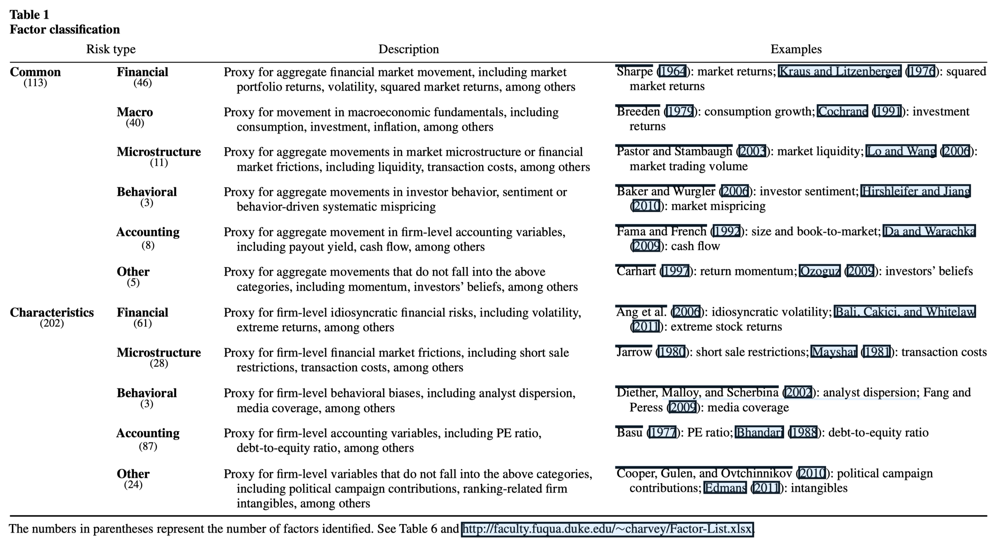
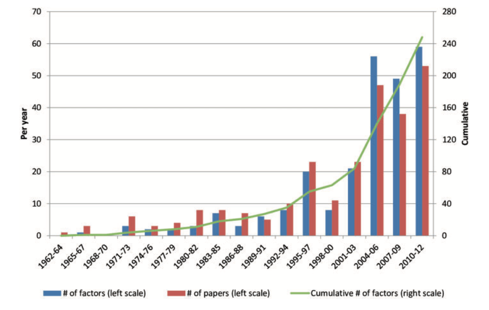
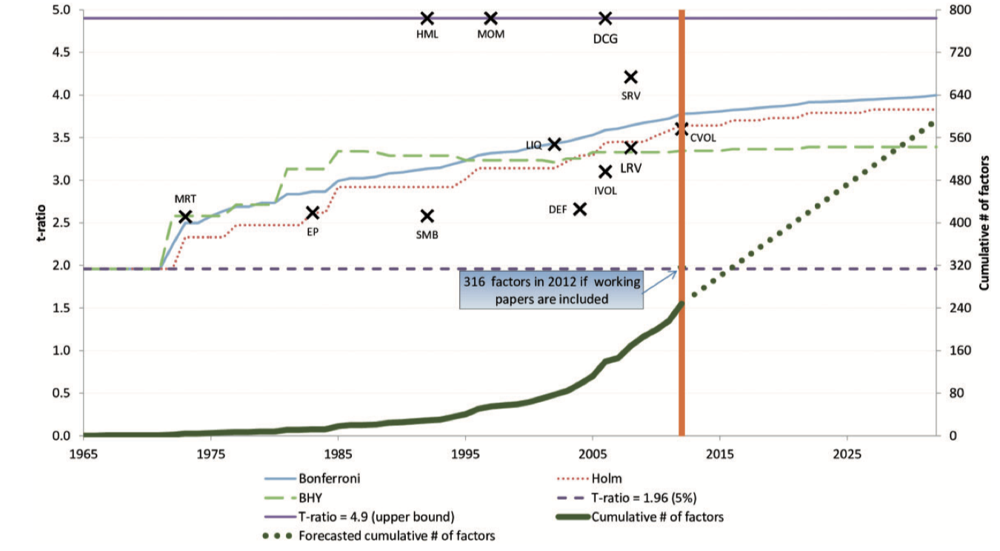

# Intro

## Intro

- Last lecture: factor models worked, but interpretation was messy
- Today: maybe empirical success is the easy part
- LNS attacks the tests
- Harvey-Liu-Zhu attack the $t$-stats
- Kelly-Pruitt-Su change the object

. . .

- Main theme: the data are high-dimensional, our tests are not

## Flight Plan

- Part I: why @LewellenNagelShanken2010 changed the standards for factor tests
- Part II: how @LewellenNagelShanken2010 tells us to raise the bar
- Part III: how @FamaFrench2015 expands the benchmark
- Part IV: why @HarveyLiuZhu2016 turns the factor zoo into an inference problem
- Part V: how @KellyPruittSu2019 moves from factors to structure

# Part I: We Should Have Higher Standards...

## The Factor-Zoo Explosion
During the 2000s and early 2010s:

- Many strategies with large expected returns and no relation to betas appeared
- Examples: accruals, profitability, investment, asset growth, ...
- See @Fama2008 for an extensive analysis

. . .

- Also: several papers proposing theories + factors that price the 25 portfolios
- Example: @LettauLudvigson2001

. . .

- @LewellenNagelShanken2010: pricing the 25 portfolios is too easy!

## Lewellen-Nagel-Shanken: The Deeper Problem

- The 25 portfolios have a very strong factor structure
- We already know that MKT, SMB, and HML price them well
- If you give me a factor that is correlated with them... it will price the 25 portfolios too!
- We're judging models based on just a few assets!

## A Killer Simulation

::: {.columns}
::: {.column width="50%"}
{fig-align="center" width="80%"}
:::
::: {.column width="50%"}
- Panel A: simulate random combinations of MKT, SMB, and HML
- Estimate the time-series betas and then run the cross-sectional pass
- Repeat many times and keep track of $R^2$
- Panel B: do the same, but with combinations of the 25 portfolios
- If you're not scared, look again
:::
:::

## How To Improve Tests

They provide a few ways to improve the tests:

1. Expand the set of test portfolios beyond size-B/M portfolios
2. Take the magnitude of the cross-sectional slopes seriously
3. Report the GLS $R^2$ instead of OLS $R^2$
4. If a factor is traded, it should price itself (i.e., have a significant risk premium)
5. Report confidence intervals for the cross-sectional $R^2$

## One Example of Improvement
{fig-align="center" width="80%"}

## {.standout}
Questions?

# Part III: Fama-French Reloaded

## The Profitability and Investment Anomalies

- @TitmanWeiXie2004: firms that invest more heavily have **lower** subsequent returns
- This is true controlling for size, B/M, and momentum
- @NovyMarx2013: firms with higher profitability have **higher** subsequent returns
- The 3-factor model cannot explain these anomalies
- @Fama2006 had already noticed these two anomalies, with different implementations

## This Actually Has Some Interpretation

Recall the basic pricing formula:

$$
P_t = \sum\limits_{i=1}^{\infty} \mathbb{E}_t\left[\frac{D_{t+i}}{(1+r)^{t+i}}\right]
$$

- A firm with earnings $Y_{t+j}$ that pays dividends $D_{t+j}$ has book equity $B_{t+j} = B_{t+j-1} + Y_{t+j} - D_{t+j}$
- The valuation formula becomes:

$$
P_t = \sum\limits_{i=1}^{\infty} \mathbb{E}_t\left[\frac{Y_{t+i} - (B_{t+i} - B_{t+i-1})}{(1+r)^{t+i}}\right]
$$

- Retained earnings (changes in book equity) are typically used for investment
- Equipment, R\&D, marketing, etc...

## FF (2015): Extending the Benchmark

- These two anomalies were well-known and hard to explain with the 3-factor model
- @FamaFrench2015: add two more factors to capture profitability and investment
- This is a direct extension of @FamaFrench1993... and a certain "concession"

. . .

- Two new factors created similarly to SMB and HML, but sorting on profitability and investment
- Profitability: *robust minus weak* (RMW)
- Investment: *conservative minus aggressive* (CMA)

## The Five Factors

- MKT, SMB, and HML are measured as in @FamaFrench1993
- Operating profitability: think about EBITDA
- Investment: asset growth

. . .

- Create 2x2 sorts of (size, other variable), where other variable = B/M, profitability, or investment 
- They study many ways to construct RMW and CMA and results won't change
- RMW and CMA are just zero-cost long-short portfolios, like SMB and HML

## FF (2015): Mean Absolute Intercepts

```{python}
import matplotlib.pyplot as plt
import matplotlib.patches as mpatches
import numpy as np

plt.rcParams["font.family"] = "Arial"
factor_colors = ["#3266ad", "#d05a2a", "#2a9d6f"]


def make_factor_figure(panels, rows, values, ylabel, ylim, ytick_fmt, ylabel_size=11):
    x = np.arange(len(panels))
    width = 0.25
    offsets = np.array([-1, 0, 1]) * width
    fig, ax = plt.subplots(figsize=(10, 4.5))

    for i, (row_label, color, offset) in enumerate(zip(rows, factor_colors, offsets)):
        ax.bar(
            x + offset,
            values[i],
            width=width * 0.92,
            color=color,
            alpha=0.78,
            edgecolor=color,
            linewidth=0.8,
            label=row_label,
        )

    ax.set_xticks(x)
    ax.set_xticklabels(panels, fontsize=10, color="#666")
    ax.set_ylabel(ylabel, fontsize=ylabel_size, color="#666")
    ax.set_ylim(*ylim)
    ax.yaxis.set_major_formatter(plt.FuncFormatter(lambda v, _: ytick_fmt.format(v)))
    ax.tick_params(axis="y", labelsize=10, colors="#888")
    ax.tick_params(axis="x", length=0)
    ax.spines[["top", "right", "left"]].set_visible(False)
    ax.spines["bottom"].set_color("#ddd")
    ax.yaxis.grid(True, color="#e8e8e8", linewidth=0.8, zorder=0)
    ax.set_axisbelow(True)

    handles = [
        mpatches.Patch(color=c, alpha=0.78, label=r)
        for c, r in zip(factor_colors, rows)
    ]
    ax.legend(
        handles=handles,
        fontsize=10,
        frameon=False,
        loc="upper left",
        handlelength=1.2,
        handleheight=0.8,
    )

    fig.tight_layout()
    plt.show()

ff2015_panels = [
    "Panel A\n25 Size-B/M",
    "Panel B\n25 Size-OP",
    "Panel C\n25 Size-Inv",
    "Panel D\n32 Size-B/M-OP",
    "Panel E\n32 Size-B/M-Inv",
    "Panel F\n32 Size-OP-Inv",
]

ff2015_rows = ["HML", "RMW CMA", "HML RMW CMA"]

ff2015_abs_alpha = np.array([
    [0.102, 0.108, 0.112, 0.152, 0.129, 0.182],
    [0.100, 0.075, 0.085, 0.137, 0.097, 0.103],
    [0.094, 0.073, 0.085, 0.134, 0.091, 0.103],
])

ff2015_ratio = np.array([
    [0.54, 0.68, 0.64, 0.61, 0.64, 0.79],
    [0.53, 0.47, 0.49, 0.55, 0.48, 0.45],
    [0.50, 0.46, 0.49, 0.54, 0.45, 0.45],
])

make_factor_figure(
    panels=ff2015_panels,
    rows=ff2015_rows,
    values=ff2015_abs_alpha,
    ylabel=r"$A|a_i|$",
    ylim=(0, 0.19),
    ytick_fmt="{:.2f}",
)
```

## FF (2015): Mean Absolute Intercepts / Mean Absolute Returns

```{python}
make_factor_figure(
    panels=ff2015_panels,
    rows=ff2015_rows,
    values=ff2015_ratio,
    ylabel=r"$A|a_i|\,/\,A|\bar{r}_i|$",
    ylim=(0, 0.85),
    ytick_fmt="{:.1f}",
)
```

## Fama-French (2015): Two Main Empirical Lessons

- Adding these factors did decrease the average $\alpha$
- HML becomes somewhat redundant
- Vast majority of cases: the model fails the GRS test from @GibbonsRossShanken1989
- What does that mean?

. . .

{fig-align="center" width="80%"}

## {.standout}
Questions?

## Fama-French (2016): Dissecting Anomalies

- @Fama2016 took @LewellenNagelShanken2010 more seriously
- Unlike @FamaFrench2015, they try to fit returns of portfolios sorted on different characteristics
- Examples: size-beta, size-net share issues, size-volatility, size-accruals, size-momentum
- Same vibe: create several sorted portfolios, run regressions, check intercepts and fit

## FF (2016): Mean Absolute Intercepts

```{python}
ff2016_panels = [
    "25 Size-β",
    "35 Size-NI",
    "25 Size-Var",
    "25 Size-RVar",
    "25 Size-AC",
    "25 Size-Prior 2–12",
]

ff2016_rows = ["Mkt SMB HML", "Mkt SMB RMW CMA", "Mkt SMB HML RMW CMA"]

ff2016_abs_alpha = np.array([
    [0.106, 0.136, 0.217, 0.222, 0.113, 0.319],
    [0.069, 0.100, 0.130, 0.118, 0.127, 0.280],
    [0.072, 0.098, 0.131, 0.120, 0.126, 0.272],
])

ff2016_ratio = np.array([
    [0.45, 0.51, 0.72, 0.71, 0.48, 0.97],
    [0.29, 0.37, 0.43, 0.37, 0.54, 0.85],
    [0.31, 0.37, 0.44, 0.38, 0.54, 0.83],
])

make_factor_figure(
    panels=ff2016_panels,
    rows=ff2016_rows,
    values=ff2016_abs_alpha,
    ylabel=r"$A|a_i|$",
    ylim=(0, 0.36),
    ytick_fmt="{:.2f}",
    ylabel_size=12,
)
```

## FF (2016): Mean Absolute Intercepts / Mean Absolute Returns

```{python}
make_factor_figure(
    panels=ff2016_panels,
    rows=ff2016_rows,
    values=ff2016_ratio,
    ylabel=r"$A|a_i|\,/\,A|\bar{r}_i|$",
    ylim=(0, 1),
    ytick_fmt="{:.1f}",
    ylabel_size=12,
)
```

## Empirical Lessons

- The 5-factor model is useful in the sense it reduces intercepts
- It essentially never passes the GRS test, though
- Two main enemies: momentum and, to some extent, accruals
- Another cool thing: they explain why the security market liner appeared flatter
- Reason: stocks with low CAPM betas load heavily on HML, RMW, and CMA
- Stocks with high CAPM betas also load heavily on factors, with a *negative* coefficient

## {.standout}
Questions?

# Part IV: The Factor Zoo

## Harvey, Liu, and Zhu (2016)

- @HarveyLiuZhu2016 collect 316 factors, from 313 papers published since the 60s in top journals
- The first paper I know of that tried to "catalog" the factor zoo
- Multiple testing is the core problem
- Even if you generate random factors, some of them will the price the cross-section by chance
- If you keep doing that forever, you'll find many "significant" factors
- Their prescription: increase the hurdle for statistical significance
- The "$t > 1.96$" rule-of-thumb is not enough
- By the way: $t$ here might mean the $t$-stat of either the CS or the TS regression

## Taxonomy of Factors
{fig-align="center" width="90%"}

## Factors Over Time
{fig-align="center" width="80%"}

## The Intuition From Bonferroni

- If you test 20 factors, the probability of at least one false positive is $1 - (1 - 0.05)^{20} \approx 0.64$
- With 100 factors, the probability of at least one false positive is $1 - (1 - 0.05)^{100} \approx 0.994$

. . .

- Suppose you test $M$ hypotheses with tests of size $\alpha$
- Let $A_i$ be the event that the $i$-th test is a rejection when the null is true

$$
\mathbb{P}\left(\cup_{i=1}^M A_i\right) \leq \sum_{i=1}^M \mathbb{P}(A_i) = M\alpha
$$

- The "Bonferroni correction" says: reject if the $p$-value is less than $\alpha / M$
- Lower $p$-values imply higher thresholds for $t$-statistics

## What They Do

- At each date, count the cumulative number of published factors, $M_t$
- Take the available factor $t$-statistics and convert them into $p$-values
- Bonferroni: use the cutoff $p_t^\star = \alpha / M_t$
- Convert $p_t^\star$ back into an implied threshold $t_t^\star$
- Trace this hurdle through time as the zoo grows
- Same exercise for Holm and BHY, which are other corrections

## Empirical Result
{fig-align="center" width="85%"}

## Why Should It Increase Over Time?

- Their logic is about the search process, not the null
- Low-hanging fruit gets picked first
- The data set is still basically finite
- Computing and data got much cheaper
- For future dates, they linearly extrapolate factor production using 2003--2012
- So a new factor today should clear a higher hurdle

## Main Empirical Lessons

- The usual $t > 1.96$ standard is too low in the factor zoo
- Once multiple testing is accounted for, the cutoff is closer to $t \approx 3$
- Many published factors no longer clear Bonferroni, Holm, or BHY
- In their final count, about 27\%--53\% of published significant factors are likely false discoveries
- If we also account for unpublished searches, the hurdle is even higher
- Limitation: the true number of attempted factors is unobserved
- Limitation: factor tests are correlated, so standard corrections may be too harsh
- Super influential paper: many factors are just a spark of luck!

## {.standout}
Questions?

# Part V: Characteristics Are Covariances

## Motivation for Kelly, Pruitt, and Su (2019)

- The true challenge in asset pricing: loadings and factors are latent
- Potentially time-varying too!

. . .

- PCA-based techniques [@Chamberlain1983] help, but loadings are constant

. . .

- Factor zoo: we probably have redundant information...
- Different combinations two factors should not be new factor
- The linear span of factors is what really matters

## What They Do

- Provide a flexible asset pricing model with many desirable features
- Factors are latent, so the researcher does not specify them ex ante
- Loadings are time-varying and are *functions* of characteristics [@Ferson1999]
- Covariances (betas) *are* characteristics [@DanielTitman1997]
- They can easily apply the model to stocks directly, not just portfolios [@LewellenNagelShanken2010]
- The model is parsimonious: fewer parameters than, for example, FF5

## Are Characteristics Generating Covariances? Or Just Mispricing?

- In a rational asset-pricing model, characteristics should not earn returns "by themselves"
- They should matter because they forecast conditional exposures to common risks

$$
\mathbb{E}_t[r_{i,t+1}] = \alpha_{i,t} + \beta_{i,t}^{\top}\lambda_t
$$

- The question is where characteristics belong: in $\beta_{i,t}$ or in $\alpha_{i,t}$
- Their answer: use characteristics to instrument conditional betas on latent factors
- Assumption/limitation: $\lambda_t$ is constant (and estimated)

## (Instrumented)PCA

$$
r_{i,t+1} = \alpha_{i,t} + \beta_{i,t}^{\top} f_{t+1} + \varepsilon_{i,t+1}
,\qquad
\alpha_{i,t} = z_{i,t}^\top \Gamma_\alpha + \nu_{i,\alpha, t}
,\qquad
\beta_{i,t} = z_{i,t}^\top \Gamma_{\beta} + \nu_{i,\beta, t}
$$

- $z_{i,t}$: lagged firm characteristics, including a constant
- $f_{t+1}$: latent factors, to be estimated
- $\Gamma_\alpha, \Gamma_\beta$: mapping from characteristics to expected returns and factor loadings

. . .

- PCA uses only returns
- Fama-French fixes factors ex ante
- IPCA estimates latent factors, but disciplines their loadings with characteristics

## Estimating Parameters
Substitute the equation for $\beta_{i,t}$ and $\alpha_{it}$ and write in matrix form:
$$
r_{t+1} = Z_t\Gamma_{\alpha} + Z_t\Gamma_{\beta} f_{t+1} + \varepsilon_{t+1}^{*}
$$

$$
(\hat{\Gamma}_{\alpha}, \hat{\Gamma}_{\beta}, \hat{F})
=
\arg\min_{\Gamma_{\alpha}, \Gamma_{\beta}, F}
\sum_{t=1}^{T-1}
\left(r_{t+1} - Z_t\Gamma_{\alpha} - Z_t\Gamma_{\beta} f_{t+1}\right)^{\top}
\left(r_{t+1} - Z_t\Gamma_{\alpha} - Z_t\Gamma_{\beta} f_{t+1}\right)
$$

- $\Gamma_{\alpha}$ collects characteristic-linked expected returns not absorbed by common factors
- $\Gamma_{\beta}$ maps characteristics to factor loadings
- So IPCA nests the risk story and the anomaly story in one system

## Restricted Estimator
- The "restricted" estimator sets $\Gamma_{\alpha} = 0$
- This is the "risk-based" model: characteristics only matter through covariances

. . .

$$
\left(\hat{\Gamma}_\beta, f_{1}, f_{2}, \ldots,f_{T}\right)
=
\arg\min_{\Gamma_\beta, \{f_{t+1}\}_{t=0}^{T-1}}
\sum_{t=1}^{T-1}
\left(r_{t+1} - Z_t \Gamma_\beta f_{t+1}\right)^\top
\left(r_{t+1} - Z_t \Gamma_\beta f_{t+1}\right)
$$

## The FOC for the Restricted Problem
$$
\hat{f}_{t+1}
=
\left(\hat{\Gamma}_\beta' Z_t' Z_t \hat{\Gamma}_\beta\right)^{-1}
\hat{\Gamma}_\beta' Z_t' r_{t+1},
\qquad \forall t
$$

and

$$
\operatorname{vec}(\hat{\Gamma}_\beta)
=
\left(
\sum_{t=1}^{T-1}
Z_t' Z_t \otimes \hat{f}_{t+1}\hat{f}_{t+1}'
\right)^{-1}
\left(
\sum_{t=1}^{T-1}
\left[ Z_t \otimes \hat{f}_{t+1} \right]' r_{t+1}
\right)
$$

- Factors resemble @FamaMacBeth1973!
- (The vec of) $\Gamma_\beta$ is a the slope coefficient of a regression of returns on interactions
- Key contribution of their companion paper: how to estimate this!
- Similar math when $\Gamma_{\alpha}$ is included: see the paper!
- Python implementation: ([Click here](https://www.dropbox.com/scl/fi/ecm4mlm1d27ka71gwrgsq/ipca_public.py?rlkey=40icghiic36vgns0n552zpzdh&e=1&dl=0))

## Wald-Type Test for Alpha

$$
H_0:\Gamma_{\alpha}=0
\qquad \text{vs.} \qquad
H_1:\Gamma_{\alpha}\neq 0
$$

$$
W_{\alpha} = \hat{\Gamma}_{\alpha}^{\top}\hat{\Gamma}_{\alpha}
$$

- (Wild parametric) Bootstrap under the null to get the $p$-value
- Fail to reject: characteristics explain returns through common exposures
- Reject: some systematic characteristic-linked alpha remains
- Similar tests for $\Gamma_{\beta}$. Why is testing $\Gamma_\beta$ interesting?

## Implementation Details

- They need to choose the number $K$ of factors: they try $K=1,2,3,4,5,6$
- They have 36 characteristics: size, assets, profitability, momentum, ...
- Total of 12,813 firms, across 1964-2014
- 1,403,544 stock-month observations
- This is much higher scale than anything before them
- Instead of asking "can a certain model price this anomaly?", they ask: "can any common factor structure price all of these anomalies?"

## {.standout}
Questions?

## Performance Metrics

$$
\text{Total } R^2
=
1-
\frac{\sum_{i,t}\left(r_{i,t+1}-z_{i,t}^{\top}\left(\hat{\Gamma}_{\alpha}+\hat{\Gamma}_{\beta}\hat{f}_{t+1}\right)\right)^2}
{\sum_{i,t} r_{i,t+1}^2}
$$

$$
\text{Predictive } R^2
=
1-
\frac{\sum_{i,t}\left(r_{i,t+1}-z_{i,t}^{\top}\left(\hat{\Gamma}_{\alpha}+\hat{\Gamma}_{\beta}\hat{\lambda}\right)\right)^2}
{\sum_{i,t} r_{i,t+1}^2}
$$

- Total $R^2$: how much realized return variation the model explains
- This is the paper's measure of how well the model describes systematic risk in the panel
- Predictive $R^2$: how much realized return variation is explained by model-implied expected returns
- They hold risk prices fixed at $\hat{\lambda}$: predictive content comes from the instrumented loadings

## Model Performance Across $K$

```{=latex}
\begin{table}
\centering
\begin{tabular}{@{}lrcccccc@{}}
\hline
& & \multicolumn{6}{c}{$K$} \\
& & 1 & 2 & 3 & 4 & 5 & 6 \\
\hline
\multicolumn{2}{@{}l}{\textit{Panel A: Individual stocks} ($r_t$)} \\
\textit{Total} $R^2$ & $\Gamma_\alpha = 0$ & 14.8 & 16.4 & 17.4 & 18.0 & 18.6 & 18.9 \\
& $\Gamma_\alpha \neq 0$ & 15.2 & 16.8 & 17.7 & 18.4 & 18.7 & 19.0 \\
\textit{Pred.} $R^2$ & $\Gamma_\alpha = 0$ & 0.35 & 0.34 & 0.41 & 0.42 & 0.69 & 0.68 \\
& $\Gamma_\alpha \neq 0$ & 0.76 & 0.75 & 0.75 & 0.74 & 0.74 & 0.72 \\
\multicolumn{2}{@{}l}{\textit{Panel B: Managed portfolios} ($x_t$)} \\
\textit{Total} $R^2$ & $\Gamma_\alpha = 0$ & 90.3 & 95.3 & 97.1 & 98.0 & 98.4 & 98.8 \\
& $\Gamma_\alpha \neq 0$ & 90.8 & 95.7 & 97.3 & 98.2 & 98.6 & 98.9 \\
\textit{Pred.} $R^2$ & $\Gamma_\alpha = 0$ & 2.01 & 2.00 & 2.10 & 2.13 & 2.41 & 2.39 \\
& $\Gamma_\alpha \neq 0$ & 2.61 & 2.56 & 2.54 & 2.51 & 2.50 & 2.46 \\
\multicolumn{2}{@{}l}{\textit{Panel C: Asset pricing test}} \\
$W_\alpha$ \textit{p-value} & & 0.00 & 0.00 & 0.00 & 0.00 & 2.06 & 52.1 \\
\hline
\end{tabular}
\end{table}
```

## Comparison With Observable-Factor Models (Individual Stocks)

```{python}
import matplotlib.ticker as mticker

# ── Data ──────────────────────────────────────────────────────────────────────
K = [1, 3, 4, 5, 6]

data = {
    "ipca": {
        "r":  {"total": [14.9, 17.6, 18.2, 18.7, 19.0],
               "pred":  [0.36, 0.43, 0.43, 0.70, 0.70],
               "Np":    [636,  1908, 2544, 3180, 3816]},
        "x":  {"total": [90.3, 97.1, 98.0, 98.4, 98.8],
               "pred":  [2.01, 2.10, 2.13, 2.41, 2.39],
               "Np":    [636,  1908, 2544, 3180, 3816]},
    },
    "obs": {
        "r":  {"total": [11.9, 18.9, 20.9, 21.9, 23.7],
               "pred":  [0.31, 0.29, 0.28, 0.29, 0.23],
               "Np":    [11452, 34356, 45808, 57260, 68712]},
        "x":  {"total": [65.6, 85.1, 87.5, 86.4, 88.6],
               "pred":  [1.67, 2.07, 1.98, 2.06, 1.96],
               "Np":    [37,  111,  148,  185,  222]},
    },
}

# ── Colours ───────────────────────────────────────────────────────────────────
C = {
    "ipca_total": "#378ADD",
    "ipca_pred":  "#85B7EB",
    "obs_total":  "#D85A30",
    "obs_pred":   "#F0997B",
    "ipca_line":  "#185FA5",
    "obs_line":   "#993C1D",
}

# ── Helpers ───────────────────────────────────────────────────────────────────
def fmt_k(v, _):
    return f"{v/1000:.0f}k" if v >= 1000 else str(int(v))


def make_figure(key, ylabel_right="$N_p$ (parameters)"):
    """
    key : 'r'  → returns
          'x'  → managed portfolios
    """
    ipca = data["ipca"][key]
    obs  = data["obs"][key]

    x    = np.arange(len(K))
    w    = 0.18          # individual bar width
    gap  = 0.02          # gap between IPCA and Obs groups

    fig, ax1 = plt.subplots(figsize=(8, 4))
    ax2 = ax1.twinx()

    # ── Bars (drawn on ax1) ───────────────────────────────────────────────────
    # IPCA group: total at x - 1.5w, pred at x - 0.5w
    # Obs  group: total at x + 0.5w, pred at x + 1.5w  (with tiny gap)
    offsets = {
        "ipca_total": -1.5 * w - gap,
        "ipca_pred":  -0.5 * w - gap,
        "obs_total":  +0.5 * w + gap,
        "obs_pred":   +1.5 * w + gap,
    }

    bars = {}
    for label, series, color in [
        ("ipca_total", ipca["total"], C["ipca_total"]),
        ("ipca_pred",  ipca["pred"],  C["ipca_pred"]),
        ("obs_total",  obs["total"],  C["obs_total"]),
        ("obs_pred",   obs["pred"],   C["obs_pred"]),
    ]:
        bars[label] = ax1.bar(
            x + offsets[label], series, width=w,
            color=color, zorder=3, label=label,
        )

    # ── Lines (drawn on ax2) ──────────────────────────────────────────────────
    ax2.plot(x, ipca["Np"], color=C["ipca_line"], linestyle="--",
             marker="o", ms=5, lw=1.6, zorder=4, label="$N_p$ IPCA")
    ax2.plot(x, obs["Np"],  color=C["obs_line"],  linestyle="--",
             marker="o", ms=5, lw=1.6, zorder=4, label="$N_p$ Obs.")

    # ── Axes formatting ───────────────────────────────────────────────────────
    ax1.set_xticks(x)
    ax1.set_xticklabels([f"$K={k}$" for k in K], fontsize=11)
    ax1.set_ylabel("$R^2$ (%)", fontsize=11)
    ax1.set_ylim(bottom=0)
    ax1.yaxis.grid(True, linestyle=":", linewidth=0.6, color="#cccccc", zorder=0)
    ax1.set_axisbelow(True)
    ax1.spines[["top", "right"]].set_visible(False)

    ax2.set_ylabel(ylabel_right, fontsize=11)
    ax2.set_ylim(bottom=0)
    ax2.yaxis.set_major_formatter(mticker.FuncFormatter(fmt_k))
    ax2.spines[["top", "left"]].set_visible(False)

    # ── Legend ────────────────────────────────────────────────────────────────
    from matplotlib.patches import Patch
    from matplotlib.lines  import Line2D

    legend_elements = [
        Patch(facecolor=C["ipca_total"], label="IPCA – Total $R^2$"),
        Patch(facecolor=C["ipca_pred"],  label="IPCA – Pred. $R^2$"),
        Patch(facecolor=C["obs_total"],  label="Obs. – Total $R^2$"),
        Patch(facecolor=C["obs_pred"],   label="Obs. – Pred. $R^2$"),
        Line2D([0], [0], color=C["ipca_line"], lw=1.6, ls="--",
               marker="o", ms=5, label="$N_p$ IPCA"),
        Line2D([0], [0], color=C["obs_line"],  lw=1.6, ls="--",
               marker="o", ms=5, label="$N_p$ Obs."),
    ]
    ax1.legend(
        handles=legend_elements,
        fontsize=8.5,
        ncol=6,
        loc="upper center",
        bbox_to_anchor=(0.5, -0.09),
        framealpha=0.85,
        columnspacing=0.8,
        handlelength=1.2,
    )

    fig.tight_layout(rect=(0, 0.04, 1, 1))
    return fig
```

```{python}
fig = make_figure("r")
plt.show()
plt.close(fig)
```

## Comparison With Observable-Factor Models (Managed Portfolios)

```{python}
fig = make_figure("x")
plt.show()
plt.close(fig)
```

## Adding Standard Factors - Total $R^2$

```{python}
# ── New data ──────────────────────────────────────────────────────────────────
models = {"CAPM": 1, "FF3+M": 4, "FF5+M": 6}

total_r2_obs = {
    "CAPM":  [15.8, 16.8, 17.5, 18.1, 18.6, 18.9],
    "FF3+M": [17.3, 17.9, 18.3, 18.6, 18.8, 19.1],
    "FF5+M": [17.5, 18.0, 18.4, 18.7, 18.9, 19.1],
}
pred_r2_obs = {
    "CAPM":  [0.35, 0.40, 0.41, 0.50, 0.69, 0.68],
    "FF3+M": [0.45, 0.66, 0.67, 0.66, 0.71, 0.69],
    "FF5+M": [0.50, 0.66, 0.67, 0.66, 0.67, 0.69],
}

K6       = [1, 2, 3, 4, 5, 6]
n_models = len(models)
bar_colors = ["#B5D4F4", "#378ADD", "#042C53"]

# ── Shared factory ────────────────────────────────────────────────────────────
def make_obs_figure(series_dict, ylabel, title, ymin=None, yfmt=None):
    x   = np.arange(len(K6))
    w   = 0.22
    gap = 0.03
    offsets = np.linspace(-(n_models - 1) / 2, (n_models - 1) / 2, n_models) * (w + gap)

    fig, ax = plt.subplots(figsize=(8, 4.2))

    for i, (name, vals) in enumerate(series_dict.items()):
        ax.bar(x + offsets[i], vals, width=w,
               color=bar_colors[i], label=name, zorder=3)

    ax.set_xticks(x)
    ax.set_xticklabels([f"$K={k}$" for k in K6], fontsize=11)
    ax.set_ylabel(ylabel, fontsize=11)
    if ymin is not None:
        ax.set_ylim(bottom=ymin)
    if yfmt is not None:
        ax.yaxis.set_major_formatter(mticker.FuncFormatter(yfmt))
    ax.yaxis.grid(True, linestyle=":", linewidth=0.6, color="#cccccc", zorder=0)
    ax.set_axisbelow(True)
    ax.spines[["top", "right"]].set_visible(False)
    ax.legend(fontsize=10, framealpha=0.85, handlelength=1.2)

    fig.tight_layout()
    return fig


# ── Figure 1: Total R² ────────────────────────────────────────────────────────
fig_total = make_obs_figure(
    total_r2_obs,
    ylabel="Total $R^2$ (%)",
    title="Total $R^2$ by number of latent factors $K$",
    ymin=15,
)

# ── Figure 2: Predictive R² ───────────────────────────────────────────────────
fig_pred = make_obs_figure(
    pred_r2_obs,
    ylabel="Pred. $R^2$ (%)",
    title="Predictive $R^2$ by number of latent factors $K$",
    ymin=0,
    yfmt=lambda v, _: f"{v:.2f}",
)
```

```{python}
fig_total
```

## Adding Standard Factors - Predictive $R^2$

```{python}
fig_pred
```

## Out of Sample

```{python}
# ── Data ──────────────────────────────────────────────────────────────────────
r_total = [13.9, 15.3, 16.3, 16.9, 17.5, 17.8]
x_total = [89.5, 94.8, 96.4, 97.4, 98.2, 98.6]
r_pred  = [0.34, 0.33, 0.55, 0.61, 0.60, 0.60]
x_pred  = [2.21, 2.15, 2.42, 2.44, 2.42, 2.42]

C_blue_dark  = "#378ADD"
C_blue_light = "#85B7EB"
C_coral_dark = "#D85A30"
C_coral_lite = "#F0997B"

# ── Figure ────────────────────────────────────────────────────────────────────
x     = np.arange(len(K6))
w     = 0.35
gap   = 0.04

fig, ax1 = plt.subplots(figsize=(8, 4))
ax2 = ax1.twinx()

# Bars — Total R² (both series share the left axis)
ax1.bar(x - w/2 - gap/2, r_total, width=w, color=C_blue_dark,
        label="Total $R^2$ — $r_t$", zorder=3)
ax1.bar(x + w/2 + gap/2, x_total, width=w, color=C_blue_light,
        label="Total $R^2$ — $x_t$", zorder=3)

# Lines — Pred. R² (right axis)
ax2.plot(x, r_pred, color=C_coral_dark, lw=1.8, linestyle="-",
         marker="o", ms=5, zorder=4, label="Pred. $R^2$ — $r_t$")
ax2.plot(x, x_pred, color=C_coral_lite, lw=1.8, linestyle="--",
         marker="s", ms=5, zorder=4, label="Pred. $R^2$ — $x_t$")

# ── Left axis ─────────────────────────────────────────────────────────────────
ax1.set_xticks(x)
ax1.set_xticklabels([f"$K={k}$" for k in K6], fontsize=11)
ax1.set_ylabel("Total $R^2$ (%)", fontsize=11, color="#185FA5")
ax1.tick_params(axis="y", colors="#185FA5")
ax1.spines["left"].set_color("#185FA5")
ax1.set_ylim(0, 110)
ax1.yaxis.grid(True, linestyle=":", linewidth=0.6, color="#cccccc", zorder=0)
ax1.set_axisbelow(True)
ax1.spines[["top", "right"]].set_visible(False)

# ── Right axis ────────────────────────────────────────────────────────────────
ax2.set_ylabel("Pred. $R^2$ (%)", fontsize=11, color="#993C1D")
ax2.tick_params(axis="y", colors="#993C1D")
ax2.spines["right"].set_color("#993C1D")
ax2.yaxis.set_major_formatter(mticker.FuncFormatter(lambda v, _: f"{v:.2f}"))
ax2.set_ylim(0)
ax2.spines[["top", "left"]].set_visible(False)

# ── Legend ────────────────────────────────────────────────────────────────────
from matplotlib.patches import Patch
from matplotlib.lines   import Line2D

legend_elements = [
    Patch(facecolor=C_blue_dark,  label="Total $R^2$ — $r_t$ (left)"),
    Patch(facecolor=C_blue_light, label="Total $R^2$ — $x_t$ (left)"),
    Line2D([0], [0], color=C_coral_dark, lw=1.8, marker="o", ms=5,
           label="Pred. $R^2$ — $r_t$ (right)"),
    Line2D([0], [0], color=C_coral_lite, lw=1.8, marker="s", ms=5,
           linestyle="--", label="Pred. $R^2$ — $x_t$ (right)"),
]
ax1.legend(handles=legend_elements, fontsize=9, framealpha=0.85,
           ncol=4, handlelength=1.4, columnspacing=1.0,
           loc="upper center", bbox_to_anchor=(0.5, -0.075))

fig.tight_layout(rect=(0, 0.06, 1, 1))
plt.show()
```

## Contribution of Total $R^2$ For Each Variable (with $K=5$)

```{=latex}
\begin{table}[htbp]
\centering
\begin{tabular}{l c c l c c l c}
\hline
mktcap & 2.84** & & roa    & 0.07    & & c     & 0.03 \\
assets & 1.64** & & suv    & 0.07**  & & noa   & 0.03 \\
beta   & 0.56** & & pcm    & 0.06*   & & rna   & 0.02 \\
strev  & 0.47** & & idiovol& 0.05**  & & invest& 0.02 \\
mom    & 0.33** & & s2p    & 0.05    & & prof  & 0.02 \\
turn   & 0.31** & & bm     & 0.04    & & pm    & 0.02 \\
w52h   & 0.14** & & bidask & 0.04    & & d2a   & 0.01 \\
a2me   & 0.14   & & intmom & 0.03*   & & dpi2a & 0.01 \\
cto    & 0.13   & & roe    & 0.03    & & q     & 0.01 \\
ol     & 0.11   & & sga2m  & 0.03    & & freecf& 0.01 \\
ltrev  & 0.10** & & ato    & 0.03*   & & lev   & 0.01 \\
fc2y   & 0.08   & & e2p    & 0.03    & & oa    & 0.00 \\
\hline
\end{tabular}
\end{table}
```
- Only 10/36 characteristics have significant $\Gamma_\beta$ coefficients at 5\%

## What Happens If You Take Out Insignificant Characteristics? - Total $R^2$

```{python}
# ── Data ──────────────────────────────────────────────────────────────────────
# Table 1 — full model, individual stocks (r_t)
t1_ga0_total   = [14.8, 16.4, 17.4, 18.0, 18.6, 18.9]
t1_gaNot_total = [15.2, 16.8, 17.7, 18.4, 18.7, 19.0]
t1_ga0_pred    = [0.35, 0.34, 0.41, 0.42, 0.69, 0.68]
t1_gaNot_pred  = [0.76, 0.75, 0.75, 0.74, 0.74, 0.72]

# Table 12 — significant instruments only
t12_ga0_total   = [14.6, 16.1, 17.1, 17.7, 18.2, 18.4]
t12_gaNot_total = [15.0, 16.4, 17.4, 18.0, 18.2, 18.4]
t12_ga0_pred    = [0.34, 0.34, 0.41, 0.43, 0.61, 0.62]
t12_gaNot_pred  = [0.67, 0.66, 0.66, 0.66, 0.65, 0.65]

C = {
    "ga0_full":  "#378ADD",
    "ga0_sig":   "#85B7EB",
    "gaN_full":  "#D85A30",
    "gaN_sig":   "#F0997B",
}

# ── Shared factory ────────────────────────────────────────────────────────────
def make_robustness_figure(series, ylabel, ymin, yfmt):
    """
    series : list of (data, color, label) tuples — 4 entries, one per bar group
    """
    x      = np.arange(len(K6))
    n      = len(series)
    w      = 0.18
    gap    = 0.03
    offsets = np.linspace(-(n - 1) / 2, (n - 1) / 2, n) * (w + gap)

    fig, ax = plt.subplots(figsize=(8, 4.2))

    for (vals, color, label), offset in zip(series, offsets):
        ax.bar(x + offset, vals, width=w, color=color, label=label, zorder=3)

    ax.set_xticks(x)
    ax.set_xticklabels([f"$K={k}$" for k in K6], fontsize=11)
    ax.set_ylabel(ylabel, fontsize=11)
    ax.set_ylim(bottom=ymin)
    ax.yaxis.set_major_formatter(mticker.FuncFormatter(yfmt))
    ax.yaxis.grid(True, linestyle=":", linewidth=0.6, color="#cccccc", zorder=0)
    ax.set_axisbelow(True)
    ax.spines[["top", "right"]].set_visible(False)

    from matplotlib.patches import Patch
    legend_elements = [
        Patch(facecolor=C["ga0_full"], label=r"$\Gamma_\alpha=0$, full model"),
        Patch(facecolor=C["ga0_sig"],  label=r"$\Gamma_\alpha=0$, sig. instruments"),
        Patch(facecolor=C["gaN_full"], label=r"$\Gamma_\alpha\neq 0$, full model"),
        Patch(facecolor=C["gaN_sig"],  label=r"$\Gamma_\alpha\neq 0$, sig. instruments"),
    ]
    ax.legend(handles=legend_elements, fontsize=9, framealpha=0.85,
              ncol=4, handlelength=1.2, columnspacing=1.0,
              loc="upper center", bbox_to_anchor=(0.5, -0.075))

    fig.tight_layout(rect=(0, 0.06, 1, 1))
    return fig


# ── Figure 1: Total R² ────────────────────────────────────────────────────────
fig_total = make_robustness_figure(
    series=[
        (t1_ga0_total,   C["ga0_full"], r"$\Gamma_\alpha=0$, full"),
        (t12_ga0_total,  C["ga0_sig"],  r"$\Gamma_\alpha=0$, sig."),
        (t1_gaNot_total, C["gaN_full"], r"$\Gamma_\alpha\neq0$, full"),
        (t12_gaNot_total,C["gaN_sig"],  r"$\Gamma_\alpha\neq0$, sig."),
    ],
    ylabel="Total $R^2$ (%)",
    ymin=14,
    yfmt=lambda v, _: f"{v:.1f}",
)

# ── Figure 2: Predictive R² ───────────────────────────────────────────────────
fig_pred = make_robustness_figure(
    series=[
        (t1_ga0_pred,    C["ga0_full"], r"$\Gamma_\alpha=0$, full"),
        (t12_ga0_pred,   C["ga0_sig"],  r"$\Gamma_\alpha=0$, sig."),
        (t1_gaNot_pred,  C["gaN_full"], r"$\Gamma_\alpha\neq0$, full"),
        (t12_gaNot_pred, C["gaN_sig"],  r"$\Gamma_\alpha\neq0$, sig."),
    ],
    ylabel="Pred. $R^2$ (%)",
    ymin=0,
    yfmt=lambda v, _: f"{v:.2f}",
)
```

```{python}
fig_total
```

## What Happens If You Take Out Insignificant Characteristics? -- Predictive $R^2$

```{python}
fig_pred
```

## Limitations and Impact

- The factors are statistical objects; economic interpretation is still incomplete
- Results depend on the chosen characteristic set and on the linear mapping $\beta_{i,t} = \Gamma_{\beta}^{\top} z_{i,t}$
- Impact: it bridges Daniel-Titman, conditional beta models, and the modern anomaly literature
- It changed the question from "which observable factor kills alpha?" to "does any common risk structure kill alpha?"

## {.standout}
Questions?

## Readings and References {.noframenumbering .allowframebreaks}
\footnotesize
