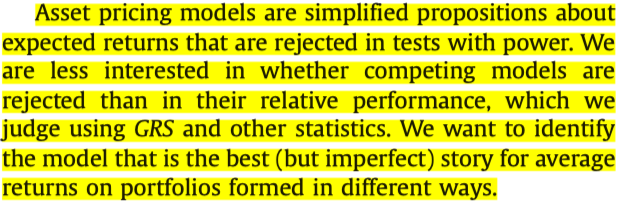

# Intro

## Intro

- Last lecture: factor models worked, but interpretation was messy
- Today: maybe empirical success is the easy part
- LNS attacks the tests
- Harvey-Liu-Zhu attack the $t$-stats
- Kelly-Pruitt-Su change the object

. . .

- Main theme: the data are high-dimensional, our tests are not

## Flight Plan

- Part I: why @LewellenNagelShanken2010 changed the standards for factor tests
- Part II: how @LewellenNagelShanken2010 tells us to raise the bar
- Part III: how @FamaFrench2015 expands the benchmark
- Part IV: why @HarveyLiuZhu2016 turns the factor zoo into an inference problem
- Part V: how @KellyPruittSu2019 moves from factors to structure

# Part I: We Should Have Higher Standards...

## The Factor-Zoo Explosion
During the 2000s and early 2010s:

- Many strategies with large expected returns and no relation to betas appeared
- Examples: accruals, profitability, investment, asset growth, ...
- See @Fama2008 for an extensive analysis

. . .

- Also: several papers proposing theories + factors that price the 25 portfolios
- Example: @LettauLudvigson2001

. . .

- @LewellenNagelShanken2010: pricing the 25 portfolios is too easy!

## Lewellen-Nagel-Shanken: The Deeper Problem

- The 25 portfolios have a very strong factor structure
- We already know that MKT, SMB, and HML price them well
- If you give me a factor that is correlated with them... it will price the 25 portfolios too!
- We're judging models based on just a few assets!

## A Killer Simulation

::: {.columns}
::: {.column width="50%"}
{fig-align="center" width="80%"}
:::
::: {.column width="50%"}
- Panel A: simulate random combinations of MKT, SMB, and HML
- Estimate the time-series betas and then run the cross-sectional pass
- Repeat many times and keep track of $R^2$
- Panel B: do the same, but with combinations of the 25 portfolios
- If you're not scared, look again
:::
:::

## How To Improve Tests

They provide a few ways to improve the tests:

1. Expand the set of test portfolios beyond size-B/M portfolios
2. Take the magnitude of the cross-sectional slopes seriously
3. Report the GLS $R^2$ instead of OLS $R^2$
4. If a factor is traded, it should price itself (i.e., have a significant risk premium)
5. Report confidence intervals for the cross-sectional $R^2$

## One Example of Improvement
{fig-align="center" width="80%"}

## {.standout}
Questions?

# Part III: Fama-French Reloaded

## The Profitability and Investment Anomalies

- @TitmanWeiXie2004: firms that invest more heavily have **lower** subsequent returns
- This is true controlling for size, B/M, and momentum
- @NovyMarx2013: firms with higher profitability have **higher** subsequent returns
- The 3-factor model cannot explain these anomalies
- @Fama2006 had already noticed these two anomalies, with different implementations

## This Actually Has Some Interpretation

Recall the basic pricing formula:

$$
P_t = \sum\limits_{i=1}^{\infty} \mathbb{E}_t\left[\frac{D_{t+i}}{(1+r)^{t+i}}\right]
$$

- A firm with earnings $Y_{t+j}$ that pays dividends $D_{t+j}$ has book equity $B_{t+j} = B_{t+j-1} + Y_{t+j} - D_{t+j}$
- The valuation formula becomes:

$$
P_t = \sum\limits_{i=1}^{\infty} \mathbb{E}_t\left[\frac{Y_{t+i} - (B_{t+i} - B_{t+i-1})}{(1+r)^{t+i}}\right]
$$

- Retained earnings (changes in book equity) are typically used for investment
- Equipment, R\&D, marketing, etc...

## FF (2015): Extending the Benchmark

- These two anomalies were well-known and hard to explain with the 3-factor model
- @FamaFrench2015: add two more factors to capture profitability and investment
- This is a direct extension of @FamaFrench1993... and a certain "concession"

. . .

- Two new factors created similarly to SMB and HML, but sorting on profitability and investment
- Profitability: *robust minus weak* (RMW)
- Investment: *conservative minus aggressive* (CMA)

## The Five Factors

- MKT, SMB, and HML are measured as in @FamaFrench1993
- Operating profitability: think about EBITDA
- Investment: asset growth

. . .

- Create 2x2 sorts of (size, other variable), where other variable = B/M, profitability, or investment 
- They study many ways to construct RMW and CMA and results won't change
- RMW and CMA are just zero-cost long-short portfolios, like SMB and HML

## FF (2015): Mean Absolute Intercepts

```{python}
import matplotlib.pyplot as plt
import matplotlib.patches as mpatches
import numpy as np

plt.rcParams["font.family"] = "Arial"

ff2015_panels = [
    "Panel A\n25 Size-B/M",
    "Panel B\n25 Size-OP",
    "Panel C\n25 Size-Inv",
    "Panel D\n32 Size-B/M-OP",
    "Panel E\n32 Size-B/M-Inv",
    "Panel F\n32 Size-OP-Inv",
]

ff2015_rows = ["HML", "RMW CMA", "HML RMW CMA"]

ff2015_abs_alpha = np.array([
    [0.102, 0.108, 0.112, 0.152, 0.129, 0.182],
    [0.100, 0.075, 0.085, 0.137, 0.097, 0.103],
    [0.094, 0.073, 0.085, 0.134, 0.091, 0.103],
])

ff2015_ratio = np.array([
    [0.54, 0.68, 0.64, 0.61, 0.64, 0.79],
    [0.53, 0.47, 0.49, 0.55, 0.48, 0.45],
    [0.50, 0.46, 0.49, 0.54, 0.45, 0.45],
])

ff2015_colors = ["#3266ad", "#d05a2a", "#2a9d6f"]
ff2015_x = np.arange(len(ff2015_panels))
ff2015_width = 0.25
ff2015_offsets = np.array([-1, 0, 1]) * ff2015_width

def make_ff2015_figure(values, ylabel, ylim, ytick_fmt):
    fig, ax = plt.subplots(figsize=(10, 4.5))

    for i, (row_label, color, offset) in enumerate(
        zip(ff2015_rows, ff2015_colors, ff2015_offsets)
    ):
        ax.bar(
            ff2015_x + offset,
            values[i],
            width=ff2015_width * 0.92,
            color=color,
            alpha=0.78,
            edgecolor=color,
            linewidth=0.8,
            label=row_label,
        )

    ax.set_xticks(ff2015_x)
    ax.set_xticklabels(ff2015_panels, fontsize=10, color="#666")
    ax.set_ylabel(ylabel, fontsize=11, color="#666")
    ax.set_ylim(*ylim)
    ax.yaxis.set_major_formatter(plt.FuncFormatter(lambda v, _: ytick_fmt.format(v)))
    ax.tick_params(axis="y", labelsize=10, colors="#888")
    ax.tick_params(axis="x", length=0)
    ax.spines[["top", "right", "left"]].set_visible(False)
    ax.spines["bottom"].set_color("#ddd")
    ax.yaxis.grid(True, color="#e8e8e8", linewidth=0.8, zorder=0)
    ax.set_axisbelow(True)

    handles = [
        mpatches.Patch(color=c, alpha=0.78, label=r)
        for c, r in zip(ff2015_colors, ff2015_rows)
    ]
    ax.legend(
        handles=handles,
        fontsize=10,
        frameon=False,
        loc="upper left",
        handlelength=1.2,
        handleheight=0.8,
    )

    fig.tight_layout()
    plt.show()

make_ff2015_figure(
    values=ff2015_abs_alpha,
    ylabel=r"$A|a_i|$",
    ylim=(0, 0.19),
    ytick_fmt="{:.2f}",
)
```

## FF (2015): Mean Absolute Intercepts / Mean Absolute Returns

```{python}
make_ff2015_figure(
    values=ff2015_ratio,
    ylabel=r"$A|a_i|\,/\,A|\bar{r}_i|$",
    ylim=(0, 0.85),
    ytick_fmt="{:.1f}",
)
```

## Fama-French (2015): Two Main Empirical Lessons

- Adding these factors did decrease the average $\alpha$
- HML becomes somewhat redundant
- Vast majority of cases: the model fails the GRS test from @GibbonsRossShanken1989
- What does that mean?

. . .

{fig-align="center" width="80%"}

## {.standout}
Questions?

## Fama-French (2016): Dissecting Anomalies

- @Fama2016 took @LewellenNagelShanken2010 more seriously
- Unlike @FamaFrench2015, they try to fit returns of portfolios sorted on different characteristics
- Examples: size-beta, size-net share issues, size-volatility, size-accruals, size-momentum
- Same vibe: create several sorted portfolios, run regressions, check intercepts and fit

## FF (2016): Mean Absolute Intercepts

```{python}
import numpy as np
import matplotlib.pyplot as plt
import matplotlib.patches as mpatches

plt.rcParams["font.family"] = "Arial"

panels = [
    "25 Size-β",
    "35 Size-NI",
    "25 Size-Var",
    "25 Size-RVar",
    "25 Size-AC",
    "25 Size-Prior 2–12",
]

rows = ["Mkt SMB HML", "Mkt SMB RMW CMA", "Mkt SMB HML RMW CMA"]

abs_alpha = np.array([
    [0.106, 0.136, 0.217, 0.222, 0.113, 0.319],
    [0.069, 0.100, 0.130, 0.118, 0.127, 0.280],
    [0.072, 0.098, 0.131, 0.120, 0.126, 0.272],
])

ratio = np.array([
    [0.45, 0.51, 0.72, 0.71, 0.48, 0.97],
    [0.29, 0.37, 0.43, 0.37, 0.54, 0.85],
    [0.31, 0.37, 0.44, 0.38, 0.54, 0.83],
])

colors = ["#3266ad", "#d05a2a", "#2a9d6f"]
x = np.arange(len(panels))
width = 0.25
offsets = np.array([-1, 0, 1]) * width

def make_figure(values, ylabel, ylim, ytick_fmt):
    fig, ax = plt.subplots(figsize=(10, 4.5))

    for i, (row_label, color, offset) in enumerate(zip(rows, colors, offsets)):
        ax.bar(
            x + offset,
            values[i],
            width=width * 0.92,
            color=color,
            alpha=0.78,
            edgecolor=color,
            linewidth=0.8,
            label=row_label,
        )

    ax.set_xticks(x)
    ax.set_xticklabels(panels, fontsize=10, color="#666")
    ax.set_ylabel(ylabel, fontsize=12, color="#666")
    ax.set_ylim(*ylim)
    ax.yaxis.set_major_formatter(plt.FuncFormatter(lambda v, _: ytick_fmt.format(v)))
    ax.tick_params(axis="y", labelsize=10, colors="#888")
    ax.tick_params(axis="x", length=0)
    ax.spines[["top", "right", "left"]].set_visible(False)
    ax.spines["bottom"].set_color("#ddd")
    ax.yaxis.grid(True, color="#e8e8e8", linewidth=0.8, zorder=0)
    ax.set_axisbelow(True)

    handles = [
        mpatches.Patch(color=c, alpha=0.78, label=r)
        for c, r in zip(colors, rows)
    ]
    ax.legend(
        handles=handles,
        fontsize=10,
        frameon=False,
        loc="upper left",
        handlelength=1.2,
        handleheight=0.8,
    )

    fig.tight_layout()
    plt.show()

make_figure(
    values=abs_alpha,
    ylabel=r"$A|a_i|$",
    ylim=(0, 0.36),
    ytick_fmt="{:.2f}",
)
```

## FF (2016): Mean Absolute Intercepts / Mean Absolute Returns

```{python}
make_figure(
    values=ratio,
    ylabel=r"$A|a_i|\,/\,A|\bar{r}_i|$",
    ylim=(0, 1),
    ytick_fmt="{:.1f}",
)
```

## {.standout}
Questions?

# Part IV: The Factor Zoo

## The Factor Zoo

- Hundreds of factors proposed
- Empirical success became cheap

## Harvey, Liu, Zhu (2016)

- Multiple testing is the core problem
- Standard $t$-statistics are not enough

## [TABLE PLACEHOLDER]

- List of factors (large table)

## t-Statistics After Many Searches

- Not reliable with many tests

## [FIGURE PLACEHOLDER]

- Distribution of t-stats / p-values

## Harvey-Liu-Zhu: Adjustments

- Bonferroni
- Holm
- BHY

## Harvey-Liu-Zhu: Main Result

- Many factors lose significance

## Publication Bias

- Unknown number of attempted factors
- Publication bias

## Where We Are

- LNS: weak tests
- FF: more factors
- Harvey: too many factors

## {.standout}

> “What are we estimating?”

# Part V: From Factors to Structure

## KPS (2019): Goal

- Unify characteristics and factor models

## KPS (2019): Core Idea

- Characteristics summarize covariances
- Betas are functions of characteristics

## The Core Problem

- Low-dimensional models
- High-dimensional data
- High-dimensional beta representation

## [FIGURE PLACEHOLDER]

- Characteristics → betas → returns

## Factors Are Projections

- Factors are projections
- Not primitive objects

## Back to Daniel-Titman

- Characteristics matter
- But via covariances

## Resolution

> “The factor zoo reflects high-dimensional structure”

## Taking Stock

- Identification is central
- Adding factors is not a solution
- The problem is high-dimensional

## The Next Step

- Regularization
- Machine learning

## {.standout}
Questions?

## Readings and References {.noframenumbering .allowframebreaks}
\footnotesize
