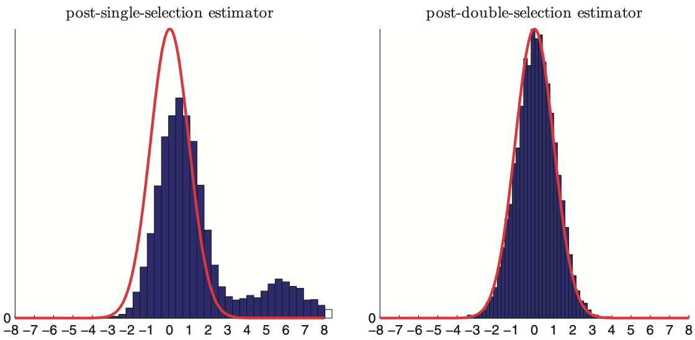

# Intro

## Intro

- Last lecture: the factor zoo became a high-dimensional problem
- Today: a stats detour before @KozakNagelSantosh2020 and @FengGiglioXiu2020
- This will be more like an ML/Stats lecture
- Goal: understand shrinkage, selection, and valid inference after selection
- A great reference: [Elements of Statistical Learning](https://hastie.su.domains/ElemStatLearn/)

## Why a Stats Detour?

- Suppose you observe $\{(y_1, x_1), \ldots, (y_n, x_n)\}$
- $y_i \in \mathbb{R}$ is a target variable, and $x_i \in \mathbb{R}^p$ is a vector of predictors

$$
y_i = x_i^\top \beta_0 + \varepsilon_i,
\qquad
p \text{ can be large relative to } n
$$

- Modern empirical work often has many plausible predictors or controls
- Once $p$ is large, OLS becomes unstable or infeasible
- Regularization is the discipline: restrict complexity, keep computation feasible
- Factor zoo = $p$ large to $n$

. . .

- Today: everything in the iid, cross-sectional world, but the similar ideas apply to time series and panel data

## Flight Plan

- Part I: Ridge, Lasso, and Elastic Net as high-dimensional linear tools
- Part II: Double Machine Learning for causal inference in high dimensions
- Next class: @KozakNagelSantosh2020 and @FengGiglioXiu2020
- These are modern takes on factor models/model selection

# Part I: Regularized Linear Models

## Setup

$$
y = X\beta_0 + \varepsilon,
\qquad
X \in \mathbb{R}^{n \times p},
\qquad
\beta_0 \in \mathbb{R}^p
$$

- $y$: target vector
- $X$: feature matrix
- $p$ may be comparable to $n$, or larger
- Main objective: predict well when signal is weak and dispersed
- Classic Machine Learning methods were *not* created for inference
- But they can be still useful for that! This will be Part II

## Why OLS Gets Fragile

$$
\hat\beta^{OLS} = (X^\top X)^{-1}X^\top y,
\qquad
\operatorname{Var}(\hat\beta^{OLS} \mid X)=\sigma^2(X^\top X)^{-1}
$$

- If $p>n$, then $\operatorname{rank}(X^\top X)\leq n < p$: no inverse
- If $X^\top X$ has small eigenvalues, variance blows up in those directions
- Recall: $(X^\top X)^{-1} = Q D^{-1} Q^\top$ for $X^\top X = Q D Q^\top$
- If $X^\top X$ has small eigenvalues, $D^{-1}$ blows up!
- Good in low dimension; fragile in high dimension

## Prediction Risk and the Bias-Variance Tradeoff

- Suppose you estimate the model and receive a new random pair $(y^{new}, x_{new})$ 
- What's the expected squared prediction error, conditional on $X$?

. . .

$$
\mathbb{E}\left[(y^{new} - x_{new}^\top \hat\beta)^2 \mid X\right]
=
\sigma^2
+
\operatorname{Bias}(x_{new}^\top \hat\beta)^2
+
\operatorname{Var}(x_{new}^\top \hat\beta)
$$

- OLS is unbiased when the model is right
- But low bias can come with huge variance
- Regularization accepts some bias to cut variance sharply
- This is already hinting at why naive regularization will screw inference up!

## Penalized Least Squares

$$
\hat\beta(\lambda)
\in
\arg\min_{\beta \in \mathbb{R}^p}
\left\{
\frac{1}{2}\lVert y - X\beta \rVert_2^2 + P_\lambda(\beta)
\right\}
$$

- $P_\lambda(\beta)$ controls model complexity
- Larger $\lambda$ means stronger shrinkage
- Different penalties create different geometry and different estimators
- Important: $\hat{\beta}$ depends on $\lambda$, and $\lambda$ is a tuning parameter, not a fixed constant

. . .

- How to choose $\lambda$? Many ways, but cross-validation is common practice

## Ridge Regression

$$
\hat\beta^{ridge}(\lambda)
\in
\arg\min_\beta
\left\{
\frac{1}{2}\lVert y - X\beta \rVert_2^2
+
\frac{\lambda}{2}\lVert \beta \rVert_2^2
\right\}
$$

- Penalty is quadratic: $\lVert \beta \rVert_2^2 = \sum_{j=1}^p \beta_j^2$
- Large coefficients are expensive
- Ridge keeps all regressors, but pushes them toward zero

## Ridge: Closed Form

Taking the FOC is both necessary and sufficient for optimality:
$$
\nabla_\beta
\left[
\frac{1}{2}\lVert y - X\beta \rVert_2^2
+
\frac{\lambda}{2}\lVert \beta \rVert_2^2
\right]
=
-X^\top(y-X\beta)+\lambda \beta
$$

$$
(X^\top X + \lambda I_p)\hat\beta^{ridge} = X^\top y
\implies
\hat\beta^{ridge} = (X^\top X + \lambda I_p)^{-1}X^\top y
$$

- Adding $\lambda I_p$ regularizes the inverse problem
- Even when $X^\top X$ is singular, $X^\top X + \lambda I_p$ is invertible for $\lambda>0$
- $\lambda$ bounds the eigenvalues away from zero, stabilizing the solution

## Ridge in the Eigenbasis

If $X^\top X = QDQ^\top$ with $D=\operatorname{diag}(d_1,\dots,d_p)$, then

$$
\hat\beta^{ridge} = Q(D+\lambda I_p)^{-1}Q^\top X^\top y
$$

If OLS exists,

$$
\hat\beta^{ridge}
=
Q \operatorname{diag}\left(\frac{d_j}{d_j+\lambda}\right) Q^\top \hat\beta^{OLS}
$$

- Each principal direction is multiplied by $d_j/(d_j+\lambda)\in(0,1)$
- Weak directions, with small $d_j$, are shrunk the most

## Why Ridge Does Not Select

Under orthogonal regressors, $X^\top X = I_p$, ridge satisfies

$$
\hat\beta_j^{ridge} = \frac{x_j^\top y}{1+\lambda},
\qquad
j=1,\dots,p
$$

- If $x_j^\top y \neq 0$, then $\hat\beta_j^{ridge} \neq 0$
- Ridge rescales correlations continuously
- No thresholding rule means no exact zeros, generically
- This is a great model if you believe you have many weak signals in $X$ to predict $y$

## {.standout}
Questions?

## Best Subset as the Ideal

- Now let's say you have $p$ regressors but you want to pick a small subset of them
- Maybe because you value parsimony, maybe because you know some are redundant...

. . .

- Recall the $\ell_0$ norm counts the number of nonzero coefficients
- Formally: $\lVert \beta \rVert_0 = \sum_{j=1}^p \mathbb{1}(\beta_j \neq 0)$

$$
\hat\beta^{subset}
\in
\arg\min_\beta
\left\{
\frac{1}{2}\lVert y - X\beta \rVert_2^2 + \lambda \lVert \beta \rVert_0
\right\}, \quad 
$$

. . .

- This is the literal "pick a sparse model" problem
- Statistically attractive, computationally nasty
- How many regressions with $k$ regressors can you run if you have $p$ candidates?

## Lasso

- Recall the $\ell_1$ norm is $\lVert \beta \rVert_1 = \sum_{j=1}^p |\beta_j|$
- $\ell_1$ is a convex proxy for $\ell_0$
- Can you show that the $\ell_0$ ball is non-convex, while the $\ell_1$ ball is convex?

. . .

\vspace{0.3cm}
Welcome to class, Mr. LASSO (Least Absolute Shrinkage and Selection Operator):

$$
\hat\beta^{lasso}(\lambda)
\in
\arg\min_\beta
\left\{
\frac{1}{2}\lVert y - X\beta \rVert_2^2 + \lambda \lVert \beta \rVert_1
\right\}
$$


. . .

- Still convex, unlike best subset
- Geometry changes, and so does the solution

## Lasso Geometry

::: {.columns}
::: {.column width="50%"}

```{python}
from pathlib import Path

import matplotlib.pyplot as plt
import numpy as np

# High-resolution figure
fig, ax = plt.subplots(figsize=(3, 6), dpi=300)
slateblue = (45 / 255, 62 / 255, 80 / 255)

# ---- L1 ball (LASSO constraint) ----
t = 1.5  # radius of the L1 ball
diamond = np.array([[0, t], [t, 0], [0, -t], [-t, 0]])
ax.fill(diamond[:, 0], diamond[:, 1], color=slateblue, alpha=0.95, zorder=1)

ax.scatter(0, t, color="C1", s=15, zorder=3)

# ---- Quadratic loss contours (OLS objective) ----
center = np.array([1.4, 2.35])  # location of unconstrained estimator \hat{δ}
Sigma = np.array([[3.0, 1.6], [1.6, 1.0]])
Sigma_inv = np.linalg.inv(Sigma)

d1 = np.linspace(-1.5, 4, 400)
d2 = np.linspace(-2.0, 4, 400)
D1, D2 = np.meshgrid(d1, d2)

Z = np.stack([D1 - center[0], D2 - center[1]], axis=-1)
quad = np.einsum("...i,ij,...j->...", Z, Sigma_inv, Z)

levels = np.linspace(0.1, 2, 10)
ax.contour(D1, D2, quad, levels=levels, colors="red", linewidths=1)

# ---- Unconstrained estimator point ----
ax.scatter(center[0], center[1], color="black", s=15, zorder=3)
# ax.text(center[0] + 0.1, center[1] + 0.05, r'$\hat{\delta}$', fontsize=14)

# ---- Axes and labels ----
ax.axhline(0, color="black", linewidth=1)
ax.axvline(0, color="black", linewidth=1)

# Remove box and ticks
for spine in ax.spines.values():
    spine.set_visible(False)
ax.set_xticks([])
ax.set_yticks([])

# Axis labels near arrow tips
ax.set_xlim(-2.0, 4.0)
ax.set_ylim(-2.0, 4.0)
ax.set_aspect("equal", "box")

ax.text(ax.get_xlim()[1], -0.15, r"$\beta_1$", ha="right", va="top", fontsize=14)
ax.text(-0.15, ax.get_ylim()[1], r"$\beta_2$", ha="right", va="top", fontsize=14)

fig.tight_layout()
```

:::
::: {.column width="50%"}
```{=latex}
The criterion can be seen as the Lagrangian of:
\begin{gather*}
\hat\beta^{lasso}(c)
\in
\arg\min_\beta
\left\{
\frac{1}{2}\lVert y - X\beta \rVert_2^2
\right\}
\\
\text{s.t.}
\quad
\lVert \beta \rVert_1 \leq c
\end{gather*}

\begin{itemize}\itemsep1em
\item For each $\lambda$, you can find some $c$ such that the two problems are equivalent
\item For each $c$, you can find some $\lambda$ such that the two problems are equivalent
\end{itemize}
```

:::
:::


## Soft Thresholding Under Orthonormal Design

If $X^\top X = I_p$ and $z_j = x_j^\top y$, then

$$
\hat\beta_j^{lasso} = S_\lambda(z_j),
\qquad
S_\lambda(z) \equiv \operatorname{sign}(z)(|z|-\lambda)_+
$$

Equivalently,

$$
\hat\beta_j^{lasso}
=
\begin{cases}
z_j - \lambda, & z_j > \lambda \\
0, & |z_j| \leq \lambda \\
z_j + \lambda, & z_j < -\lambda
\end{cases}
$$

- Small correlations get killed exactly
- This is selection, not just shrinkage

## Elastic Net

$$
\hat\beta^{EN}
\in
\arg\min_\beta
\left\{
\frac{1}{2}\lVert y - X\beta \rVert_2^2
+
\lambda_1 \lVert \beta \rVert_1
+
\frac{\lambda_2}{2}\lVert \beta \rVert_2^2
\right\}
$$

- Lasso part encourages sparsity
- Ridge part stabilizes the problem
- Two penalties, two roles
- Strict generalization, but now you deal with two tuning parameters
- There are fast algorithms for solving these problems -- convex analysis rocks!

## Why Elastic Net Helps with Correlation

Suppose $x_1=x_2$ and only $\beta_1+\beta_2=c$ matters for fit. Then

$$
\beta_1^2 + \beta_2^2
\geq
\frac{(\beta_1+\beta_2)^2}{2}
=
\frac{c^2}{2}
$$

with equality if and only if $\beta_1=\beta_2=c/2$.

- For fixed fit, the $\ell_2$ term prefers balanced coefficients
- Elastic Net pulls strongly correlated regressors together
- Pure Lasso can keep one and drop the other arbitrarily

## Standardization Matters

If $x_j^\ast = c x_j$, then the same fitted values require $\beta_j^\ast = \beta_j/c$.
For Lasso,

$$
\lambda |\beta_j^\ast| = \lambda \frac{|\beta_j|}{|c|}
$$

- The penalty acts on coefficients, not directly on variables
- Rescaling regressors changes the effective penalty if we do nothing
- Standardize predictors before penalizing
- More sophisticated generalizations allow for one $\lambda_j$ for each $\beta_j$

## Choosing the Penalty

Standard cross-validation:

- Divide the data into $K$ *random* folds $\mathcal I_1, \ldots, \mathcal I_K$
- Consider a grid $\Lambda = (\lambda_1, \ldots, \lambda_m)$
- For each fold $k$, estimate $\hat\beta^{(-k)}(\lambda)$ on the data excluding fold $k$

. . .

Cross-validation picks

$$
\hat\lambda
\in
\arg\min_{\lambda \in \Lambda}
\underbrace{
\frac{1}{K}
\sum_{k=1}^K
\underbrace{\sum_{i \in \mathcal I_k}
\left(y_i - x_i^\top \hat\beta^{(-k)}(\lambda)\right)^2}_{\text{validation error for fold } k}
}_{\text{average validation error}}
$$

- Choose $\lambda$ for out-of-sample fit

## {.standout}
Questions?

# Part II: High-Dimensional Causal Inference

## Preliminaries

- Causality still comes from design, not from an algorithm
- Machine Learning won't help if you have a crappy empirical design
- If you have the perfect data, you probably only neeed simple averages
- It's when data is imperfect that you call the firefighters!

. . .

- Important: ML methods were created for forecasting, not for inference
- This is the Belloni-Chernozhukov move [@belloni_high-dimensional_2014; @belloni_inference_2014; @chernozhukov_doubledebiased_2018]

## Treatment Effects in High Dimensions

$$
y_i = d_i \theta_0 + x_i^\top \beta_0 + \varepsilon_i,
\qquad
\mathbb E[\varepsilon_i \mid d_i, x_i] = 0
$$

- $y_i$: outcome
- $d_i$: treatment
- $x_i \in \mathbb R^p$: many controls
- Goal: estimate $\theta_0$ and build a confidence interval

## Approximate Sparsity

The working assumption is not "truth is literally sparse", but

$$
x_i^\top \beta_0 = x_{i,S}^\top \beta_{0,S} + r_i,
\qquad
|S| = s \ll n,
\qquad
r_i \text{ small}
$$

- A small subset of regressors gives a good approximation
- We *do not* know that subset ex ante
- Regularization is useful only if this approximation is meaningful

## Why Naive Lasso Fails

A tempting idea is

$$
(\hat\theta,\hat\beta)
\in
\arg\min_{\theta,\beta}
\left\{
\frac{1}{2}\lVert y - d\theta - X\beta \rVert_2^2 + \lambda \lVert \beta \rVert_1
\right\}
$$

- Even if $\theta$ is left unpenalized, missing controls can still bias $\hat\theta$
- Selection mistakes matter when omitted controls are correlated with treatment
- Prediction success is not enough for valid inference on $\theta_0$

## The Treatment Equation Matters Too

$$
d_i = x_i^\top \gamma_0 + u_i,
\qquad
\mathbb E[u_i \mid x_i] = 0
$$

- Some controls matter because they predict outcomes
- Some matter because they predict treatment
- Think about the propensity score!
- Omitted variable bias cares about both channels


## Post-Double-Selection

Define the selected sets

$$
\hat S_y = \{j : \hat\beta_j^{(y)} \neq 0\},
\qquad
\hat S_d = \{j : \hat\gamma_j^{(d)} \neq 0\},
\qquad
\hat S = \hat S_y \cup \hat S_d
$$

Procedure:

1. Run Lasso of $y_i$ on $x_i$
2. Run Lasso of $d_i$ on $x_i$
3. Run OLS of $y_i$ on $d_i$ and $x_{i,\hat S}$

## Why the Union Works

- A control creates omitted variable bias only if it matters for the treatment residual, the outcome residual, or both
- The union $\hat S_y \cup \hat S_d$ protects both margins
- If a variable is weak in one equation but strong in the other, the union still keeps it

. . .

$$
\hat S = \hat S_y \cup \hat S_d
\qquad
\text{instead of}
\qquad
\hat S_y \text{ alone}
$$

## The Main Result

Under approximate sparsity and regularity conditions,

$$
\sqrt{n}\left(\hat\theta_{PDS} - \theta_0\right) \xrightarrow{d} \mathcal N(0,\sigma^2)
$$

- Inference is uniformly valid over a large class of data-generating processes [@belloni_inference_2014]
- Confidence intervals are built in the usual way once $\sigma^2$ is estimated
- This is much stronger than "it predicts well in simulations"

## A Monte Carlo Reassurance

{fig-align="center"}

## DML Preview

The generalized partially linear model is

$$
y_i = d_i\theta_0 + g_0(x_i) + \varepsilon_i,
\qquad
d_i = m_0(x_i) + u_i
$$

A Neyman-orthogonal score is

$$
\psi(W_i;\theta,\eta)
=
\left(d_i - m(x_i)\right)
\left(y_i - g(x_i) - \theta(d_i-m(x_i))\right)
$$

- Estimate $g_0$ and $m_0$ with ML on auxiliary folds
- Plug them into the score on held-out data
- Cross-fitting plus orthogonality is the bridge from Double Lasso to DML [@chernozhukov_doubledebiased_2018]

## {.standout}
Questions?

## Taking Stock

- Ridge stabilizes
- Lasso stabilizes and selects
- Elastic Net stabilizes and groups correlated signals
- Post-selection inference is not automatic
- Belloni-Chernozhukov show how to recover valid treatment-effect inference with many controls

## Readings and References {.noframenumbering .allowframebreaks}
\footnotesize
