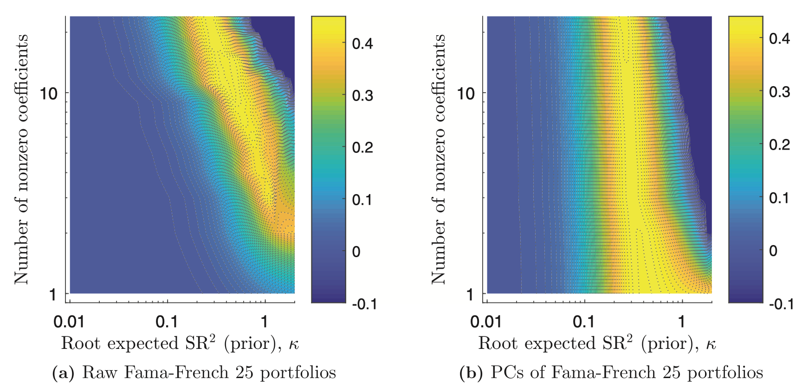
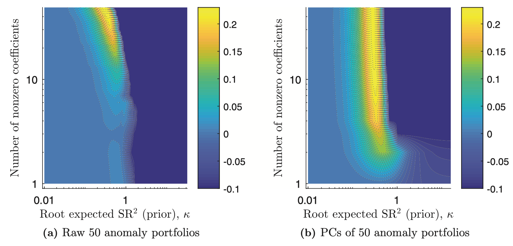
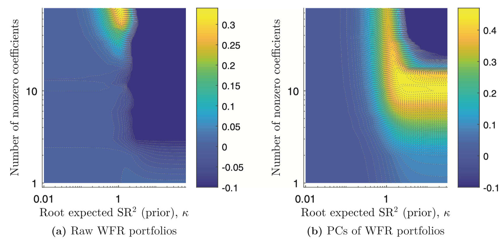
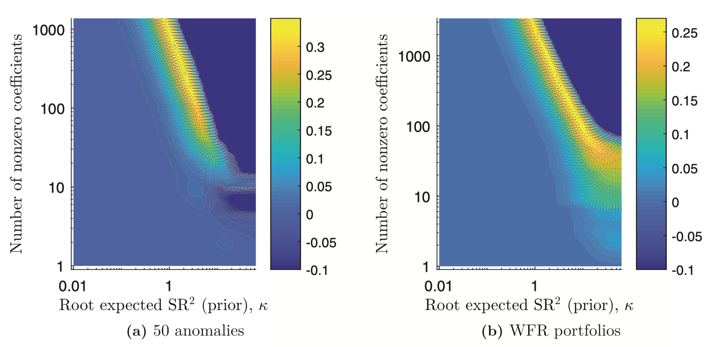

# Intro

## Intro

- Last lecture: shrinkage and double selection
- Today: apply those tools to the factor zoo
- @KozakNagelSantosh2020 ask how to estimate an SDF in a huge characteristic space
- @FengGiglioXiu2020 ask whether one new factor still matters after the whole zoo
- Main theme: high dimension changes both estimation and inference

## Why This Lecture?

- Lecture 14: weak test assets and multiple testing made the zoo look dangerous [@LewellenNagelShanken2010; @HarveyLiuZhu2016]
- Lecture 15: regularization and valid post-selection inference gave us new tools [@belloni_inference_2014]
- Today: two modern answers to the same broad problem
- One estimates a robust high-dimensional SDF
- One tests a candidate factor against a high-dimensional benchmark

## Flight Plan

- Part I: why @KozakNagelSantosh2020 reject characteristics-sparse factor models
- Part II: how @FengGiglioXiu2020 test whether a new factor adds marginal pricing power
- End: compare the two objects, the two methods, and the two contributions

# Part I: Shrinking the Cross-Section

## The Question

- Can a few characteristics summarize the whole cross-section?
- FF3 and FF5 made that look plausible [@FamaFrench1993; @FamaFrench2015]
- Lecture 14 already made us suspicious [@LewellenNagelShanken2010; @HarveyLiuZhu2016]
- @KozakNagelSantosh2020 ask: maybe the SDF is not sparse in characteristics at all

## Why Sparse Characteristics Are a Strong Claim

- Present-value identity connected observed prices with expected profitability and investment
- Many characteristics can proxy for profitability, investment, distress, ...
- We don't actually observe expectations
- Sparsity in characteristics means extreme redundancy across anomalies

## SDF Setup

- Start with a $N\times 1$ vector of excess returns $R_t$
- $Z_{t}$: $N\times H$ matrix of firm characteristics
- $F_t = Z_{t-1}^\top R_t$ are factor portfolios

\vspace{1cm}
They consider an SDF of the following form:
$$
M_t = 1 - b_{t-1}^\top(R_t - \mathbb{E}_{t-1}[R_t])
$$
where $b_{t-1}=Z_{t-1}^\top b$

- If a given $b_j=0$, then the $j$th characteristic does not enter the SDF at all
- Sparsity in the SDF is equivalent to sparsity of $b$

## SDF Setup

Plugging one equation into the other, we can rewrite the SDF as
$$
M_t = 1 - b^\top\!\left(F_t - \mathbb{E}_{t-1}[F_t]\right),
$$

. . .

- A conditional model for the SDF entails $\mathbb{E}_{t-1}[M_t R_t] = 0$
- Then it should be the case that
$$
\mathbb{E}[M_tF_t] = 0
$$
since factors are themselves portfolios of returns!

. . .

- Solving for $b$ gives:
$$
b = \Sigma^{-1}\mu
$$
where $\Sigma = \mathbb{E}[(F_t - \mathbb{E}[F_t])(F_t - \mathbb{E}[F_t])^\top]$ and $\mu = \mathbb{E}[F_t]$


## Naive Estimation Fails

$$
\hat b^{naive} = \hat\Sigma_1^{-1}\bar\mu
$$

- This is just the sample analog of the exact formula
- Problem 1: expected returns are noisy
- Problem 2: $H$ can be large relative to $T$, screwing up the covariance estimate
- Result: the estimator overfits means and loads too much on weak directions

## Rotate to Principal Components

$$
\Sigma_1 = Q D Q^\top,
\qquad
P_t = Q^\top F_t,
\qquad
b_P = D^{-1}\mathbb{E}[P_t]
$$

- PCs rank directions by variance
- Low-eigenvalue PCs are statistically fragile
- Directions of low variance generate huge coefficients unless the premia is estimated to be zero
- If we mis-handle them, the estimated SDF becomes wild

## The Economic Prior

- Suppose you know $\Sigma$
- They assume a Gaussian prior for $\mu$:
$$
\mu \sim \mathcal{N}\left(0, \kappa^2 \frac{\Sigma^{\eta}}{\tau}\right), \qquad \tau = \text{tr}[\Sigma] = \sum\limits_{j=1}^H d_j
$$
where $d_j$ is the $j$-th eigenvalue of $\Sigma$

- Recall that $\Sigma^{\eta} = Q D^{\eta} Q^\top$
- If $\eta$ is large, directions of low eigenvalues are taken to zero a priori

. . .

- Notice that $b \sim \mathcal{N}(0, \kappa^2 \frac{\Sigma^{\eta-2}}{\tau})$
- The variance about $b$ is huge is $\eta$ is too small
- They pick $\eta=2$

## The Shrinkage Estimator

- We get a spherical prior on coefficients: $b \sim \mathcal{N}\left(0, \frac{\kappa^2}{\tau}I_H\right)$
- Now they assume factors come from an i.i.d Gaussian distribution
- This makes you able to derive the posterior distribution of $b$ given the *observed* mean of factors:

$$
\hat{b} = \left(\Sigma + \gamma I_H\right)^{-1}\bar\mu
$$
where $\gamma = \frac{\kappa^2}{T\cdot\tau}$

- This looks like something you saw last class, right?

## Penalized Interpretation

$$
\hat b
=
\arg\min_b
\left\{
(\bar\mu - \Sigma b)^\top \Sigma^{-1}(\bar\mu - \Sigma b)
+
\gamma\, b^\top b
\right\}
$$

- That estimator is equivalent to the argmin of the above objective function
- Recall that $\lVert b \rVert_2^2 = b^\top b$
- This is like Ridge but with a non-standard loss function

. . .

- Another equivalent optimization problem is

$$
\hat b
=
\arg\min_b
\left\{
(\bar\mu - \Sigma b)^\top(\bar\mu - \Sigma b)
+
\gamma\, b^\top \Sigma b
\right\}
$$

- This is like Ridge but with a different penalty
- $b^\top \Sigma b$ is the maximal Sharpe ratio attained. Why?

## Why Add an $\ell_1$ Penalty?

$$
\hat b
=
\arg\min_b
\left\{
(\bar\mu - \Sigma_1 b)^\top \Sigma^{-1}(\bar\mu - \Sigma_1 b)
+
\gamma_2\, b^\top b
+
\gamma_1 \sum_{j=1}^H |b_j|
\right\}
$$

- $\ell_1$ can drop useless factors
- But pure lasso is bad with correlated predictors
- And characteristic portfolios are very correlated
- This is like the Elastic Net, with a non-standard loss function
- Their main empirical message: $\ell_2$ matters much more than sparse selection

## How To Pick Penalty Parameters?

- They use $K$-fold cross-validation
- They use $K=3$ and split the data in a contiguous fashion
- After estimating the SDF on $K-1$ folds, they compute the out-of-sample $R^2$ on the holdout fold

$$
R_{OOS}^2 = 1 - \frac{(\bar{\mu}_K - \bar{\Sigma}_K \hat{b})^\top (\bar{\mu}_K - \bar{\Sigma}_K \hat{b})}{\bar{\mu}_K^\top \bar{\mu}_K}
$$

- Keep rotating and average values

## FF25 as a Sanity Check

{fig-align="center"}

## 50 Anomalies From The Literature

{fig-align="center"}

## WRDS Fincial Ratios: 70 Portfolios

{fig-align="center"}

## Considering Non-Linearities: Characteristics and Their Powers

{fig-align="center"}

## Contribution to the Literature

- Not another factor paper: it is a paper about how to estimate the SDF in high dimension
- It rejects the hope that a tiny set of characteristics is enough
- It gives a formal role to shrinkage in empirical asset pricing
- One line summary: the SDF is not sparse in characteristics, but it is still shrinkable
- Their view: Asset Pricing is about many *weak* factors...

## {.standout}
Questions?

# Part II: Taming the Factor Zoo

## The Question

- Suppose someone proposes a new factor today
- How should we test it against the whole existing zoo?
- A new factor should bring new pricing information, not just be correlated with the old factors
- FF3 or FF5 are convenient benchmarks, but also arbitrary
- @FengGiglioXiu2020 propose a conservative test on purpose

## Model Setup

$$
m_t
=
\gamma_0^{-1}\left(1 - \lambda_g^\top g_t - \lambda_h^\top h_t\right)
$$

$$
\mathbb{E}[r_t]
=
\iota_n \gamma_0 + C_g \lambda_g + C_h \lambda_h
$$

- $g_t$: factor we want to test
- $h_t$: potentially huge set of control factors
- The goal is inference on $\lambda_g$
- The problem: $h_t$ is large and we don't know which controls to include

## SDF Loadings Are the Object

$$
\mathbb{E}[r_t]
=
\iota_n \gamma_0 + \beta_g \gamma_g + \beta_h \gamma_h
$$

- Risk premia and SDF loadings are not the same thing
- A factor can earn a premium just because it is correlated with true pricing factors
- Feng care about whether the factor enters the SDF
- So the target is $\lambda_g$, not just average return

## Why Standard Two-Pass Breaks

- If $p$ is small, ordinary two-pass methods are fine
- But in the zoo, $p$ can be comparable to $n$ or $T$
- Using all factors is infeasible or very noisy
- Using FF3 or FF5 alone creates omitted-variable bias

## Sparsity as a Working Assumption

- They assume the relevant control set is approximately low-dimensional
- This is the same broad "bet on sparsity" logic as Lecture 15
- But the benchmark is not fixed ex ante
- The benchmark must be selected from a large set of candidates

## Why Plain LASSO Is Not Enough

- LASSO is good for prediction
- Inference fails if an omitted control is correlated with the factor of interest
- So selection mistakes can create omitted-variable bias
- This is exactly the Belloni-Chernozhukov-Hansen logic from last lecture [@belloni_inference_2014]

## Double Selection: Step 1

$$
\min_{\gamma,\lambda}
\left\{
n^{-1}\left\lVert \bar r - \iota_n \gamma - \hat C_h \lambda \right\rVert_2^2
+
\tau_0 n^{-1}\lVert \lambda \rVert_1
\right\}
$$

- First LASSO selects controls that help explain the cross-section
- This is the "pricing ability" margin
- It looks like the natural factor-selection step
- But it is not enough for valid inference on $\lambda_g$

## Double Selection: Step 2

$$
\min_{\xi_j,\chi_j}
\left\{
n^{-1}\left\lVert \hat C_{g,\cdot j} - \iota_n \xi_j - \hat C_h \chi_j^\top \right\rVert_2^2
+
\tau_j n^{-1}\lVert \chi_j \rVert_1
\right\}
$$

- Second LASSO searches for controls whose exposures line up with exposures to $g_t$
- This is the omitted-variable-bias margin
- It keeps factors that may look weak for pricing but are dangerous to omit

## Post-Selection Estimation

$$
(\hat\gamma_0,\hat\lambda_g,\hat\lambda_h)
=
\arg\min_{\gamma_0,\lambda_g,\lambda_h}
\left\{
\left\lVert \bar r - \iota_n \gamma_0 - \hat C_g \lambda_g - \hat C_h \lambda_h \right\rVert_2^2
:
\lambda_{h,j}=0 \text{ for } j \notin \hat I
\right\}
$$

- Refit by OLS after taking the union of selected controls
- This removes the regularization bias from LASSO
- Same structure as post-double-selection in Lecture 15

## Why This Delivers Valid Inference

- First stage protects pricing relevance
- Second stage protects against omitted-variable bias
- Post-selection OLS restores an interpretable slope estimate
- So inference on $\lambda_g$ remains valid even with imperfect model selection

## Data and Test Assets

- 150 monthly factors from 1976 to 2017
- 15 standard public factors plus 135 long-short proxies
- 750 characteristic-sorted test portfolios
- The large test set directly answers the LNS critique [@LewellenNagelShanken2010]

## Recent Factors: Table I Placeholder

```{=latex}
\vspace{0.4cm}
\begin{center}
\fbox{
\parbox[c][0.50\textheight][c]{0.88\textwidth}{
\centering
\Large Placeholder for Table I \\
\large Testing factors introduced in 2012-2016
}
}
\end{center}
```

- The punchline: most new factors look redundant or useless relative to the old zoo
- A few survive, especially profitability-style factors

## Selection Rates: Figure 1 Placeholder

```{=latex}
\vspace{0.4cm}
\begin{center}
\fbox{
\parbox[c][0.52\textheight][c]{0.86\textwidth}{
\centering
\Large Placeholder for Figure 1 \\
\large First-stage factor selection rates across subsamples
}
}
\end{center}
```

- Selected models can vary a lot
- That is exactly why "oracle" intuition is dangerous
- Model uncertainty is not a nuisance detail here

## Tuning-Parameter Heatmaps: Figure 2 Placeholder

```{=latex}
\vspace{0.4cm}
\begin{center}
\fbox{
\parbox[c][0.52\textheight][c]{0.86\textwidth}{
\centering
\Large Placeholder for Figure 2 \\
\large Robustness of $t$-statistics to tuning parameters
}
}
\end{center}
```

- The selected benchmark changes with the penalty
- Yet some core conclusions are fairly stable
- Important lesson: benchmark uncertainty and inference must be handled together

## Screening the Zoo Over Time

- They also test factors recursively as they arrive
- In that exercise, many proposed factors would have been screened out at birth
- This fits the broader worry that published anomalies often decay [@McLeanPontiff2016]
- The procedure is meant to discipline discovery, not encourage more fishing

## Contribution to the Literature

- It turns Lecture 15's double-selection logic into an asset-pricing test
- It replaces arbitrary benchmarks with selected but inference-valid benchmarks
- It responds directly to LNS and complements HLZ [@LewellenNagelShanken2010; @HarveyLiuZhu2016]
- It makes factor discovery conservative on purpose

## {.standout}
Questions?

# Part III: Putting Them Together

## Same Problem, Different Objects

- Kozak: estimate a robust high-dimensional SDF
- Feng: test one candidate factor conditional on many controls
- Kozak ask which span matters for pricing
- Feng ask whether one new direction still adds anything beyond the existing span

## Taking Stock

- Lecture 12-13 built factor models
- Lecture 14 showed the zoo and the weakness of old testing standards
- Lecture 15 gave us shrinkage and valid post-selection inference
- Lecture 16: modern empirical asset pricing means regularization plus tough benchmarks
- A factor is not interesting because it has a story; it must survive high-dimensional comparison

## Readings and References {.noframenumbering .allowframebreaks}
\footnotesize
